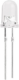
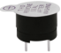
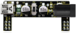

# About keyestudio

Keyestudio is the best-selling brand of KEYES Corporation. Our products include Arduino development boards, expansion boards, sensors and modules, Raspberry PI, micro:bit expansion boards as well as smart cars, which are committed to learning about Arduino for customers of any level. 

Notably, all of our products are in line with international quality standards and are greatly appreciated in different markets across the world. 

Welcome to check out more contents from our official website: [**http://www.keyestudio.com**](http://www.keyestudio.com)

## Obtain Information and After-sales Service

1.Download address: [https://fs.keyestudio.com/KS5012](https://fs.keyestudio.com/KS5011)

2.If something is found missing or broken, or you have some difficulty learning the kit, please feel free to contact us. Welcome to send email to us: service@keyestudio.com

3.We will seek to update projects and products continuously from your sincere advice.

## Warning

1.Some of the electronic components，sensors as well as modules in this product contain tiny pins, please keep them out of reach of children under 7 years old.

2.This product contains conductive parts (control board and electronic module). Please operate according to the requirements of tutorials. Improper operation may cause parts to overheat damage. Do not touch and immediately disconnect the circuit power.

## Copyright

The keyestudio trademark and logo are the copyright of KEYES DIY ROBOT co.,LTD. 

All products under Keyestudio brand can’t be copied, sold and resold without authorization by anyone or company. 

If you are interested in our products, please contact to our sales representatives: [**fennie@keyestudio.com**](http://m.138.gz.cn/webadmin/~CAmsnCrrNXhTAySKCerrIfWjjZuuWVfI/~/usr/mod_edituser.jsp?;uid=fennie@keyestudio.com;;clearCache=)

## **Keyestudio ESP32 Learning Kit Basic Edition**

### 1.Description

Do you want to learn about programming?

As long as you're passionate about science and dare to explore new things, this kit is surely the best choice for you. The Keyestudio ESP32 Learning Kit Basic Edition mainly contains some common electronic components/sensors/modules, a ESP32 mainboard and bread wires are also included.

As many as 74 project tutorials are provided, which contain detailed wiring diagrams, components knowledge, and fascinating project code. Each project is produced using Thonny for Windows, Arduino IDE for Windows, and Arduino IDE for Raspberry Pi.  It's easy to get started.

You can create numerous fascinating DIY experiments with one controller (ESP32), various of sensors/modules and electronics. These courses can give you a deeper understanding of programming methods, logic, electronic circuits and the Linux operating system (Raspberry Pi).

### 2.Kit

|  |  |  |  |  |
| :----------------------------------------------------------: | :----------------------------------------------------------: | :----------------------------------------------------------: | :----------------------------------------------------------: | :----------------------------------------------------------: |
|                      ESP32 Mainboard*1                       |                         Blue LED*10                          |                          Red LED*10                          |                        Yellow LED*10                         |                         Green LED*10                         |
|  |  |  |  |  |
|                         White LED*10                         |                            RGB*1                             |                       220ΩResistor*10                        |                       10KΩResistor*10                        |                        1KΩResistor*10                        |
|  |  |  |  |  |
|                     10KΩ Potentiometer*1                     |                       Active Buzzer*1                        |                       Passive Buzzer*1                       |                       Button Switch*4                        |                        Tilt Switch*1                         |
|  |  |  |  |  |
|                       Photoresistor*3                        |                        Flame Sensor*1                        |                       10K Thermistor*1                       |                         Yellow Cap*2                         |                          Blue Cap*2                          |
|  |  |  |  |  |
|                        IC 74HC595N *1                        |                    1-Digit Tube Display*1                    |                    4-Digit Tube Display*1                    |                  8*8 Dot Matrix Display *1                   |                      LCD_128X32_DOT *1                       |
|  |  |  |  |  |
|                       S8050 Triode *2                        |                       S8550 Triode *2                        |                            Fan*1                             |                          Dc Motor*1                          |                      Breadboard Wire*30                      |
|  |  |  |  |  |
|                      M-F Dupont Wire*10                      |                       830Breadboard*1                        |                         USB Cable*1                          |                      Resistance Card*1                       |                           Diode*1                            |
|  |  |                                                              |                                                              |                                                              |
|                    6 AA Battery Holder*1                     |         Keyestudio Breadboard special power module*1         |                                                              |                                                              |                                                              |

### 3.Catalog

<table border="1">
<tbody>
<tr class="odd">
<td>Project 01:</td>
<td>Hello World</td>
</tr>
<tr class="even">
<td>Project 02:</td>
<td>Turn On LED</td>
</tr>
<tr class="odd">
<td>Project 03:</td>
<td>LED Flashing</td>
</tr>
<tr class="even">
<td>Project 04:</td>
<td>Breathing Led</td>
</tr>
<tr class="odd">
<td>Project 05:</td>
<td>Traffic Lights</td>
</tr>
<tr class="even">
<td>Project 06:</td>
<td>RGB LED</td>
</tr>
<tr class="odd">
<td>Project 07:</td>
<td>Flowing Water Light</td>
</tr>
<tr class="even">
<td>Project 08:</td>
<td>1-Digit Digital Tube</td>
</tr>
<tr class="odd">
<td>Project 09:</td>
<td>4-Digit Digital Tube</td>
</tr>
<tr class="even">
<td>Project 10:</td>
<td>8×8 Dot-matrix Display</td>
</tr>
<tr class="odd">
<td>Project 11:</td>
<td>74HC595N Control 8 LEDs</td>
</tr>
<tr class="even">
<td>Project 12:</td>
<td>Active Buzzer</td>
</tr>
<tr class="odd">
<td>Project 13:</td>
<td>Passive Buzzer</td>
</tr>
<tr class="even">
<td>Project 14:</td>
<td>Mini Table Lamp</td>
</tr>
<tr class="odd">
<td>Project 15:</td>
<td>Tilt And LED</td>
</tr>
<tr class="even">
<td>Project 16:</td>
<td>I2C 128×32 LCD</td>
</tr>
<tr class="odd">
<td>Project 17:</td>
<td>Small Fan</td>
</tr>
<tr class="even">
<td>Project 18:</td>
<td>Dimming Light</td>
</tr>
<tr class="odd">
<td>Project 19:</td>
<td>Flame Alarm</td>
</tr>
<tr class="even">
<td>Project 20:</td>
<td>Night Lamp</td>
</tr>
<tr class="odd">
<td>Project 21:</td>
<td>Temperature Instrument</td>
</tr>
<tr class="even">
<td>Project 22:</td>
<td>Bluetooth (The Python tutorial does not have Bluetooth functionality)</td>
</tr>
<tr class="odd">
<td>Project 23:</td>
<td>WiFi Station Mode</td>
</tr>
<tr class="even">
<td>Project 24:</td>
<td>WiFi AP Mode</td>
</tr>
<tr class="odd">
<td>Project 25:</td>
<td>WiFi Station+AP Mode</td>
</tr>
</tbody>
</table>

