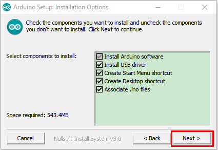
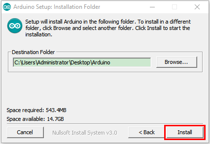
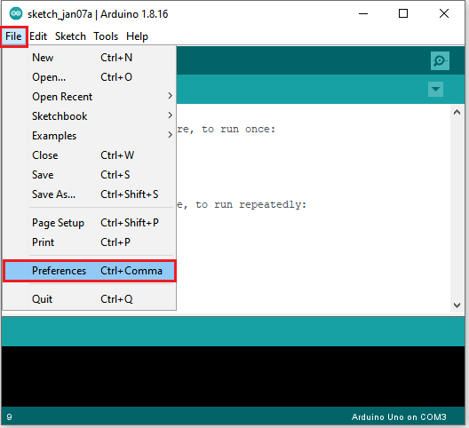

# Arduino Windows

Development Environment Configuration

Click on the link to enter the development environment setup tutorial：[Development Environment Configuration-Windows](3-2Arduino-Windows.md)

**Windows System：**

## 1.Download and install Arduino software：

（1）First, enter arduino's official website: [https://www.arduino.cc/](https://www.arduino.cc/) , and click “SOFTWARE”to enter the download page. As shown in the figure below：

(2) Then, select and download the corresponding installer for your operating system. If you are a Windows user, please select “Windows Installer” to download to install the driver correctly.

Choose to click the **Windows Win7 and newer** to download Arduino 1.8.16 version installer, which requires manual installation. But when click the **Windows ZIP File**, the Arduino 1.8.16 zip file will be downloaded directly, just unzip it to complete the installation.

In general, you can click **JUST DOWNLOAD** to download it.

(3) After the Arduino IDE is downloaded, continue the installation. When you receive the warning from the operating system, please allow the driver installation by clicking **I Agree** first, and then click **Next** after selecting the components to install.

（4）Select the installation directory (we recommend keeping the default directory), and then click **Install**.

（5）Select Install if the following screen appears.

This process extracts and installs all the necessary files to properly execute the Arduino software (IDE).

After installation is complete, an Arduino Software shortcut will be generated in the desktop.

## 2.Install a driver on Windows：

（Note：If you have installed the driver, just skip it）

Before using the ESP32 board, you must install a driver, otherwise it can not communicate with the computer. Unlike the USB series chip (ATMEGA8U2) of the Arduino UNO R3, the ESP32 board is used the CP2102 chip USB series chip and USB type C interface.

The driver of the CP2102 chip is included in 1.8.0 version and newer version of Arduino IDE. Usually, you connect the board to the computer and wait for Windows to begin its driver installation process. After a few moments, the process will succeed.

**Note:**

1\. Please make sure that your IDE is updated to 1.8.0 or newer version

2\. If the version of Arduino IDE you download is below 1.8, you should download the driver of CP2102 and install it manually.

Link to download the driver of CP2102: [CP2102-Driver-File-Windows](CP2102-Driver-File-Windows.zip)

If the driver installation process fail, you need to install the driver manually. Open device Manager for your computer and right-click“the computer”→click“Properties”→Click“Device Manager”. Look under Ports (COM & LPT) or other device, a yellow exclamation mark means that the CP2102 driver installation failed.

It shows that the driver for CP2102 fails to be installed successfully if there is a yellow mark. Double-click, and then click “**Update drive...**” to update the driver.

Click “**Browse my computer for drivers**”to find the Arduino software we installed or downloaded.

There is a **drivers** folder in Arduino software installed package（), open the driver folder and you can see the driver of CP210X series chips.

Click“**Browse...**”, then find the drivers folder, or you could enter“driver”to search in rectangular box, then click“**Next**”,

After a while, the driver is installed successfully.

Open the computer device Manager again, you can see that the CP2102 driver has been successfully installed, and find the yellow exclamation mark disappear.

## 3\. Install the ESP32 on Arduino IDE：

The installation process for ESP32 is almost the same as that for ESP8266. If you are to install ESP32 on an Arduino IDE, follow these steps：

Note：you need to download Arduino IDE 1.8.5 or advanced version to install the ESP32.

1)   Click the iconto open the Arduino IDE。

（2）Click“**File**” →**“Preferences”**，copy the website address：<https://dl.espressif.com/dl/package_esp32_index.json> in the“**Additional Boards Manager URLs:**”，and then click“**OK**” to save the address.

（3）First click “**Tools**”→“**Board:**”，and click “**Boards Manager...**”to enter“**Boards Manager**”, enter“**ESP32**”in the boxafter“**ALL**”, then select the latest version to install, the installation package is not large, click“**Install**”to Install the plug-in, as shown in the figure below.

4.  After successful installation, click“**Close**”to Close the page。

## 4\. Arduino IDE Setting:

（1）Click the icon to open the Arduino IDE.

（2）When downloading the code to the board, you must select the correct name of Arduino board that matches the board connected to your computer, then click“**Tools**”→“**Board:**”. As shown below ;

(Note: we use the ESP32 board in this tutorial; therefore, we select ESP32 Arduino**)**

Set the board type as follows:

Then select the correct COM port (the corresponding COM port can be seen after the driver is installed successfully).

Before a code was uploaded to the ESP32 mainboard, we have to demonstrate the functionality of each symbol that appeared in the Arduino IDE toolbar.

A- Used to verify whether there is any compiling mistakes or not.

B- Used to upload the sketch to your Arduino board.

C- Used to create shortcut window of a new sketch.

D- Used to directly open an example sketch.

E- Used to save the sketch.

F- Used to send the serial data received from board to the serial
monitor.
