# Arduino Tutorial

## Download Arduino code and library files

Click on the link to download Arduino code files and library files: [Arduino-Codes-and-Libraries](Arduino-Codes-and-Libraries.zip)

## Project 01: Hello World

### 1.Introduction

For ESP32 beginners, we'll start with some simple things. In this project, you just need an ESP32 mainboard, a USB cable and a computer to complete“Hello World\!”Project. It is not only a communication test for ESP32 mainboard and computer, but also a primary project for ESP32.

### 2.Components

|  |  |
| ------------------------------------------------------------ | ------------------------------------------------------------ |
| ESP32*1                                                      | USB Cable*1                                                  |


### 3.Wiring

In this project, we use a USB cable to connect the ESP32 to the computer.


### 4.Test Code

```c
//*************************************************************************************
/*
 * Filename    : Hello World
 * Description : Enter the letter R,and the serial port displays"Hello World".
 * Auther      :http//www.keyestudio.com
*/
char val;// defines variable "val"
void setup()
{
Serial.begin(115200);// sets baudrate to 115200
}
void loop()
{
  if (Serial.available() > 0) {
    val=Serial.read();// reads symbols assigns to "val"
    if(val=='R')// checks input for the letter "R"
    {  // if so,    
     Serial.println("Hello World!");// shows “Hello World !”.
    }
  }
}
//*************************************************************************************
```


Before uploading the project code to ESP32，click“Tools”→“Board” and select“ESP32 Wrover Module”.


Select the serial port.


**Note:** For macOS users, if the uploading fails, please set the baud rate to 115200 before clicking.


Clickto download the code to ESP32.


**Note:** If uploading the code fails, you can press the Boot button on ESP32 after click, and release the Boot button after the percentage of uploading progress appears, as shown below:


The code is uploaded successfully！


### 5.Test Result

After the code is uploaded successfully, power up with a USB cable and click the iconto enter the serial monitor.

Set baud rate to 115200 and type "R" in the text box. Click "Send", and the serial monitor will display "Hello World\!”.


## Project 02: Turn On LED

### 1.Introduction

In this project, we will show you how to light up the LED. We use the ESP32's digital pin to turn on the LED so that the LED is lit up.

### 2.Components

|  |  |  |
| ------------------------------------------------------------ | ------------------------------------------------------------ | ------------------------------------------------------------ |
| ESP32*1                                                      | Breadboard*1                                                 | USB Cable*1                                                  |
|  |  |  |
| Red LED*1                                                    | 220Ω Resistor*1                                              | Jumper Wire*2                                                |


### 3.Component Knowledge

**（1）LED:**


The LED is a semiconductor known as “light-emitting diode” , which is an electronic device made from semiconducting materials(silicon, selenium, germanium, etc.). It has an anode and a cathode, the short lead is cathode, which connects to GND, the long lead is anode, which connects to 3.3V or 5V.


**（2）Five-band resistor**

A resistor is an electronic component in a circuit that restricts or regulates the flow current to flow. On the left is the appearance of the resistor and on the right is the symbol for the resistance in the circuit . Its unit is(Ω). 1 mΩ= 1000 kΩ，1kΩ= 1000Ω.


We can use resistors to protect sensitive components, such as LED. The strength of the resistance is marked on the body of the resistor with an electronic color code. Each color code represents a number, and you can refer to it in a resistance card.

\-Color 1 – 1st Digit.

\-Color 2 – 2nd Digit.

\-Color 3 – 3rd Digit.

\-Color 4 – Multiplier.

\-Color 5 – Tolerance.


In this kit, we provide three five-band resistors with different resistance values. We three five-band resistors as an example. 

220Ω Resistor\*10


10KΩ Resistor\*10


1KΩ Resistor\*10


In the same voltage, there will be less current and more resistance. The connection between current(I), voltage(V), and resistance(R) can be expressed by the formula: I=U/R. In the figure below, if the voltage is 3V, the current through R1 is: I = U / R = 3 V / 10 KΩ= 0.0003A= 0.3mA.


Don’t connect a low resistance directly to the two poles of the power supply, which will cause excessive current to damage the electronic components. Resistors do not have positive and negative poles.

**（3）Bread board**

Breadboards are used to build and test circuits quickly before completing any circuit design. There are many holes in the breadboard that can be inserted into circuit components such as integrated circuits and resistors. A typical breadboard is shown below：


The breadboard has strips of metal , which run underneath the board and connect the holes on the top of the board. The metal strips are laid out as shown below. Note that the top and bottom rows of holes are connected horizontally，while the remaining holes are connected vertically.


The first two rows (top) and the last two rows (bottom) of the breadboard are used for the positive pole (+) and negative pole (-) of the power supply respectively. The conductive layout of the breadboard is shown in the figure below:


When we connect DIP (Dual In-line Packages) components, such as integrated circuits, microcontrollers, chips and so on, we can see that a groove in the middle isolates the middle part, so the top and bottom of the groove is not connected. DIP components can be connected as shown in the following diagram:


**（4）Power Supply**

The ESP32 needs 3.3V-5V power supply. In this project, we will connect the ESP32 to the computer via an USB cable.


### 4.Wiring Diagram

First, disconnect all power from the ESP32. Then build the circuit according to the wiring diagram. After the circuit is built and verified correctly, connect the ESP32 to your computer via a USB cable.

**Note:** Avoid any possible short circuits (especially connecting 3.3V and GND)\!

**WARNING:** A short circuit can cause high current in your circuit, create excessive component heat and cause permanent damage to your hardware\!


Note:

How to connect a LED

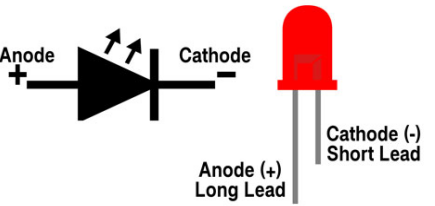

How to identify the 220Ω Five-band resistor


### 5.Test Code

```c
//**********************************************************************
/*
 * Filename    : Turn On LED
 * Description : Make an led on.
 * Auther      : http//www.keyestudio.com
*/
#define LED_BUILTIN 15

// the setup function runs once when you press reset or power the board
void setup() {
  // initialize digital pin LED_BUILTIN as an output.
  pinMode(LED_BUILTIN, OUTPUT);
}
void loop() {
  digitalWrite(LED_BUILTIN, HIGH);   // turn the LED on (HIGH is the voltage level)
}
//*************************************************************************************
```


Before uploading the code to ESP32，click“Tools”→“Board” and select“ESP32 Wrover Module”.


Select the serial port.


**Note:** For macOS users, if the uploading fails, please set the baud rate to 115200 before clicking.


Clickto download the code to ESP32.


**Note:** If uploading the code fails, you can press the Boot button on ESP32 after click, and release the Boot
button after the percentage of uploading progress appears, as shown below:


The code is uploaded successfully！


### 6.Test Result

After uploading the code successfully, power up with a USB cable and the LED will lit up.


## Project 03：LED Flashing 

### 1.Introduction

In this project, we will show you the LED flashing effect. We will work to use the ESP32's digital pin to turn on the LED and make it flash.

### 2.Components

|  |  |  |
| ------------------------------------------------------------ | ------------------------------------------------------------ | ------------------------------------------------------------ |
| ESP32*1                                                      | Breadboard*1                                                 | USB Cable*1                                                  |
|  |  |  |
| Red LED*1                                                    | 220Ω Resistor*1                                              | Jumper Wire*2                                                |


### 3.Wiring Diagram

First, disconnect all power from the ESP32. Then build the circuit according to the wiring diagram. After the circuit is built and verified correctly, connect the ESP32 to your computer via a USB cable.

**Note:** Avoid any possible short circuits (especially connecting 3.3V and GND)\!

**WARNING:** A short circuit can cause high current in your circuit, create excessive component heat and cause permanent damage to your hardware\!


**Note:**

How to connect a LED


How to identify the 220Ω Five-band resistor


### 4.Test Code

```c
//**********************************************************************
/*
 * Filename    : External LED flashing
 * Description : Make an led blinking.
 * Auther      : http//www.keyestudio.com
*/
#define PIN_LED   15   //define the led pin

// the setup function runs once when you press reset or power the board
void setup() {
  // initialize digital pin LED as an output.
  pinMode(PIN_LED, OUTPUT);
}

// the loop function runs over and over again forever
void loop() {
  digitalWrite(PIN_LED, HIGH);   // turn the LED on (HIGH is the voltage level)
  delay(500);                       // wait for 0.5s
  digitalWrite(PIN_LED, LOW);    // turn the LED off by making the voltage LOW
  delay(500);                       // wait for 0.5s
}
//*************************************************************************************
```

Before uploading the code to ESP32, please check the configuration of Arduino IDE.

Click "**Tools**" to confirm the board type and port, as shown below:


Clickto download the code to ESP32.


**Note:** If uploading the code fails, you can press the Boot button on ESP32 after click, and release the Boot
button after the percentage of uploading progress appears, as shown below:


The code is uploaded successfully！


### 5.Test Result

After uploading the code successfully, power up with a USB cable and the LED will start flashing.


## Project 04: Breathing Led

### 1.Introduction

In previous studies, we know that LEDs have on/off state, so how to enter the intermediate state? How to output an intermediate state to make the LED half bright? That's what we're going to learn.

Breathing light, that is, LED is turned from off to on gradually, and gradually from on to off, just like "breathing". However, how to control the brightness of a LED? We will use ESP32’s PWM to achieve this target.

### 2.Components

|  | 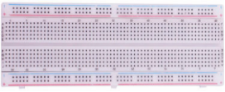 |  |
| ------------------------------------------------------------ | ------------------------------------------------------------ | ------------------------------------------------------------ |
| ESP32*1                                                      | Breadboard*1                                                 | USB Cable*1                                                  |
|  |  |  |
| Red LED*1                                                    | 220Ω Resistor*1                                              | Jumper Wire*2                                                |


### 3.Component Knowledge


**Analog & Digital**

An Analog Signal is a continuous signal in both time and value. On the contrary, a digital signal or discrete time signal is a time series consisting of a sequence of quantities. Most signals in life are analog signals. A familiar example of an analog signal would be how the temperature throughout the day continuously changes and could not change instantaneously from 0℃ to 10℃. However, digital signals can instantaneously change in value. This change is expressed in numbers as 1 and 0 (the basis of binary code). Their differences can be seen more easily when compared, as shown below:


In practical application, we often use binary as the digital signal, that is a series of 0’s and 1’s. Since a binary signal only has two values (0 or 1), it has great stability and reliability. Lastly, both analog and digital signals can be converted into each other.

**PWM：**

PWM, Pulse-Width Modulation, is a very effective method for using digital signals to control analog circuits. Common processors cannot directly output analog signals. PWM technology makes it very convenient to achieve this conversion (translation of digital to analog signals). 

PWM technology uses digital pins to send certain frequencies of square waves, that is, the output of high levels and low levels, which alternately last for a while. The total time for each set of high levels and low levels is generally fixed, which is called the period (Note: the reciprocal of the period is frequency). The time of high level outputs is generally called “pulse width”, and the duty cycle is the percentage of the ratio of pulse duration, or pulse width (PW) to the total period (T) of the waveform.

The longer the output of high levels last, the longer the duty cycle and the higher the corresponding voltage in the analog signal will be. The following figures show how the analog signal voltages vary between 0V-3.3V(high level is 3.3V) corresponding to the pulse width 0%-100%:


The longer the PWM duty cycle is, the higher the output power will be. Therefore, we can use PWM to control the brightness of an LED or the speed of DC motor and so on. It is evident from the above that PWM is not real analog, and the effective value of the voltage is equivalent to the corresponding analog. Then we can control the output power of the LED and other output modules to achieve different effects.

**ESP32 and PWM:**

On ESP32, the LEDC(PWM) controller has 16 separate channels, each of which can independently control frequency, duty cycle, and even accuracy. Unlike traditional PWM pins, the PWM output pins of ESP32 are configurable, with one or more PWM output pins per channel. The relationship between the maximum frequency and bit precision is shown in the following formula, where the maximum value of bit is 31.


For example, generate a PWM with an 8-bit precision (2<sup>8</sup>=256.
Values range from 0 to 255) with a maximum frequency of 80,000,000/255 = 312,500Hz.）

### 4.Wiring Diagram


**Note:**

How to connect a LED


How to identify the 220Ω Five-band resistor


### 5.Test Code

The design of this project makes the GPIO15 output PWM, and the pulse width gradually increases from 0% to 100%, and then gradually decreases from 100% to 0%.

```c
//**********************************************************************
/*
 * Filename    : Breathing Led
 * Description : Make led light fade in and out, just like breathing.
 * Auther      : http//www.keyestudio.com
*/
#define PIN_LED   15   //define the led pin
#define CHN       0   //define the pwm channel
#define FRQ       1000  //define the pwm frequency
#define PWM_BIT   8     //define the pwm precision
void setup() {
  ledcSetup(CHN, FRQ, PWM_BIT); //setup pwm channel
  ledcAttachPin(PIN_LED, CHN);  //attach the led pin to pwm channel
}

void loop() {
  for (int i = 0; i < 255; i++) { //make light fade in
    ledcWrite(CHN, i);
    delay(10);
  }
  for (int i = 255; i > -1; i--) {  //make light fade out
    ledcWrite(CHN, i);
    delay(10);
  }
}
//*************************************************************************************
```


Before uploading Project Code to ESP32, please check the configuration of Arduino IDE.

Click "**Tools**" to confirm the board type and port as shown below:


Clickto download the code to ESP32.


**Note:** If uploading the code fails, you can press the Boot button on ESP32 after click, and release the Boot button after the percentage of uploading progress appears, as shown below:


The code is uploaded successfully\!


### 6.Test Result

After uploading the code successfully, power up with a USB cable and the LED is turned from ON to OFF and then back from OFF to ON gradually like breathing.


## Project 05：Traffic Lights

### 1.Introduction

Traffic lights are closely related to people's daily lives, which generally show red, yellow, and green. Everyone should obey the traffic rules, which can avoid many traffic accidents. In this project, we will use ESP32 and some LEDs (red, green and yellow) to simulate the traffic lights.

### 2.Components

| 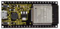 |  |  |  |
| ------------------------------------------------------------ | ------------------------------------------------------------ | ------------------------------------------------------------ | ------------------------------------------------------------ |
| ESP32*1                                                      | Red LED*1                                                    | USB Cable*1                                                  | Jumper Wires                                                 |
|  |  |  |  |
| Bread board*1                                                | Yellow LED*1                                                 | Green LED*1                                                  | 220Ω Resistor*3                                              |


### 3.Wiring Diagram


**Note:**

How to connect a LED


How to identify the 220Ω Five-band resistor


### 4.Test Code

```c
//**********************************************************************
/*
 * Filename    : Traffic Lights
 * Description : Simulated traffic lights.
 * Auther      : http//www.keyestudio.com
*/
#define PIN_LED_RED   0   //define the red led pin
#define PIN_LED_YELLOW   2   //define the yellow led pin
#define PIN_LED_GREEN  15   //define the green led pin

void setup() {
  pinMode(PIN_LED_RED, OUTPUT);
  pinMode(PIN_LED_YELLOW, OUTPUT);
  pinMode(PIN_LED_GREEN, OUTPUT);
}

void loop() {
   digitalWrite(PIN_LED_GREEN, HIGH);// turns on the green led
   delay(5000);// delays 5 seconds
   digitalWrite(PIN_LED_GREEN, LOW); // turns off the green led
   for(int i=0;i<3;i++)// flashes 3 times.
{
   delay(500);// delays 0.5 second
   digitalWrite(PIN_LED_YELLOW, HIGH);// turns on the yellow led
   delay(500);// delays 0.5 second
   digitalWrite(PIN_LED_YELLOW, LOW);// turns off the yellow led
} 
   delay(500);// delays 0.5 second
   digitalWrite(PIN_LED_RED, HIGH);// turns on the red led
   delay(5000);// delays 5 second
   digitalWrite(PIN_LED_RED, LOW);// turns off the red led
}
//*************************************************************************************
```


Before uploading the code to ESP32, please check the configuration of Arduino IDE.

Click "**Tools**" to confirm the board type and port as shown below:


Clickto download the project code to ESP32.


**Note:** If uploading the code fails, you can press the Boot button on ESP32 after click, and release the Boot
button after the percentage of uploading progress appears, as shown below:


The code is uploaded successfully！


### 5.Test Result

After uploading the code successfully, power up with a USB cable and what you'll see are below:

① First, the green light will be on for five seconds then off; 

② Next, the yellow light blinks three times then goes off;

③ Then, the red light goes on for five seconds then goes off;

④ Repeat step 1 to 3 above.


## Project 06: RGB LED

### 1.Introduction


RGB is composed of three colors (red, green and blue),which can emit different colors by mixing these three colors.

In this project, we will introduce the RGB and show you how to use ESP32 to control the RGB to emit different color lights .RGB is pretty basic, but it’s also a great way to learn the fundamentals of electronics and coding.

### 2.Components

|  |  |  |
| ------------------------------------------------------------ | ------------------------------------------------------------ | ------------------------------------------------------------ |
| ESP32*1                                                      | RGB LED                                                      | Jumper Wires                                                 |
|  |  |  |
| Breadboard*1                                                 | 220Ω Resistor*3                                              | USB Cable*1                                                  |


### 3.Component Knowledge

Most monitors adopt the RGB color standard, and all colors on a computer screen are a mixture of red, green and blue in varying proportions.


This RGB LED has 4 pins, with each color (red, green, blue) and a common cathode. To change its brightness, we can use the PWM of the ESP32 pins, which can give different duty cycle signals to the RGB to produce different colors of light.

If we use three 10-bit PWM to control the RGB, in theory, we can create 2 <sup>10</sup>\*2<sup>10</sup>\*2<sup>10</sup> =1,073,741,824(1billion) colors through different combinations.

### 4.Wiring Diagram


**Note:**

How to connect a LED


How to identify the 220Ω Five-band resistor


### 5.Test Code

```c
//**********************************************************************
/*
 * Filename    : RGB LED
 * Description : Use RGBLED to show random color.
 * Auther      : http//www.keyestudio.com
*/
int ledPins[] = {0, 2, 15};    //define red, green, blue led pins
const byte chns[] = {0, 1, 2};        //define the pwm channels
int red, green, blue;
void setup() {
  for (int i = 0; i < 3; i++) {   //setup the pwm channels,1KHz,8bit
    ledcSetup(chns[i], 1000, 8);
    ledcAttachPin(ledPins[i], chns[i]);
  }
}

void loop() {
  red = random(0, 256);
  green = random(0, 256);
  blue = random(0, 256);
  setColor(red, green, blue);
  delay(200);
}

void setColor(byte r, byte g, byte b) {
  ledcWrite(chns[0], 255 - r); //Common anode LED, low level to turn on the led.
  ledcWrite(chns[1], 255 - g);
  ledcWrite(chns[2], 255 - b);
}
//*************************************************************************************
```

### 6.Test Result

Compile and upload the code to ESP32, after the code is uploaded successfully, power up with a USB cable and you will see that the RGB LED starts to display random colors.


## Project 07: Flowing Water Light

### 1.Introduction

In our daily life, we can see many billboards composed of different colors of LED. They constantly change the light (like water) to attract customers' attention. In this project, we will use ESP32 to control 10 LEDs to achieve the effect of flowing water.

### 2.Components

|  |  |  |
| ------------------------------------------------------------ | ------------------------------------------------------------ | ------------------------------------------------------------ |
| ESP32*1                                                      | Breadboard*1                                                 | USB Cable*1                                                  |
|  |  |  |
| Red LED*1                                                    | 220Ω Resistor*1                                              | Jumper Wire*2                                                |

### 3.Wiring Diagram


**Note:**

How to connect a LED


How to identify the 220Ω Five-band resistor


### 4.Test Code

This project is designed to make a flowing water lamp. Actions: First turn LED \#1 ON, then turn it OFF. Then turn LED \#2 ON, and then turn it OFF... and repeat the same to all 10 LEDs until the last LED is turns OFF. This process is repeated to achieve the“movements”of flowing water.

```c
//**********************************************************************
/* 
 * Filename    : Flowing Water Light
 * Description : Using ten leds to demonstrate flowing lamp.
 * Auther      : http//www.keyestudio.com
*/
byte ledPins[] = {22, 21, 19, 18, 17, 16, 4, 0, 2, 15};
int ledCounts;

void setup() {
  ledCounts = sizeof(ledPins);
  for (int i = 0; i < ledCounts; i++) {
    pinMode(ledPins[i], OUTPUT);
  }
}

void loop() {
  for (int i = 0; i < ledCounts; i++) {
    digitalWrite(ledPins[i], HIGH);
    delay(100);
    digitalWrite(ledPins[i], LOW);
  }
  for (int i = ledCounts - 1; i > -1; i--) {
    digitalWrite(ledPins[i], HIGH);
    delay(100);
    digitalWrite(ledPins[i], LOW);
  }
}
//**********************************************************************
```

### 5.Test Result

Compile and upload the code to ESP32, after the code is uploaded successfully, power up with a USB cable and you will see that 10 LEDs will light up from left to right and then back from right to left.


## Project 08：1-Digit Digital Tube

### 1.Introduction

A 1-Digit 7-Segment Display is an electronic display device that displays decimal numbers. It is widely used in digital clocks, electronic meters, basic calculators and other electronic devices that display digital information. 

Though they may not look modern enough, they are an alternative to more complex dot matrix displays and are easy to use in limited light conditions and strong sunlight. In this project, we will use ESP32 to control 1-Digit 7-segment display displays numbers.

### 2.Components

|  |  |  |
| ------------------------------------------------------------ | ------------------------------------------------------------ | ------------------------------------------------------------ |
| ESP32*1                                                      | Breadboard*1                                                 | USB Cable*1                                                  |
|  |  |  |
| 1-Digit 7-Segment Display*1                                  | 220Ω Resistor*8                                              | Jumper Wire*2                                                |

### 3.Component Knowledge


**1-Digit 7-Segment Display principle:** 

Digital tube display is a semiconductor light emitting device, its basic unit is a light-emitting diode (LED). The digital tube display can be divided into 7-segment display and 8-segment display according to the number of segments. The 8-segment display has one more LED unit than the 7-segment display (used for decimal point display). Each segment of the 7-segment display is a separate LED. According to the connection mode of the LED unit, the digital tube can be divided into a common anode digital tube and a common cathode digital tube.

In the common cathode 7-segment display, all the cathodes (or negative electrodes) of the segmented LEDs are connected together, so you should connect the common cathode to GND. To light up a segmented LED, you can set its associated pin to“HIGH”. 

In the common anode 7-segment display, the LED anodes (positive electrodes) of all segments are connected together, so you should connect the common anode to“+5V”. To light up a segmented LED, you can set its associated pin to“LOW”.


Each part of the digital tube is composed of an LED. So when you use it, you also need to use a current limiting resistor. Otherwise, the LED will be damaged. In this experiment, we use an ordinary common cathode one-digit digital tube. As we mentioned above, you should connect the common cathode to GND. To light up a segmented LED, you can set its associated pin to“HIGH”.

### 4.Wiring Diagram

Note: The direction of the 7-segment display inserted into the breadboard is consistent with the wiring diagram, with one more point in the lower right corner.

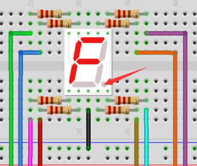


### 5.Test Code

The digital display is divided into 7 segments, and the decimal point display is divided into 1 segment. When certain numbers are displayed, the corresponding segment will be lit. For example, when the number 1 is displayed, segments b and c will be turned on.

```c
//**********************************************************************
/* 
 * Filename    : 1-Digit Digital Tube
 * Description : One Digit Tube displays numbers from 9 to 0.
 * Auther      : http//www.keyestudio.com
*/
// sets the IO PIN for every segment
int a=16; // digital PIN 16 for segment a
int b=4; // digital PIN 4 for segment b
int c=5; // digital PIN 5 for segment c
int d=18; // digital PIN 18 for segment d
int e=19; // digital PIN 19 for segment e
int f=22; // digital PIN 22 for segment f
int g=23; // digital PIN 23 for segment g
int dp=17; // digital PIN 17 for segment dp
void digital_0(void) // displays number 0
{
digitalWrite(a,HIGH);
digitalWrite(b,HIGH);
digitalWrite(c,HIGH);
digitalWrite(d,HIGH);
digitalWrite(e,HIGH);
digitalWrite(f,HIGH);
digitalWrite(g,LOW);
digitalWrite(dp,LOW);
}
void digital_1(void) // displays number 1
{
digitalWrite(a,LOW);
digitalWrite(b,HIGH);
digitalWrite(c,HIGH);
digitalWrite(d,LOW);
digitalWrite(e,LOW);
digitalWrite(f,LOW);
digitalWrite(g,LOW);
digitalWrite(dp,LOW);
}
void digital_2(void) // displays number 2
{
digitalWrite(a,HIGH);
digitalWrite(b,HIGH);
digitalWrite(c,LOW);
digitalWrite(d,HIGH);
digitalWrite(e,HIGH);
digitalWrite(f,LOW);
digitalWrite(g,HIGH);
digitalWrite(dp,LOW);
}
void digital_3(void) // displays number 3
{
digitalWrite(a,HIGH);
digitalWrite(b,HIGH);
digitalWrite(c,HIGH);
digitalWrite(d,HIGH);
digitalWrite(f,LOW);
digitalWrite(e,LOW);
digitalWrite(dp,LOW);
digitalWrite(g,HIGH);
}
void digital_4(void) // displays number 4
{
digitalWrite(a,LOW);
digitalWrite(b,HIGH);
digitalWrite(c,HIGH);
digitalWrite(d,LOW);
digitalWrite(e,LOW);
digitalWrite(f,HIGH);
digitalWrite(g,HIGH);
digitalWrite(dp,LOW);
}
void digital_5(void) // displays number 5
{
digitalWrite(a,HIGH);
digitalWrite(b,LOW);
digitalWrite(c,HIGH);
digitalWrite(d,HIGH);
digitalWrite(e,LOW);
digitalWrite(f,HIGH);
digitalWrite(g,HIGH);
digitalWrite(dp,LOW);
}
void digital_6(void) // displays number 6
{
digitalWrite(a,HIGH);
digitalWrite(b,LOW);
digitalWrite(c,HIGH);
digitalWrite(d,HIGH);
digitalWrite(e,HIGH);
digitalWrite(f,HIGH);
digitalWrite(g,HIGH);
digitalWrite(dp,LOW);
}
void digital_7(void) // displays number 7
{
digitalWrite(a,HIGH);
digitalWrite(b,HIGH);
digitalWrite(c,HIGH);
digitalWrite(d,LOW);
digitalWrite(e,LOW);
digitalWrite(f,LOW);
digitalWrite(g,LOW);
digitalWrite(dp,LOW);
}
void digital_8(void) // displays number 8
{
digitalWrite(a,HIGH);
digitalWrite(b,HIGH);
digitalWrite(c,HIGH);
digitalWrite(d,HIGH);
digitalWrite(e,HIGH);
digitalWrite(f,HIGH);
digitalWrite(g,HIGH);
digitalWrite(dp,LOW);
}
void digital_9(void) // displays number 9
{
digitalWrite(a,HIGH);
digitalWrite(b,HIGH);
digitalWrite(c,HIGH);
digitalWrite(d,HIGH);
digitalWrite(e,LOW);
digitalWrite(f,HIGH);
digitalWrite(g,HIGH);
digitalWrite(dp,LOW);
}
void setup()
{
  // initialize digital pin LED as an output.
  pinMode(a, OUTPUT);
  pinMode(b, OUTPUT);
  pinMode(c, OUTPUT);
  pinMode(d, OUTPUT);
  pinMode(e, OUTPUT);
  pinMode(f, OUTPUT);
  pinMode(g, OUTPUT);
  pinMode(dp, OUTPUT);
}
void loop()
{
while(1)
{
digital_9();// displays number 9
delay(1000); // waits a sencond
digital_8();// displays number 8
delay(1000); // waits a sencond
digital_7();// displays number 7
delay(1000); // waits a sencond
digital_6();// displays number 6
delay(1000); // waits a sencond
digital_5();// displays number 5
delay(1000); // waits a sencond
digital_4();// displays number 4
delay(1000); // waits a sencond
digital_3();// displays number 3
delay(1000); // waits a sencond
digital_2();// displays number 2
delay(1000); // waits a sencond
digital_1();// displays number 1
delay(1000);// waits a sencond
digital_0();// displays number 0
delay(1000);// waits a sencond
}}
//**********************************************************************
```

### 6.Test Result

Compile and upload the code to ESP32, after the code is uploaded successfully, power up with a USB cable and you will see that the 1-Digit 7-Segment Display will display numbers from 9 to 0.


## Project 09：4-Digit Digital Tube

### 1.Introduction

A 4-digit 7-segment display is a very practical display device and it is used for devices such as electronic clocks, score counters and the number of people in the park. Because of the low price, easy to use, more and more projects will use 4 Digit 7-segment display. In this project, we use ESP32 to control 4-digit 7-segment display to display digits.

### 2.Components

|  |  |  |
| ------------------------------------------------------------ | ------------------------------------------------------------ | ------------------------------------------------------------ |
| ESP32*1                                                      | Breadboard*1                                                 | USB Cable*1                                                  |
|  |  |  |
| 4-digit 7-segment display Module*1                           | 220Ω Resistor*8                                              | Jumper Wire*2                                                |

### 3.Component Knowledge


**4-digit 7-segment display：**

It is a device with common cathode and anode, its display principle is similar to the 1-Digit digital tube display. They all have eight GPIO ports to control the digital tube display, that is 8 leds. However, here is 4-digit, so it needs four GPIO ports to control the bit selection end. Our 4 - digit digital tube is common cathode. 

The following figure shows the pin diagram of the 4-digit digital tube. G1, G2, G3 and G4 are the control pins. 


**Schematic Diagram**


### 4.Wiring Diagram


### 5.Test Code

```c
//**********************************************************************
/* 
 * Filename    : 4-Digit Digital Tube
 * Description : Four Digit Tube displays numbers from 0 to 9999.
 * Auther      : http//www.keyestudio.com
*/
#define d_a 18   //Define nixie tube a to pin 18
#define d_b 13
#define d_c 2
#define d_d 16
#define d_e 17
#define d_f 19
#define d_g 0
#define d_dp 4

#define G1 21   //Define the first set of nixtube G1 to pin 21
#define G2 22
#define G3 14
#define G4 15

//Nixie tube 0-F code value
unsigned char num[17][8] =
{
 //a  b  c  d  e  f  g  dp 
  {1, 1, 1, 1, 1, 1, 0, 0},     //0
  {0, 1, 1, 0, 0, 0, 0, 0},     //1
  {1, 1, 0, 1, 1, 0, 1, 0},     //2
  {1, 1, 1, 1, 0, 0, 1, 0},     //3
  {0, 1, 1, 0, 0, 1, 1, 0},     //4
  {1, 0, 1, 1, 0, 1, 1, 0},     //5
  {1, 0, 1, 1, 1, 1, 1, 0},     //6
  {1, 1, 1, 0, 0, 0, 0, 0},     //7
  {1, 1, 1, 1, 1, 1, 1, 0},     //8
  {1, 1, 1, 1, 0, 1, 1, 0},     //9
  {1, 1, 1, 0, 1, 1, 1, 1},     //A
  {1, 1, 1, 1, 1, 1, 1, 1},     //B
  {1, 0, 0, 1, 1, 1, 0, 1},     //C
  {1, 1, 1, 1, 1, 1, 0, 1},     //D
  {1, 0, 0, 1, 1, 1, 1, 1},     //E
  {1, 0, 0, 0, 1, 1, 1, 1},     //F
  {0, 0, 0, 0, 0, 0, 0, 1},     //.
};

void setup()
{
  pinMode(d_a,OUTPUT);    //Set to output pin
  pinMode(d_b,OUTPUT);
  pinMode(d_c,OUTPUT);
  pinMode(d_d,OUTPUT);
  pinMode(d_e,OUTPUT);
  pinMode(d_f,OUTPUT);
  pinMode(d_g,OUTPUT);
  pinMode(d_dp,OUTPUT);
  
  pinMode(G1,OUTPUT);
  pinMode(G2,OUTPUT);
  pinMode(G3,OUTPUT);
  pinMode(G4,OUTPUT);
}

void loop()
{

  //Start counting from 0 and gradually increase by 1 to 9999, repeating.
  for(int l = 0;l < 10;l++ )
  {
    for(int k = 0; k < 10;k++)
    {
      for(int j = 0; j < 10; j++)
      {
        for(int i = 0;i < 10;i++)
        {
          //125 flashes a second equals one second.
          //1000/8=125
          for(int q = 0;q<125;q++)
          {
            Display(1,l);//The first nixie tube shows the value of L.
            delay(2);
            Display(2,k);
            delay(2);
            Display(3,j);
            delay(2);
            Display(4,i);
            delay(2);
          }
          
        }
      }
    }
  }
}

//Display functions: g ranges from 1 to 4,num ranges from 0 to 9
void Display(unsigned char g,unsigned char n) 
{
  digitalWrite(d_a,LOW);      //Remove the light
  digitalWrite(d_b,LOW);
  digitalWrite(d_c,LOW);
  digitalWrite(d_d,LOW);
  digitalWrite(d_e,LOW);
  digitalWrite(d_f,LOW);
  digitalWrite(d_g,LOW);
  digitalWrite(d_dp,LOW);
  
  switch(g)           //Gate a choice
  {
    case 1:
      digitalWrite(G1,LOW);   //Choose the first digit
      digitalWrite(G2,HIGH);
      digitalWrite(G3,HIGH);
      digitalWrite(G4,HIGH);
      break;
    case 2:
      digitalWrite(G1,HIGH);
      digitalWrite(G2,LOW);   //Choose the second bit
      digitalWrite(G3,HIGH);
      digitalWrite(G4,HIGH);
      break;
    case 3:
      digitalWrite(G1,HIGH);
      digitalWrite(G2,HIGH);
      digitalWrite(G3,LOW);   //Choose the third bit
      digitalWrite(G4,HIGH);
      break;
    case 4:
      digitalWrite(G1,HIGH);
      digitalWrite(G2,HIGH);
      digitalWrite(G3,HIGH);
      digitalWrite(G4,LOW);   //Choose the fourth bit
      break;
    default:break;
  }
  
  digitalWrite(d_a,num[n][0]);      //a Queries the code value table
  digitalWrite(d_b,num[n][1]);
  digitalWrite(d_c,num[n][2]);
  digitalWrite(d_d,num[n][3]);
  digitalWrite(d_e,num[n][4]);
  digitalWrite(d_f,num[n][5]);
  digitalWrite(d_g,num[n][6]);
  digitalWrite(d_dp,num[n][7]);
}
//**********************************************************************
```

### 6.Test Result

Compile and upload the code to ESP32, after the code is uploaded successfully, power up with a USB cable and you will see that the 4-digit 7-segment display displays 0-9999，and repeat these actions in an infinite loop.

## Project 10：8×8 Dot-matrix Display

### 1.Introduction

Dot matrix display is an electronic digital display device that can display information on machine, clocks, public transport departure indicators and many other devices. 

In this project, we will use ESP32 to control 8x8 LED dot matrix to display digits.

### 2.Components

|  |  |  |
| ------------------------------------------------------------ | ------------------------------------------------------------ | ------------------------------------------------------------ |
| ESP32*1                                                      | Breadboard*1                                                 | USB Cable*1                                                  |
| 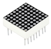 |  |  |
| 8*8 dot matrix module *1                                     | 220Ω Resistor*8                                              | Jumper Wire*2                                                |

### 3.Component Knowledge

**8\*8 dot matrix module：**

The 8\*8 dot matrix is composed of 64 LEDs, including row common anode and row common cathode. Our module is row common anode, that is, each row has a line connecting the positive pole of the LED, and the column is connecting the negative pole of the LED lamp, as shown in the following figure :

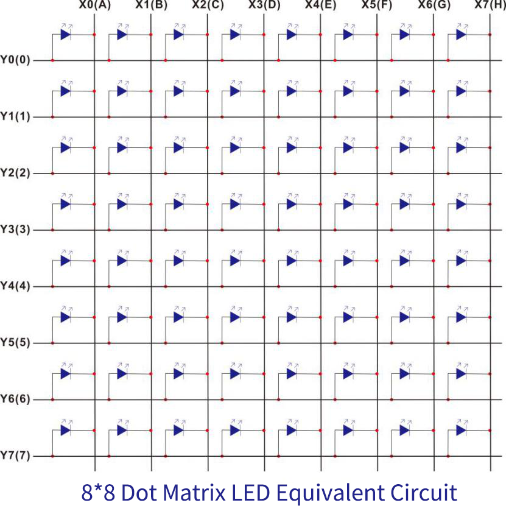


### 4.Wiring Diagram

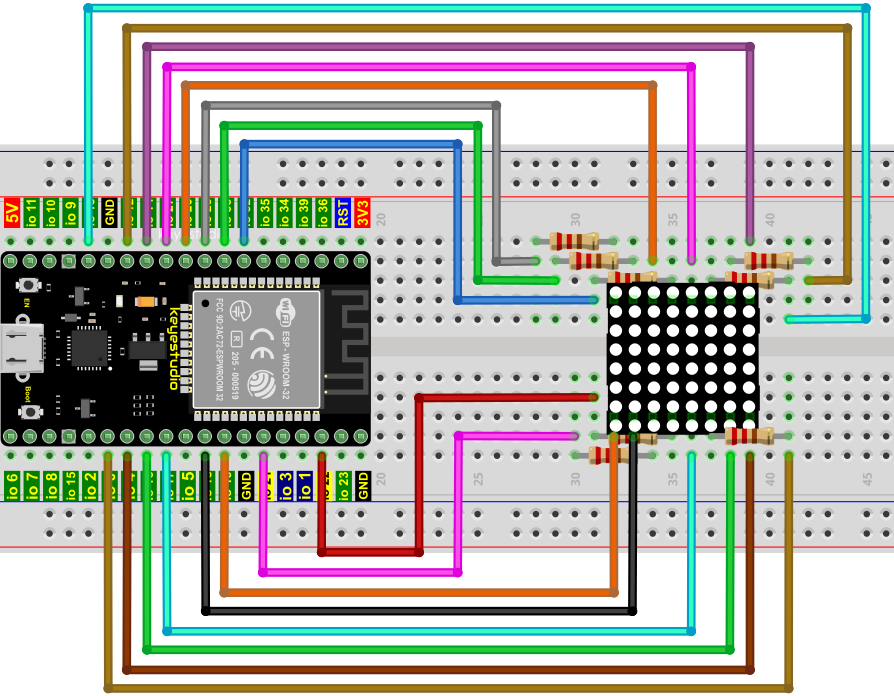

### 5.Test Code

```c
//**********************************************************************************
/* 
 * Filename    : 8×8 Dot-matrix Display
 * Description : 8×8 Dot-matrix displays numbers from 0 to 9.
 * Auther      : http//www.keyestudio.com
*/
int R[] = {14,26,4,27,19,16,18,17};
int C[] = {32,21,22,12,0,13,33,25};

unsigned char data_0[8][8] =
{
{0,0,1,1,1,0,0,0},
{0,1,0,0,0,1,0,0},
{0,1,0,0,0,1,0,0},
{0,1,0,0,0,1,0,0},
{0,1,0,0,0,1,0,0},
{0,1,0,0,0,1,0,0},
{0,1,0,0,0,1,0,0},
{0,0,1,1,1,0,0,0}
};

unsigned char data_1[8][8] =
{
{0,0,0,0,1,0,0,0},
{0,0,0,1,1,0,0,0},
{0,0,0,0,1,0,0,0},
{0,0,0,0,1,0,0,0},
{0,0,0,0,1,0,0,0},
{0,0,0,0,1,0,0,0},
{0,0,0,0,1,0,0,0},
{0,0,0,1,1,1,0,0}
};

unsigned char data_2[8][8] =
{
{0,0,1,1,1,0,0,0},
{0,1,0,0,0,1,0,0},
{0,0,0,0,0,1,0,0},
{0,0,0,0,1,0,0,0},
{0,0,0,1,0,0,0,0},
{0,0,1,0,0,0,0,0},
{0,1,1,1,1,1,0,0},
{0,0,0,0,0,0,0,0}
};

unsigned char data_3[8][8] =
{
{0,0,1,1,1,1,0,0},
{0,0,0,0,0,1,0,0},
{0,0,0,0,0,1,0,0},
{0,0,1,1,1,1,0,0},
{0,0,0,0,0,1,0,0},
{0,0,0,0,0,1,0,0},
{0,0,1,1,1,1,0,0},
{0,0,0,0,0,0,0,0}
};

unsigned char data_4[8][8] =
{
{0,1,0,0,0,0,0,0},
{0,1,0,0,1,0,0,0},
{0,1,0,0,1,0,0,0},
{0,1,1,1,1,1,1,0},
{0,0,0,0,1,0,0,0},
{0,0,0,0,1,0,0,0},
{0,0,0,0,1,0,0,0},
{0,0,0,0,0,0,0,0}
};

unsigned char data_5[8][8] =
{
{0,1,0,0,0,0,0,0},
{0,1,1,1,1,1,0,0},
{0,1,0,0,0,0,0,0},
{0,1,1,1,1,1,0,0},
{0,0,0,0,0,1,0,0},
{0,0,0,0,0,1,0,0},
{0,1,1,1,1,1,0,0},
{0,0,0,0,0,0,0,0}
};

unsigned char data_6[8][8] =
{
{0,1,1,1,1,1,0,0},
{0,1,0,0,0,0,0,0},
{0,1,0,0,0,0,0,0},
{0,1,1,1,1,1,0,0},
{0,1,0,0,0,1,0,0},
{0,1,0,0,0,1,0,0},
{0,1,1,1,1,1,0,0},
{0,0,0,0,0,0,0,0}
};

unsigned char data_7[8][8] =
{
{0,0,0,0,0,0,0,0},
{0,1,1,1,1,1,0,0},
{0,0,0,0,0,1,0,0},
{0,0,0,0,1,0,0,0},
{0,0,0,1,0,0,0,0},
{0,0,1,0,0,0,0,0},
{0,1,0,0,0,0,0,0},
{0,0,0,0,0,0,0,0}
};

unsigned char data_8[8][8] =
{
{0,1,1,1,1,1,0,0},
{0,1,0,0,0,1,0,0},
{0,1,0,0,0,1,0,0},
{0,1,1,1,1,1,0,0},
{0,1,0,0,0,1,0,0},
{0,1,0,0,0,1,0,0},
{0,1,1,1,1,1,0,0},
{0,0,0,0,0,0,0,0}
};

unsigned char data_9[8][8] =
{
{0,1,1,1,1,1,0,0},
{0,1,0,0,0,1,0,0},
{0,1,0,0,0,1,0,0},
{0,1,1,1,1,1,0,0},
{0,0,0,0,0,1,0,0},
{0,0,0,0,0,1,0,0},
{0,1,1,1,1,1,0,0},
{0,0,0,0,0,0,0,0}
};

void Display(unsigned char dat[8][8])
{
for(int c = 0; c<8;c++)
{
digitalWrite(C[c],LOW);
for(int r = 0;r<8;r++)
{
digitalWrite(R[r],dat[r][c]);
}
delay(1);
Clear();
}
}

void Clear()
{
for(int i = 0;i<8;i++)
{
digitalWrite(R[i],LOW);
digitalWrite(C[i],HIGH);
}
}

void setup(){
  for(int i = 0;i<8;i++)
  {
    pinMode(R[i],OUTPUT);
    pinMode(C[i],OUTPUT);
  }

}

void loop(){
  for (int i = 1; i <= 100; i = i + (1)) {
    Display(data_0);
  }
  for (int i = 1; i <= 100; i = i + (1)) {
    Display(data_1);
  }
  for (int i = 1; i <= 100; i = i + (1)) {
    Display(data_2);
  }
  for (int i = 1; i <= 100; i = i + (1)) {
    Display(data_3);
  }
  for (int i = 1; i <= 100; i = i + (1)) {
    Display(data_4);
  }
  for (int i = 1; i <= 100; i = i + (1)) {
    Display(data_5);
  }
  for (int i = 1; i <= 100; i = i + (1)) {
    Display(data_6);
  }
  for (int i = 1; i <= 100; i = i + (1)) {
    Display(data_7);
  }
  for (int i = 1; i <= 100; i = i + (1)) {
    Display(data_8);
  }
  for (int i = 1; i <= 100; i = i + (1)) {
    Display(data_9);
  }
}
//**********************************************************************************
```

### 6.Test Result

Compile and upload the code to ESP32, after the code is uploaded successfully, power up with a USB cable and you will see that the 8\*8 dot matrix displays the numbers 0\~9 respectively.


## Project 11：74HC595N Control 8 LEDs 

### 1.Introduction

In previous projects, we learned how to light up an LED.

With only 32 IO ports on ESP32, how do we light up a lot of leds? Sometimes it is possible to run out of pins on the ESP32, and you need to extend it with the shift register.You can use the 74HC595N chip to control 8 outputs at a time, taking up only a few pins on your microcontroller. In addition, you can also connect multiple registers together to further expand the output. 

In this project, we will use an ESP32，a 74HC595 chip and LEDs to make a flowing water light to understand the function of the 74HC595 chip.

### 2.Components

|  | 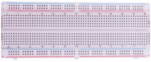 |  |  |
| ------------------------------------------------------------ | ------------------------------------------------------------ | ------------------------------------------------------------ | ------------------------------------------------------------ |
| ESP32*1                                                      | Breadboard*1                                                 | 74HC595N chip*1                                              | Jumper Wires                                                 |
|  |  |  |                                                              |
| 220Ω Resistor*8                                              | Red LED*8                                                    | USB Cable*1                                                  |                                                              |


### 3.Component Knowledge


**74HC595N Chip:** 

The 74HC595 chip is used to convert serial data into parallel data. A 74HC595 chip can convert the serial data of one byte into 8 bits, and send its corresponding level to each of the 8 ports correspondingly. With this characteristic, the 74HC595 chip can be used to expand the IO ports of an ESP32. At least 3 ports are required to control the 8 ports of the 74HC595 chip.


The ports of the 74HC595 chip are described as follows ：

<table border="1">
<tbody>
<tr class="odd">
<td>Pin 13--OE</td>
<td>Enable output, which is used to ensure that latch data is input to pins Q0-Q7. It does not output high level at low level. In this project, we will connect GND directly and keep the output data at low level.</td>
</tr>
<tr class="even">
<td>Pin 14---SI</td>
<td>This is the 74HC595 pin that receives data, namely the serial data input end, can input one bit at a time, so the continuously input 8 times can form a byte. </td>
</tr>
<tr class="odd">
<td>Pin 10---SCLR</td>
<td>Remove shift register: When this pin is in low level, the content in shift register will be cleared.. In this experiment, we connect VCC to maintain a high level.</td>
</tr>
<tr class="even">
<td>Pin 11---SCK</td>
<td>Serial shift clock: when its electrical level is rising, serial data input register will do a shift.</td>
</tr>
<tr class="odd">
<td>Pin 12---RCK</td>
<td>Parallel Update Output: when its electrical level is rising, it will update the parallel data output. In this case, the data is output from ports Q0 to Q7 in parallel</td>
</tr>
<tr class="even">
<td>Pin 9---SQH</td>
<td>Serial data output: it can be connected to more 74HC595 in series.</td>
</tr>
<tr class="odd">
<td>Q0--Q7(Pin 15，Pin 1-7)</td>
<td>Parallel data output, can directly control the 8 segments of the digital tube.</td>
</tr>
</tbody>
</table>
### 4.Wiring Diagram

Note: Note the orientation the 74HC595N chip is inserted.


### 5.Test Code

```c
//**********************************************************************
/* 
 * Filename    : 74HC595N Control 8 LEDs
 * Description : Use 74HC575N to drive ten leds to display the flowing light.
 * Auther      : http//www.keyestudio.com
*/
int dataPin = 14;   // Pin connected to DS of 74HC595(Pin14)  
int latchPin = 12;  // Pin connected to ST_CP of 74HC595(Pin12)
int clockPin = 13;  // Pin connected to SH_CP of 74HC595(Pin11)          
void setup() {
  // set pins to output
  pinMode(latchPin, OUTPUT);
  pinMode(clockPin, OUTPUT);
  pinMode(dataPin, OUTPUT);
}

void loop() {
  // Define a one-byte variable to use the 8 bits to represent the state of 8 LEDs of LED bar graph.
  // This variable is assigned to 0x01, that is binary 00000001, which indicates only one LED light on.
  byte x = 0x01;    // 0b 0000 0001
  for (int j = 0; j < 8; j++) { // Let led light up from right to left
    writeTo595(LSBFIRST, x);
    x <<= 1; // make the variable move one bit to left once, then the bright LED move one step to the left once.
    delay(50);
  }
  delay(100);
  x = 0x80;       //0b 1000 0000
  for (int j = 0; j < 8; j++) { // Let led light up from left to right
    writeTo595(LSBFIRST, x);
    x >>= 1;    
    delay(50);
  }
  delay(100);
}
void writeTo595(int order, byte _data ) {
  // Output low level to latchPin
  digitalWrite(latchPin, LOW);
  // Send serial data to 74HC595
  shiftOut(dataPin, clockPin, order, _data);
  // Output high level to latchPin, and 74HC595 will update the data to the parallel output port.
  digitalWrite(latchPin, HIGH);
}
//**********************************************************************************
```


​    
### 6.Test Result

Compile and upload the code to ESP32, after the code is uploaded successfully, power up with a USB cable and you will see that the 8 LEDs start flashing in flowing water mode.

## Project 12：Active Buzzer

### 1.Introduction

Active buzzer is a sound component that is widely used as a sound component for computers、printers、alarms、electronic toys and phones、timers etc. It has an internal vibration source, just by connecting to a 5V power supply, it can continuously buzz. 

In this project, we will use ESP32 to control the active buzzer to beep.

### 2.Components

|  | 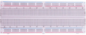 |  |                                                              |
| ------------------------------------------------------------ | ------------------------------------------------------------ | ------------------------------------------------------------ | ------------------------------------------------------------ |
| ESP32*1                                                      | Breadboard*1                                                 | Active buzzer*1                                              |                                                              |
|  |  |  |  |
| NPN Transistor(S8050)*1                                      | 1kΩ Resistor*1                                               | Jumper Wires                                                 | USB Cable*1                                                  |


### 3.Component Knowledge


**Active buzzer:** 

Active buzzer inside has a simple oscillator circuit, which can convert constant direct current into a certain frequency pulse signal. Once active buzzer receives a high level, it will produce sound. 

Passive buzzer is an internal without vibration source integrated electronic buzzer, it must be driven by 2k to 5k square wave, rather than a DC signal. 

The two buzzers are very similar in appearance, but one buzzer with a green circuit board is a passive buzzer, while the other buzzer with black tape is an active buzzer. 

Passive buzzers don't have positive polarity, but active buzzers have. As shown below:


**Transistor:**


Because the buzzer requires such large current that GPIO of ESP32 output capability cannot meet the requirement, a transistor of NPN type is needed here to amplify the current.

Transistor, the full name: semiconductor transistor, is a semiconductor device that controls current. Transistorcan be used to amplify weak signal, or works as a switch. It has three electrodes(PINs): base (b), collector (c) and emitter (e). When there is current passing between "be", "ce" will allow several-fold current (transistor magnification) pass, at this point, transistor works in the amplifying area. When current between "be" exceeds a certain value, "ce" will not allow current to increase any longer, at this point, transistor works in the saturation area. Transistor has two types as shown below: PNP and NPN,


**PNP transistor NPN transistor**

In our kit, the PNP transistor is marked with 8550, and the NPN transistor is marked with 8050.

Based on the transistor's characteristics, it is often used as a switch in digital circuits. As micro-controller's capacity to output current is very weak, we will use transistor to amplify current and drive large-current components.

When using NPN transistor to drive buzzer, we often adopt the following method. If GPIO outputs high level, current will flow through R1, the transistor will get conducted, and the buzzer will sound. If GPIO outputs low level, no current flows through R1, the transistor will not be conducted, and buzzer will not sound.

When using PNP transistor to drive buzzer, we often adopt the following method. If GPIO outputs low level, current will flow through R1, the transistor will get conducted, and the buzzer will sound. If GPIO outputs high level, no current flows through R1, the transistor will not be conducted, and buzzer will not sound.


### 4.Wiring Diagram


Note: The buzzer power supply in this circuit is 5V. On a 3.3V power supply, the buzzer can work, but it will reduce the loudness.

### 5.Test Code

```c
//**********************************************************************
/* 
 * Filename    : Active Buzzer
 * Description : Active buzzer beeps.
 * Auther      : http//www.keyestudio.com
*/
#define buzzerPin  15   //define buzzer pins

void setup ()
{
  pinMode (buzzerPin, OUTPUT);
}
void loop ()
{
  digitalWrite (buzzerPin, HIGH);
  delay (500);
  digitalWrite (buzzerPin, LOW);
  delay (500);
}
//**********************************************************************************
```

### 6.Test Result

Compile and upload the code to ESP32, after the code is uploaded successfully, power up with a USB cable and you will see that the active buzzer beeps.


## Project 13：Passive Buzzer

### 1.Introduction

In a previous project, we studied an active buzzer, which can only make a sound and may make you feel very monotonous. In this project, we will learn a passive buzzer and use the ESP32 control it to work. Unlike the active buzzer, the passive buzzer can emit sounds of different frequencies.

### 2.Components

|  |  |  |                                                              |
| ------------------------------------------------------------ | ------------------------------------------------------------ | ------------------------------------------------------------ | ------------------------------------------------------------ |
| ESP32*1                                                      | Breadboard*1                                                 | Passive Buzzer *1                                            |                                                              |
|  |  |  | 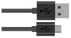 |
| NPN Transistor(S8050)*1                                      | 1kΩResistor*1                                                | Jumper Wires                                                 | USB Cable*1                                                  |


### 3.Component Knowledge

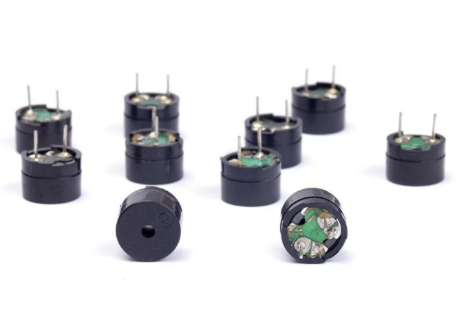

**Passive buzzer:** 

A passive buzzer is an integrated electronic buzzer with no internal vibration source and it has to be driven by 2K-5K square waves, not DC signals. 

The two buzzers are very similar in appearance, but one buzzer with a green circuit board is a passive buzzer and the other buzzer with black tape is an active buzzer. 

Passive buzzers cannot distinguish between positive polarity while active buzzers can.


**Transistor:** 

Please refer to Project 12.

### 4.Wiring Diagram

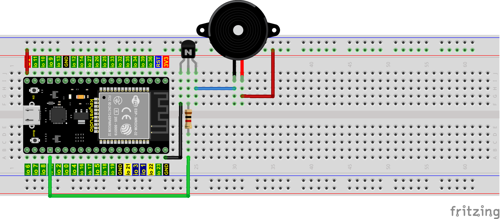

### 5.Test Code

```c
//**********************************************************************
/*
 * Filename    : Passive Buzzer
 * Description : Passive Buzzer sounds the alarm.
 * Auther      : http//www.keyestudio.com
*/
#define LEDC_CHANNEL_0 0

// LEDC timer uses 13 bit accuracy

#define LEDC_TIMER_13_BIT  13

// Define tool I/O ports

#define BUZZER_PIN  15

//Create a musical melody list, Super Mario

int melody[] = {330, 330, 330, 262, 330, 392, 196, 262, 196, 165, 220, 247, 233, 220, 196, 330, 392, 440, 349, 392, 330, 262, 294, 247, 262, 196, 165, 220, 247, 233, 220, 196, 330, 392,440, 349, 392, 330, 262, 294, 247, 392, 370, 330, 311, 330, 208, 220, 262, 220, 262,

294, 392, 370, 330, 311, 330, 523, 523, 523, 392, 370, 330, 311, 330, 208, 220, 262,220, 262, 294, 311, 294, 262, 262, 262, 262, 262, 294, 330, 262, 220, 196, 262, 262,262, 262, 294, 330, 262, 262, 262, 262, 294, 330, 262, 220, 196};

//Create a list of tone durations

int noteDurations[] = {8,4,4,8,4,2,2,3,3,3,4,4,8,4,8,8,8,4,8,4,3,8,8,3,3,3,3,4,4,8,4,8,8,8,4,8,4,3,8,8,2,8,8,8,4,4,8,8,4,8,8,3,8,8,8,4,4,4,8,2,8,8,8,4,4,8,8,4,8,8,3,3,3,1,8,4,4,8,4,8,4,8,2,8,4,4,8,4,1,8,4,4,8,4,8,4,8,2};
void setup() {
pinMode(BUZZER_PIN, OUTPUT); // Set the buzzer to output mode
}

void loop() {

  int noteDuration; //Create a variable of noteDuration

  for (int i = 0; i < sizeof(noteDurations); ++i)

  {
      noteDuration = 800/noteDurations[i];

      ledcSetup(LEDC_CHANNEL_0, melody[i]*2, LEDC_TIMER_13_BIT);

      ledcAttachPin(BUZZER_PIN, LEDC_CHANNEL_0);

      ledcWrite(LEDC_CHANNEL_0, 50);

      delay(noteDuration * 1.30); //delay
  }
}
//**********************************************************************
```

### 6.Test Result

Compile and upload the code to ESP32, after the code is uploaded successfully, power up with a USB cable and you will see that the passive buzzer plays music.

## Project 14: Mini Table Lamp

### 1.Introduction

Do you know that the ESP32 can light up an LED when you press a button? In this project, we will use a ESP32、a button switch and an LED to make a mini table lamp.

### 2.Components

|  |  |  |  |                                                              |
| ------------------------------------------------------------ | ------------------------------------------------------------ | ------------------------------------------------------------ | ------------------------------------------------------------ | ------------------------------------------------------------ |
| ESP32*1                                                      | Breadboard*1                                                 | Button*1                                                     | Button Cap*1                                                 |                                                              |
|  |  |  |  |  |
| 10KΩ Resistor*1                                              | Red LED*1                                                    | 22Ω Resistor*1                                               | USB Cable*1                                                  | Jumper Wires                                                 |


### 3.Component Knowledge


#### **Button:** 

A button can control the circuit on and off, the button is plugged into a circuit, the circuit is disconnected when the button is not pressed. The circuit works when you press the button, but breaks again when you release it. 

Why does it only work when you press it? It starts from the internal structure of the button, which don’t allow current to travel from one end of the button to the other before it is pressed; When pressed, a metal strip inside the button connects the two sides to allow electricity to pass through.

The internal structure of the button is shown in the figure：

. 

Before the button is pressed, 1 and 2 are on, 3 and 4 are also on, but 1, 3 or 1, 4 or 2, 3 or 2, 4 are off (not working). Only when the button is pressed, 1, 3 or 1, 4 or 2, 3 or 2, 4 are on.

The button switch is one of the most commonly used components in circuit design.

#### **Schematic diagram of the button:**

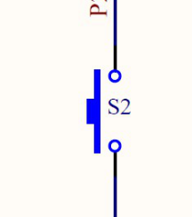

#### **What is button** **[shake](javascript:;)?**

We think of the switch circuit as "press the button and turn it on immediately", "press it again and turn it off immediately". In fact, this is not the case.

The button usually uses a mechanical elastic switch, and the mechanical elastic switch will produce a series of [shake](javascript:;) due to the elastic action at the moment when the mechanical contact is opened and closed (usually about 10ms). 

As a result, the button switch will not immediately and stably turn on the circuit when it is closed, and it will not be completely and instantaneously disconnected when it is turned off.

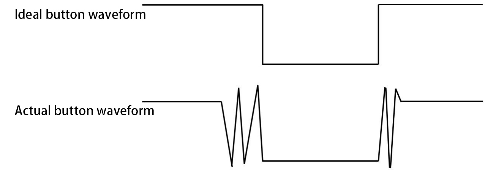

#### **How to eliminate the** **[shake](javascript:;)?**

There are two common methods, namely fix [shake](javascript:;) in the software and hardware. We only discuss the [shake](javascript:;) removal in the software.

We already know that the [shake](javascript:;) time generated by elasticity is about 10ms, and the delay command can be used to delay the execution time of the command to achieve the effect of [shake](javascript:;) removal.

Therefore, we delay 0.02s in the code to achieve the key anti-shake function.


### 4.Wiring Diagram


**Note:**

How to connect the LED


How to identify the 220Ω 5-band resistor and 10KΩ 5-band resistor


### 5.Test code

```c
//**********************************************************************
/* 
 * Filename    : Mini Table Lamp
 * Description : Make a table lamp.
 * Auther      : http//www.keyestudio.com
*/
#define PIN_LED    4
#define PIN_BUTTON 15
bool ledState = false;

void setup() {
  // initialize digital pin PIN_LED as an output.
  pinMode(PIN_LED, OUTPUT);
  pinMode(PIN_BUTTON, INPUT);
}

// the loop function runs over and over again forever
void loop() {
  if (digitalRead(PIN_BUTTON) == LOW) {
    delay(20);
    if (digitalRead(PIN_BUTTON) == LOW) {
      reverseGPIO(PIN_LED);
    }
    while (digitalRead(PIN_BUTTON) == LOW);
  }
}

void reverseGPIO(int pin) {
  ledState = !ledState;
  digitalWrite(pin, ledState);
}
//**********************************************************************
```

### 6.Test Result

Compile and upload the code to ESP32, after the code is uploaded successfully, power up with a USB cable and you will see that press the push button switch, the LED turns on; When it is released, the LED is still on. Press it again, and the LED turns off. When it is released, the LED stays off. Doesn't it look like a mini table lamp?

## Project 15：Tilt and LED

### 1.Introduction

The ancients without electronic clock, so the hourglass are invented to measure time. The hourglass has a large capacity on both sides, and which is filled with fine sand on one side. 

What’s more, there is a small channel in the middle, which can make the hourglass stand upright , the side with fine sand is on the top. due to the effect of gravity,the fine sand will flow down through the channel to the other side of the hourglass.

When the sand reaches the bottom, turn it upside down and record the number of times it has gone through the hourglass, therefore, the next day we can know the approximate time of the day by it. 

In this project, we will use ESP32 to control the tilt switch and LED lights to simulate an hourglass to make an electronic hourglass.

### 2.Components

|  |  |  |  |
| ------------------------------------------------------------ | ------------------------------------------------------------ | ------------------------------------------------------------ | ------------------------------------------------------------ |
| ESP32*1                                                      | Tilt Switch*1                                                | Red LED*4                                                    | 10KΩ Resistor*1                                              |
|  |  |  |  |
| Breadboard*1                                                 | 220Ω Resistor*4                                              | USB Cable*1                                                  | Jumper Wires                                                 |


### 3.Component Knowledge


Tilt switch is also called digital switch. Inside is a metal ball that can roll. 

The principle of rolling the metal ball to contact with the conductive plate at the bottom, which is used to control the on and off of the circuit. When it is a rolling ball tilt sensing switch with single directional trigger, the tilt sensor is tilted toward the trigger end (two gold-plated pin ends), the tilt switch is in a closed circuit and the voltage at the analog port is about 5V(binary number is 1023).

In this way, the LED will light up. When the tilting switch is in horizontal position or tilting to the other end, the tilting switch is in open state the voltage of the analog port is about 0V (binary number is 0), the LED will turn off. In the program, we judge the state of the switch based on whether the voltage value of the analog port is greater than 2.5V (binary number is 512).

The internal structure of the tilt switch is used here to illustrate how it works, as shown below:


### 4.Wiring Diagram

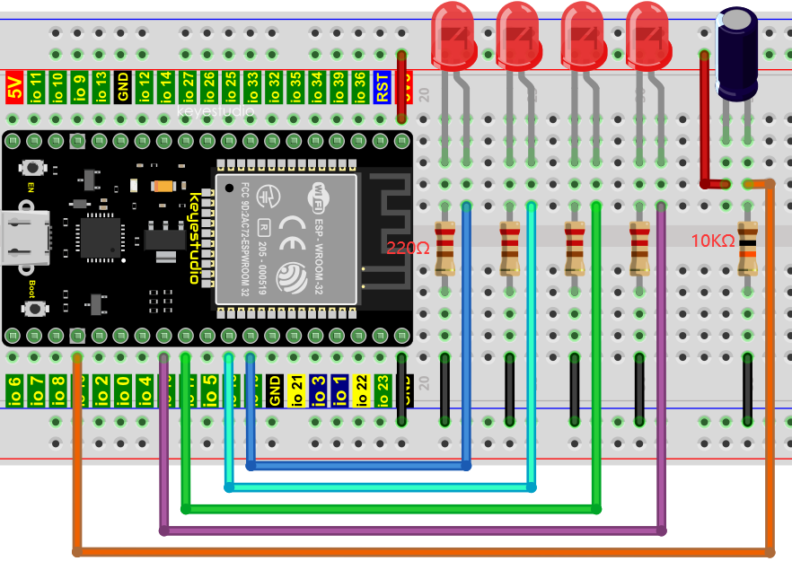

**Note:**

How to connect the LED


How to identify the 220Ω 5-band resistor and 10KΩ 5-band resistor


### 5.Test Code

```c
//**********************************************************************
/* 
 * Filename    : Tilt And LED
 * Description : Tilt switches and four leds to simulate an hourglass.
 * Auther      : http//www.keyestudio.com
*/
#define SWITCH_PIN  15  // the tilt switch is connected to Pin15
byte switch_state = 0;
void setup()
{
     for(int i=16;i<20;i++)
  {
        pinMode(i, OUTPUT);
  } 
    pinMode(SWITCH_PIN, INPUT);
 for(int i=16;i<20;i++)
  {
    digitalWrite(i,0);
  } 
  Serial.begin(9600);
}
void loop()
{
switch_state = digitalRead(SWITCH_PIN); 
Serial.println(switch_state);
 if (switch_state == 0) 
 {
 for(int i=16;i<20;i++)
  {
    digitalWrite(i,1);
    delay(500);
  } 
  }
   if (switch_state == 1) 
 {
   for(int i=19;i>15;i--)
   {
    digitalWrite(i,0);
    delay(500);
   }
  }
}
//**********************************************************************************
```

### 6.Test Result

Compile and upload the code to ESP32, after the code is uploaded successfully, power up with a USB cable and you will see that when you tilt the breadboard to an angle, the LEDs will light up one by one. When you turn the breadboard to the original angle, the LEDs will turn off one by one. Like the hourglass, the sand will leak out over time.

## Project 16: I2C 128×32 LCD

### 1.Introduction

In everyday life, we can do all kinds of experiments with the display module and also DIY a variety of small objects. 

For example, you can make a temperature meter with a temperature sensor and display, or make a distance meter with an ultrasonic module and display. 

In this project, we will use the LCD\_128X32\_DOT module as the display and connect it to the ESP32, which will be used to control the LCD\_128X32\_DOT display to display various English words, common symbols and numbers.

### 2.Components

|  |  |                                                              |
| ------------------------------------------------------------ | ------------------------------------------------------------ | ------------------------------------------------------------ |
| ESP32*1                                                      | Breadboard*1                                                 |                                                              |
| 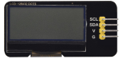 |  |  |
| LCD_128X32_DOT*1                                             | M-F Dupont Wires                                             | USB Cable*1                                                  |


### 3.Component Knowledge


#### **LCD\_128X32\_DOT:** 

It is an LCD module with 128\*32 pixels and its driver chip is ST7567A. 

The module uses the IIC communication mode, while the code contains a library of all alphabets and common symbols that can be called directly. When using, we can also set it in the code so that the English letters and symbols show different text sizes. 

To make it easy to set up the pattern display, we also provide a mold capture software that converts a specific pattern into control code and then copies it directly into the test code for use.

#### **Schematic diagram of LCD\_128X32\_DOT**


#### **Features:**

- Pixel: 128\*32 character

- Operating voltage(chip)：4.5V to 5.5V

- Operating current：100mA (5.0V)

- Optimal operating voltage(module):5.0V


### 4.Wiring Diagram

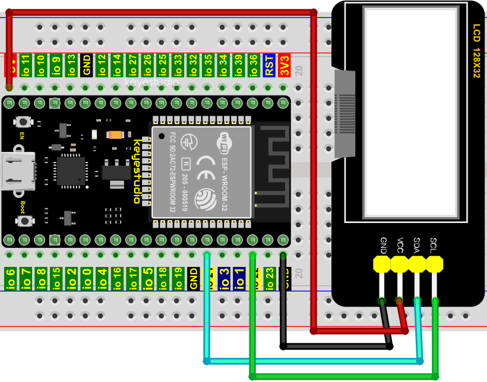

### 5.Adding the lcd128\_32\_io library

This code uses a library named "**lcd128\_32\_io**", if you haven't installed it yet, please do so before learning. The steps to add
third-party libraries are as follows:

Open the Arduino IDE，click “Sketch”→“Include Library”→“Add .ZIP Library...”. 

Click on the link to download the library file：[Arduino C “lcd128_32_io.h” Librarie](./Arduino-Librarie.zip)

Select the **LCD\_128X32.ZIP** file and then click“Open”.


### 6.Test Code

```c
//**********************************************************************************
/*
 * Filename    : LCD 128*32
 * Description : LCD 128*32 display string
 * Auther      : http//www.keyestudio.com
*/
#include "lcd128_32_io.h"

//Create lCD128 *32 pin，sda--->21， scl--->22
lcd lcd(21, 22);

void setup() {
  lcd.Init(); //initialize
  lcd.Clear();  //clear
}

void loop() {
  lcd.Cursor(0, 4); //Set display position
  lcd.Display("KEYESTUDIO"); //Setting the display
  lcd.Cursor(1, 0);
  lcd.Display("ABCDEFGHIJKLMNOPQR");
  lcd.Cursor(2, 0);
  lcd.Display("123456789+-*/<>=$@");
  lcd.Cursor(3, 0);
  lcd.Display("%^&(){}:;'|?,.~\\[]");
}
//**********************************************************************************
```

### 7.Test Result

Compile and upload the code to ESP32, after the code is uploaded successfully, power up with a USB cable and you will see that the 128X32LCD module display will show“KEYESTUDIO”at the first line，“ABCDEFGHIJKLMNOPQR”will be displayed at the second line，“123456789+-\*/\<\>=$@”will be shown at the third line and“%^&(){}:;'|?,.\~\\\\\[\]”will be displayed at the fourth line.

## Project 17：Small Fan

### 1.Introduction

In hot summer, we need electric fans to cool us down, so in this project, we will use the ESP32 to control a DC motor and small fan blades to make a small electric fan.

### 2.Components

| 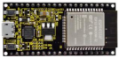 | 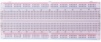 |  | 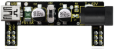 |
| ------------------------------------------------------------ | ------------------------------------------------------------ | ------------------------------------------------------------ | ------------------------------------------------------------ |
| ESP32*1                                                      | Breadboard*1                                                 | 6 AA Battery Holder*1                                        | Breadboard Power Module*1                                    |
| 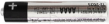 |  |  |  |
| AA Battery(Self-prepared)*6                                  | Fan*1                                                        | DC Motor*1                                                   | NPN Transistor (S8050)*1                                     |
|  |  |  |  |
| PNP Transistor (S8550)*1                                     | 1KΩ Resistor*1                                               | Jumper Wire                                                  | Diode*1                                                      |
| USB Cable*1 |                                                              |                                                              |                                                              |


### 3.Component Knowledge

#### **Keyestudio Breadboard Power Supply Module**


#### **Introduction**

This breadboard power supply module is compatible with 5V and 3.3V, which can be applied to MB102 breadboard. The module contains two channels of independent control, powered by the USB all the way.

The output voltage is constant for the DC5V, and another way is powered by DC 7-12V, output controlled by the slide switch, respectively for DC5V and DC3.3V.

If the other power supply is DC 7-12v, when the slide switch is switched to +5V, the output voltages of the left and right lines of the module are DC 5V. When the slide switch is switched to +3V, the output voltage of the USB power supply terminal of the module is DC5V , and the output voltage of the DC 7-12V power supply terminal of the other power supply is DC3.3V.

#### **Specification**

- Applied to MB102 breadboard
- Input voltage：DC 7-12V or powered by USB
- Output voltage：3.3V or 5V
- Max output current：\<700mA
- Up and down two channels of independent control, one of which can be switched to 3.3V or 5V
- Comes with two sets of DC output pins, easy for external use


### 4.Wiring Diagram 1


(Note: Connect the wires and then install a small fan blade on the DC motor. )

### **5. Test Code**

```c
//**********************************************************************
/* 
 * Filename    : Small_Fan
 * Description : S8050 triode drives the motor working
 * Auther      : http//www.keyestudio.com
*/

void setup() {
  
  pinMode(15, OUTPUT); // Initialize pin 15 as output.
}

void loop() {
  digitalWrite(15, HIGH);   // Turn on the motor (HIGH means HIGH level)
  delay(4000);              // Delay 4 seconds
  digitalWrite(15, LOW);    // Reduce the voltage and turn off the motor
  delay(2000);              // Delay 2 seconds
}
//**********************************************************************************
```

### 6.Test Result 1

Upload the code to the ESP32 and power up. The motor rotates for 4s, stops for 2s, in loop way.

### 7.Wiring Diagram 2

We use the S8550 PNP transistor to control the motor.


Note: wire up and connect a fan on the motor.

### 8.Test Code 2

```c
//**********************************************************************
/* 
 * Filename    : Small_Fan
 * Description : S8550 triode drives the motor working
 * Auther      : http//www.keyestudio.com
*/

void setup() {
  
  pinMode(15, OUTPUT); // Initialize pin 15 as output.
}

void loop() {
  digitalWrite(15, LOW);   // Turn on the motor (LOW means LOW level)
  delay(4000);              // Delay 4 seconds
  digitalWrite(15, HIGH);    // Raise the voltage and turn off the motor
  delay(2000);              // Delay 2 seconds
}
//**********************************************************************************
```

### 9.Test Result 2

Upload the code to the ESP32 and power up. The motor rotates for 4s, stops for 2s, in loop way.


## Project 18：Dimming Light

### 1.Introduction

A potentiometer is a three-terminal resistor with sliding or rotating contacts that forms an adjustable voltage divider. It works by changing the position of the sliding contacts across a uniform resistance. 

In the potentiometer, the entire input voltage is applied across the whole length of the resistor, and the output voltage is the voltage drop between the fixed and sliding contact.

In this project, we will learn how to use ESP32 to read the values of the potentiometer, and make a dimming lamp with LED.

### 2.Components

|  |  |  |  |
| ------------------------------------------------------------ | ------------------------------------------------------------ | ------------------------------------------------------------ | ------------------------------------------------------------ |
| ESP32*1                                                      | Breadboard*1                                                 | Potentiometer*1                                              | Red LED*1                                                    |
|  | 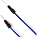 |  |                                                              |
| 220ΩResistor*1                                               | Jumper Wires                                                 | USB Cable*1                                                  |                                                              |


### 3.Component Knowledge


#### **Adjustable potentiometer:** 

It is a kind of resistor and an analog electronic component, which has two states of 0 and 1(high level and low level). The analog quantity is different, its data state presents a linear state such as 1 \~ 1024.

#### **ADC :** 

An ADC is an electronic integrated circuit used to convert analog signals such as voltages to digital or binary form consisting of 1s and 0s. 

The range of our ADC on ESP32 is 12 bits, that means the resolution is 2^12=4096, and it represents a range (at 3.3V) will be divided equally to 4096 parts. The rage of analog values corresponds to ADC values. So the more bits the ADC has, the denser the partition of analog will be and the greater the precision of the resulting conversion.


Subsection 1: the analog in rang of 0V---3.3/4095 V corresponds to digital 0;

Subsection 2: the analog in rang of 3.3/4095 V---2\*3.3 /4095V corresponds to digital 1;

…

The following analog will be divided accordingly.

The conversion formula is as follows:


#### **DAC：**

The reversing of this process requires a DAC, Digital-to-Analog Converter. The digital I/O port can output high level and low level (0 or 1), but cannot output an intermediate voltage value. This is where a DAC is useful. ESP32 has two DAC output pins with 8-bit accuracy, GPIO25 and GPIO26, which can divide VCC (here is 3.3V) into 2^8=256 parts. 

For example, when the digital quantity is 1, the output voltage value is 3.3/256 \*1 V, and when the digital quantity is 128, the output voltage value is 3.3/256 *128=1.65V, the higher the accuracy of DAC, the higher the accuracy of output voltage value will be.

The conversion formula is as follows:


#### **ADC on ESP32：**

ESP32 has 16 pins can be used to measure analog signals. GPIO pin sequence number and analog pin definition are shown in the following table：

<table border="1">
<tbody>
<tr class="odd">
<td><strong>ADC number in ESP32</strong></td>
<td><strong>ESP32 GPIO number</strong></td>
</tr>
<tr class="even">
<td><strong>ADC0</strong></td>
<td><strong>GPIO 36</strong></td>
</tr>
<tr class="odd">
<td><strong>ADC3</strong></td>
<td><strong>GPIO 39</strong></td>
</tr>
<tr class="even">
<td><strong>ADC4</strong></td>
<td><strong>GPIO 32</strong></td>
</tr>
<tr class="odd">
<td><strong>ADC5</strong></td>
<td><strong>GPIO33</strong></td>
</tr>
<tr class="even">
<td><strong>ADC6</strong></td>
<td><strong>GPIO34</strong></td>
</tr>
<tr class="odd">
<td><strong>ADC7</strong></td>
<td><strong>GPIO 35</strong></td>
</tr>
<tr class="even">
<td><strong>ADC10</strong></td>
<td><strong>GPIO 4</strong></td>
</tr>
<tr class="odd">
<td><strong>ADC11</strong></td>
<td><strong>GPIO0</strong></td>
</tr>
<tr class="even">
<td><strong>ADC12</strong></td>
<td><strong>GPIO2</strong></td>
</tr>
<tr class="odd">
<td><strong>ADC13</strong></td>
<td><strong>GPIO15</strong></td>
</tr>
<tr class="even">
<td><strong>ADC14</strong></td>
<td><strong>GPIO13</strong></td>
</tr>
<tr class="odd">
<td><strong>ADC15</strong></td>
<td><strong>GPIO 12</strong></td>
</tr>
<tr class="even">
<td><strong>ADC16</strong></td>
<td><strong>GPIO 14</strong></td>
</tr>
<tr class="odd">
<td><strong>ADC17</strong></td>
<td><strong>GPIO27</strong></td>
</tr>
<tr class="even">
<td><strong>ADC18</strong></td>
<td><strong>GPIO25</strong></td>
</tr>
<tr class="odd">
<td><strong>ADC19</strong></td>
<td><strong>GPIO26</strong></td>
</tr>
</tbody>
</table>
#### **DAC on ESP32：**

ESP32 has two 8-bit digital analog converters to be connected to GPIO25 and GPIO26 pins, respectively, and it is immutable. As shown in the following table：

<table border="1">
<tbody>
<tr class="odd">
<td><strong>Simulate pin number</strong></td>
<td><strong>GPIO number</strong></td>
</tr>
<tr class="even">
<td><strong>DAC1</strong></td>
<td><strong>GPIO25</strong></td>
</tr>
<tr class="odd">
<td><strong>DAC2</strong></td>
<td><strong>GPIO26</strong></td>
</tr>
</tbody>
</table>

The DAC pin number is already defined in ESP32's code base; for example, you can replace GPIO25 with DAC1 in the code.

Read the ADC value, DAC value and voltage value of the potentiometer.

We connect the potentiometer to the analog IO port of ESP32 to read the ADC value, DAC value and voltage value of the potentiometer, please refer to the wiring diagram below：


```c
//**********************************************************************************
/*  
 * Filename    : Read Potentiometer Analog Value
 * Description : Basic usage of ADC，DAC and Voltage
 * Auther      : http//www.keyestudio.com
*/
#define PIN_ANALOG_IN  36  //the pin of the Potentiometer

void setup() {
  Serial.begin(115200);
}

//In loop()，the analogRead() function is used to obtain the ADC value, 
//and then the map() function is used to convert the value into an 8-bit precision DAC value. 
//The input and output voltage are calculated according to the previous formula, 
//and the information is finally printed out.
void loop() {
  int adcVal = analogRead(PIN_ANALOG_IN);
  int dacVal = map(adcVal, 0, 4095, 0, 255);
  double voltage = adcVal / 4095.0 * 3.3;
  Serial.printf("ADC Val: %d, \t DAC Val: %d, \t Voltage: %.2fV\n", adcVal, dacVal, voltage);
  delay(200);
}
//**********************************************************************************
```

Compile and upload the code to ESP32, after the code is uploaded successfully, power up with a USB cable, open the serial monitor and set the baud rate to 115200. You will see that the serial monitor window will print out the ADC value, DAC value and voltage value of the potentiometer. 

When turning the potentiometer handle, the ADC value, DAC value and voltage value will change. As shown below:


### 4.Wiring diagram of the dimming lamp

In the previous step, we read the ADC value, DAC value and voltage value of the potentiometer. 

Now we need to convert the ADC value of the potentiometer into the brightness of the LED to make a lamp that can adjust the brightness.The wiring diagram is as follow:


### 5.Test Code

```c
//**********************************************************************************
/*  
 * Filename    : Dimming Light
 * Description : Controlling the brightness of LED by potentiometer.
 * Auther      : http//www.keyestudio.com
*/
#define PIN_ANALOG_IN    36  //the pin of the potentiometer
#define PIN_LED     15  // the pin of the LED
#define CHAN            0
void setup() {
  ledcSetup(CHAN, 1000, 12);
  ledcAttachPin(PIN_LED, CHAN);
}

void loop() {
  int adcVal = analogRead(PIN_ANALOG_IN); //read adc
  int pwmVal = adcVal;        // adcVal re-map to pwmVal
  ledcWrite(CHAN, pwmVal);    // set the pulse width.
  delay(10);
}
//**********************************************************************************
```

### 6.Test Result

Compile and upload the code to ESP32, after the code is uploaded successfully, power up with a USB cable and you will see that turn the potentiometer handle and the brightness of the LED will change accordingly.


## Project 19：Flame Alarm

### 1.Introduction

Fire is a terrible disaster and fire alarm systems are very useful in houses, commercial buildings and factories. 

In this project, we will use ESP32 to control a flame sensor, a buzzer and a LED to simulate fire alarm devices. This is a meaningful maker activity.

### 2.Components

| 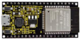 |  |  |  |
| ------------------------------------------------------------ | ------------------------------------------------------------ | ------------------------------------------------------------ | ------------------------------------------------------------ |
| ESP32*1                                                      | Breadboard*1                                                 | Red LED*1                                                    | Active Buzzer*1                                              |
|  |  |  |  |
| Flame Sensor*1                                               | 220Ω Resistor*1                                              | 10KΩResistor*1                                               | Jumper Wires                                                 |
|  |  |  |                                                              |
| NPN Transistor(S8050)*1                                      | 1kΩ Resistor*1                                               | USB Cable*1                                                  |                                                              |


### 3.Component Knowledge


The flame emits a certain amount IR light that is invisible to the human eye, but our flame sensor can detect it and alert a microcontroller (such as ESP32) that a fire has been detected. 

It has a specially designed infrared receiver tube to detect the flame and then convert the flame brightness into a fluctuating level signal. The short pin of the receiving triode is negative pole and the other long pin is positive pole. We should connect the short pin (negative) to 5V and the long pin (positive) to the analog pin, a resistor and GND. As shown in the figure below：


**Note:** 

Since vulnerable to radio frequency radiation and temperature changes, the flame sensor should be kept away from heat sources like radiators, heaters and air conditioners, as well as direct irradiation of sunlight, headlights and incandescent light.

### 4. Read the ADC value, DAC value and voltage value of the flame sensor

We first use a simple code to read the ADC value, DAC value and voltage value of the flame sensor and print them out. Please refer to the wiring diagram below：


```c
//**********************************************************************************
/*  
 * Filename    : Read Analog Value Of Flame Sensor
 * Description : Basic usage of ADC，DAC and Voltage
 * Auther      : http//www.keyestudio.com
*/
#define PIN_ANALOG_IN  36  //the pin of the Flame sensor

void setup() {
  Serial.begin(115200);
}

//In loop()，the analogRead() function is used to obtain the ADC value, 
//and then the map() function is used to convert the value into an 8-bit precision DAC value. 
//The input and output voltage are calculated according to the previous formula, 
//and the information is finally printed out.
void loop() {
  int adcVal = analogRead(PIN_ANALOG_IN);
  int dacVal = map(adcVal, 0, 4095, 0, 255);
  double voltage = adcVal / 4095.0 * 3.3;
  Serial.printf("ADC Val: %d, \t DAC Val: %d, \t Voltage: %.2fV\n", adcVal, dacVal, voltage);
  delay(200);
}
//**********************************************************************************
```

Compile and upload the code to ESP32, after the code is uploaded successfully, power up with a USB cable, open the serial monitor and set the baud rate to 115200. You will see that the serial monitor window will print out the ADC value, DAC value and voltage value of the flame sensor. 

When the sensor is closed to fire, the ADC value, DAC value and voltage value will get greater. Conversely, the ADC value, DAC value and voltage value decrease.


### 5.Wiring diagram of the flame alarm

Next, we will use a flame sensor, a buzzer, and a LED to make an interesting project, that is flame alarm. When flame is detected, the LED flashes and the buzzer alarms.


### 6.Test Code

**（Note： the threshold of 500 in the code can be reset as required)**

```c
//**********************************************************************************
/*  
 * Filename    : Flame Alarm
 * Description : Controlling the buzzer and LED by flame sensor.
 * Auther      : http//www.keyestudio.com
*/
#define PIN_ADC0      36  //the pin of the flame sensor
#define PIN_LED       15  // the pin of the LED
#define PIN_BUZZER    4  // the pin of the buzzer

void setup() {
  pinMode(PIN_LED, OUTPUT);
  pinMode(PIN_BUZZER, OUTPUT);
  pinMode(PIN_ADC0, INPUT);
}

void loop() {
  int adcVal = analogRead(PIN_ADC0); //read the ADC value of flame sensor
  if (adcVal >= 500) {
    digitalWrite (PIN_BUZZER, HIGH); //turn on buzzer
    digitalWrite(PIN_LED, HIGH); // turn on LED
    delay(500); // wait a second.
    digitalWrite (PIN_BUZZER, LOW);
    digitalWrite(PIN_LED, LOW); // turn off LED
    delay(500); // wait a second
  }
 else
 {
    digitalWrite(PIN_LED, LOW);  //turn off LED
    digitalWrite (PIN_BUZZER, LOW); //turn off buzzer
  }
}
//**********************************************************************************
```

### 7.Test Result

Compile and upload the code to ESP32, after the code is uploaded successfully, power up with a USB cable and you will see that when the flame sensor detects the flame, the LED will flash and the buzzer will alarm; otherwise, the LED does not light up and the buzzer does not sound.


## Project 20：Night Lamp

### 1.Introduction

Sensors or components are ubiquitous in our daily life. For example, some public street lamps will automatically turn on at night and turn off during the day. 

Why? In fact, this make use of a photosensitive element that senses the intensity of external ambient light. When the outdoor brightness decreases at night, the street lights will turn on automatically; In the daytime, the street lights will automatically turn off. 

The principle of which is very simple, In this Project, we use a ESP32 to control a LED to achieve the effect of the street light.

### 2.Components

| 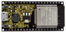 |  |  |  |
| ------------------------------------------------------------ | ------------------------------------------------------------ | ------------------------------------------------------------ | ------------------------------------------------------------ |
| ESP32*1                                                      | Breadboard*1                                                 | Red LED*1                                                    | 10KΩResistor*1                                               |
|  |  |  |  |
| Photoresistor*1                                              | 220ΩResistor*1                                               | Jumper Wires                                                 | USB Cable*1                                                  |


### 3.Component Knowledge


**Photoresistor :** 

It is a kind of photosensitive resistance, its principle is that the photoresistor surface receives brightness (light) to reduce the resistance, the resistance value will change with the detected intensity of the ambient light . With this characteristic, we can use the photosensitive resistance to detect the light intensity.

Photosensitive resistance and its electronic symbol are as follows：


The following circuit is used to detect changes in resistance values of photoresistors：


In the circuit above, when the resistance of the photoresistor changes due to the change of light intensity, the voltage between the photoresistor and resistance R2 will also change.  

Thus, the intensity of light can be obtained by measuring this voltage.

### 4.Read the ADC value, DAC value and voltage value of the photoresistor

We first use a simple code to read the ADC value, DAC value and voltage value of the photoresistor and print them out. Please refer to the following wiring diagram：

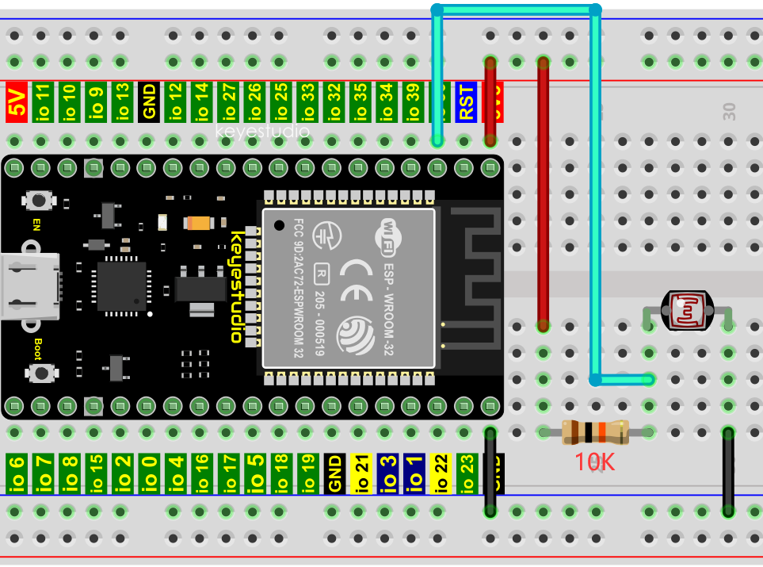

```c
//**********************************************************************************
/*  
 * Filename    : Read Photosensitive Analog Value
 * Description : Basic usage of ADC
 * Auther      : http//www.keyestudio.com
*/
#define PIN_ANALOG_IN  36  //the pin of the photosensitive sensor

void setup() {
  Serial.begin(115200);
}

//In loop()，the analogRead() function is used to obtain the ADC value, 
//and then the map() function is used to convert the value into an 8-bit precision DAC value. 
//The input and output voltage are calculated according to the previous formula, 
//and the information is finally printed out.
void loop() {
  int adcVal = analogRead(PIN_ANALOG_IN);
  int dacVal = map(adcVal, 0, 4095, 0, 255);
  double voltage = adcVal / 4095.0 * 3.3;
  Serial.printf("ADC Val: %d, \t DAC Val: %d, \t Voltage: %.2fV\n", adcVal, dacVal, voltage);
  delay(200);
}
//**********************************************************************************
```

Compile and upload the code to ESP32, after the code is uploaded successfully, power up with a USB cable, open the serial monitor and set the baud rate to 115200. 

You will see that the serial monitor window will print out the ADC value、DAC value and voltage value of the photoresistor. When the light intensity around the photoresistor is gradually reduced, the ADC value, DAC value and voltage value will gradually increase. On the contrary, the ADC value, DAC value and voltage value decrease gradually.


### 5.Wiring diagram of the light-controlled lamp：

We made a small dimming lamp in the front, now we will make a light controlled lamp. The principle is the same, that is, the ESP32 takes the ADC value of the sensor, and then adjusts the brightness of the LED.


### 6.Test Code

```c
//**********************************************************************************
/*  
 * Filename    : Night Lamp
 * Description : Controlling the brightness of LED by photosensitive sensor.
 * Auther      : http//www.keyestudio.com
*/
#define PIN_ANALOG_IN    36  // the pin of the photosensitive sensor
#define PIN_LED     15  // the pin of the LED
#define CHAN            0
#define LIGHT_MIN       372
#define LIGHT_MAX       2048
void setup() {
  ledcSetup(CHAN, 1000, 12);
  ledcAttachPin(PIN_LED, CHAN);
}

void loop() {
  int adcVal = analogRead(PIN_ANALOG_IN); //read adc
  int pwmVal = map(constrain(adcVal, LIGHT_MIN, LIGHT_MAX), LIGHT_MIN, LIGHT_MAX, 0, 4095);  // adcVal re-map to pwmVal
  ledcWrite(CHAN, pwmVal);    // set the pulse width.
  delay(10);
}
//**********************************************************************************
```

### 7.Test Result

Compile and upload the code to ESP32, after the code is uploaded successfully, power up with a USB cable and you will see that when the intensity of light around the photoresistor is reduced, the LED will be bright, on the contrary, the LED will be dim.

## Project 21: Temperature Instrument

### 1.Introduction

Thermistor is a kind of resistor whose resistance depends on temperature changes, which is widely used in gardening, home alarm systems and other devices. 

Therefore, we can use the features to make a temperature instrument.

### 2.Components

| 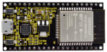 |  |  |  |
| ------------------------------------------------------------ | ------------------------------------------------------------ | ------------------------------------------------------------ | ------------------------------------------------------------ |
| ESP32*1                                                      | Breadboard*1                                                 | Thermistor*1                                                 | 10KΩResistor*1                                               |
| 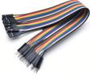 |  |  |  |
| M-F Dupont Wires                                             | LCD 128X32 DOT*1                                             | Jumper Wires                                                 | USB Cable*1                                                  |


### 3.Component Knowledge

**Thermistor:** It is a temperature sensitive resistor. 

When it senses a change in temperature, the resistance of the thermistor will change. We can take advantage of this characteristic to detect temperature intensity. The thermistor and its electronic symbol are shown below:


The relationship between resistance and temperature of the thermistor is：


**Rt** is the thermistor resistance under T2 temperature;

**R** is the nominal resistance of thermistor under T1 temperature;

**EXP\[n\]** is nth power of e;

**B** is temperature index;

**T1, T2** is Kelvin temperature (absolute temperature). Kelvin
temperature=273.15 + Celsius temperature.

**Parameters** : B=3950, R=10k, T1=25.

The circuit connection method of the thermistor is similar to the photoresistor, as shown below：


We can use the value measured by the ADC converter to obtain the resistance of thermistor, and then we can use the formula to obtain the temperature value.

Therefore, the temperature formula can be derived as:：


### 4.Read the value of the Thermistor

First we will learn the thermistor to read the current ADC value, voltage value and temperature value and print them out. Please connect the wirings according to the wiring diagram below：


```c
//**********************************************************************************
/*  
 * Filename    : Thermomter
 * Description : Making a thermometer by thermistor.
 * Auther      : http//www.keyestudio.com
*/
#define PIN_ANALOG_IN   36
void setup() {
  Serial.begin(115200);
}

void loop() {
  int adcValue = analogRead(PIN_ANALOG_IN);                       //read ADC pin
  double voltage = (float)adcValue / 4095.0 * 3.3;                // calculate voltage
  double Rt = 10 * voltage / (3.3 - voltage);                     //calculate resistance value of thermistor
  double tempK = 1 / (1 / (273.15 + 25) + log(Rt / 10) / 3950.0); //calculate temperature (Kelvin)
  double tempC = tempK - 273.15;                                  //calculate temperature (Celsius)
  Serial.printf("ADC value : %d,\tVoltage : %.2fV, \tTemperature : %.2fC\n", adcValue, voltage, tempC);
  delay(1000);
}
//**********************************************************************************
```

Compile and upload the code to ESP32, after the code is uploaded successfully, power up with a USB cable, open the serial monitor and set the baud rate to 115200. 

You will see that the monitor prints out the thermistor's current ADC value, voltage value and temperature value. Try pinching the thermistor with your index finger and thumb (don't touch wires) for a while, and you will see the temperature increasing.


### 5.Wiring diagram of the temperature instrument


### 6.Adding the lcd128\_32\_io library

Open the Arduino IDE，click “Sketch”→“Include Library”→“Add .ZIP Library...”. 

In the pop-up window, find the file named **“2. Windows System\\2. C\_Tutorial\\3. Libraries\\LCD\_128X32.ZIP”,** which locates in this directory. Select the **LCD\_128X32.ZIP** file and then click “Open”.


### 7.Test Code

```c
//**********************************************************************************
/*  
 * Filename    : Temperature Instrument
 * Description : LCD displays the temperature of thermistor.
 * Auther      : http//www.keyestudio.com
*/
#include "lcd128_32_io.h"

#define PIN_ANALOG_IN   36

lcd lcd(21, 22); //Create lCD128 *32 pin，sda->21， scl->22

void setup() {
  lcd.Init(); //initialize
  lcd.Clear();  //clear
}
char string[10];

void loop() {
  int adcValue = analogRead(PIN_ANALOG_IN);                       //read ADC pin
  double voltage = (float)adcValue / 4095.0 * 3.3;                // calculate voltage
  double Rt = 10 * voltage / (3.3 - voltage);                     //calculate resistance value of thermistor
  double tempK = 1 / (1 / (273.15 + 25) + log(Rt / 10) / 3950.0); //calculate temperature (Kelvin)
  double tempC = tempK - 273.15;                                  //calculate temperature (Celsius)
  lcd.Cursor(0,0); //Set display position
  lcd.Display("Voltage:"); //Setting the display
  lcd.Cursor(0,8);
  lcd.DisplayNum(voltage);
  lcd.Cursor(0,11);
  lcd.Display("V");
  lcd.Cursor(2,0); 
  lcd.Display("tempC:");
  lcd.Cursor(2,8);
  lcd.DisplayNum(tempC);
  lcd.Cursor(2,11);
  lcd.Display("C");
  delay(200);
}
//**********************************************************************************
```

### 8.Test Result

Compile and upload the code to ESP32, after the code is uploaded successfully, power up with a USB cable and you will see that the LCD 128X32 DOT displays the voltage value of the thermistor and the temperature value in the current environment.

## Project 22：Bluetooth

This chapter mainly introduces how to make simple data transmission through Bluetooth of ESP22 and mobile phones. Project 22.1 is classic Bluetooth while project 22.2 is Bluetooth control LED.

### Project 22.1：Classic Bluetooth

#### 1.Components

|  |  |
| ------------------------------------------------------------ | ------------------------------------------------------------ |
| USB  Cable*1                                                 | ESP22*1                                                      |


In this tutorial we need to use a Bluetooth APP called serial Bluetooth terminal to assist in the experiment.

Download link:
[https://www.appsapk.com/serial-Bluetooth-terminal/](https://www.appsapk.com/serial-bluetooth-terminal/).

Here is its [sign](C:/Users/NINGMEI/AppData/Local/youdao/dict/Application/8.10.7.0/resultui/html/index.html#/javascript:;)


#### 2.Component Knowledge

Bluetooth is a short-distance communication system that can be divided into two types, namely low power Bluetooth (BLE) and classic Bluetooth.
There are two modes for simple data transfer: master mode and slave mode. 

**Master Mode**: 

In this mode, work is done on the master device and can be connected to the slave device. When the device initiates a connection request in the main mode, information such as the address and pairing password of other Bluetooth devices are required.  Once paired, you can connect directly to them.  

**Slave Mode**: 

A Bluetooth module in the slave mode can only accept connection requests from the host, but cannot initiate connection requests. After being connected to a host device, it can send and receive data through the host device.

Bluetooth devices can interact with each other, when they interact, the Bluetooth device in the main mode searches for nearby devices. While a connection is established, they can exchange data. For example, when a mobile phone exchanges data with ESP22, the mobile phone is usually in master mode and the ESP22 is in slave mode.  


#### 3.Wiring Diagram

We can use a USB cable to connect ESP22 mainboard to the USB port on a computer.


#### 4.Test Code


```c
//**********************************************************************************
/*
 * Filename    : Classic Bluetooth--SerialToSerialBT
 * Description : ESP32 communicates with the phone by bluetooth and print phone's data via a serial port
 * Auther      : http//www.keyestudio.com
*/
#include "BluetoothSerial.h"

BluetoothSerial SerialBT;
String buffer;
void setup() {
  Serial.begin(115200);
  SerialBT.begin("ESP32test"); //Bluetooth device name
  Serial.println("\nThe device started, now you can pair it with bluetooth!");
}

void loop() {
  if (Serial.available()) {
    SerialBT.write(Serial.read());
  }
  if (SerialBT.available()) {
    Serial.write(SerialBT.read());
  }
  delay(20);
}
//**********************************************************************************
```

#### 6.Test Result

Compile and upload the code to the ESP22. After uploading successfully, we will use a USB cable to power on. Open the serial
monitor and set the baud rate to **115200**. 

When you see the serial monitor prints out the character string as below, it indicates that the Bluetooth of ESP22 is ready and waiting for connection with a phone. (If open the serial monitor and set the baud rate to 115200, the information is not displayed, please press the RESET button of the ESP22)


Make sure that the Bluetooth of your phone has been turned on and “Serial Bluetooth Terminal” has been installed.


Click“Search”，search for the nearby Bluetooth and select to connect the“ESP22 test”.


Turn on software APP, click the left of the terminal. Select "**Devices**" .


Select ESP22test in classic Bluetooth mode, and a successful connecting prompt will appear as shown below.


Data can be transferred between your phone and a computer via ESP22 now.


Send “Hello！”, When the computer receives it, which will reply with "Hi\!".


### Project 22.2：Bluetooth Control LED

#### 1.Components

|  |  |  |
| :----------------------------------------------------------: | :----------------------------------------------------------: | :----------------------------------------------------------: |
|                           ESP22*1                            |                          Red LED*1                           |                         Jumper Wires                         |
|  |  |  |
|                         Breadboard*1                         |                        220ΩResistor*1                        |                         USB Cable*1                          |


#### 2.Wiring Diagram


#### 3.Test Code


```c
//**********************************************************************************
/*
 * Filename    : Bluetooth Control LED
 * Description : The phone controls esp32's led via bluetooth.
                When the phone sends "LED_on," ESP32's LED lights turn on.
                When the phone sends "LED_off," ESP32's LED lights turn off.
 * Auther      : http//www.keyestudio.com
*/
#include "BluetoothSerial.h"
#include "string.h"
#define LED 15
BluetoothSerial SerialBT;
char buffer[20];
static int count = 0;
void setup() {
  pinMode(LED, OUTPUT);
  SerialBT.begin("ESP32test"); //Bluetooth device name
  Serial.begin(115200);
  Serial.println("\nThe device started, now you can pair it with bluetooth!");
}

void loop() {
  while(SerialBT.available())
  {
    buffer[count] = SerialBT.read();
    count++;
  }
  if(count>0){
    Serial.print(buffer);
    if(strncmp(buffer,"led_on",6)==0){
      digitalWrite(LED,HIGH);
    }
    if(strncmp(buffer,"led_off",7)==0){
      digitalWrite(LED,LOW);
    }
    count=0;
    memset(buffer,0,20);
  }
}
//**********************************************************************************
```

#### 4.Test Result

Compile and upload the code to the ESP22. After uploading successfully, we will use a USB cable to power on. The APP operation is the same as the project 22.1. To make the external LED on and off, simply change the sending content to "led\_on" and "led\_off". 

Moving the APP to send data:

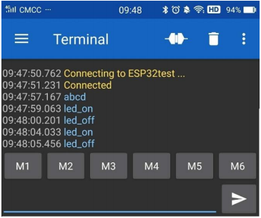

The serial monitor will display as follows:

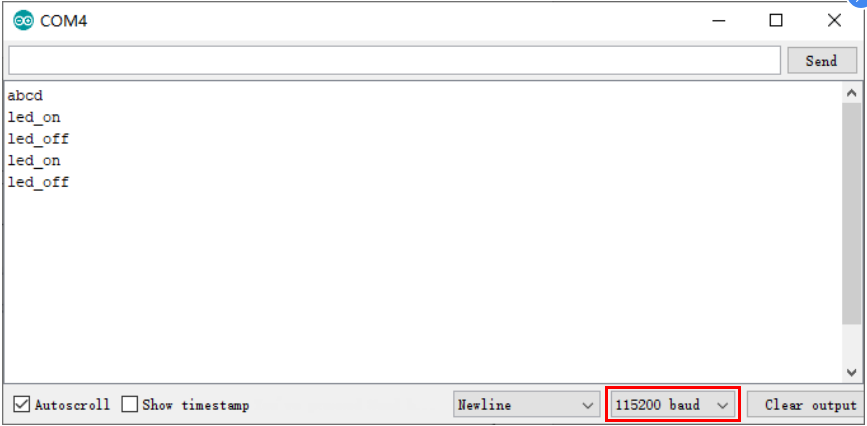

**LED Circumstance**


**Note:** If the sent content is not "led-on 'or" led-off ", the status of the LED will not change. If the LED is on, it remains on when irrelevant content is received; Conversely, if the LED is off, it continues to be off when irrelevant content is received.


## Project 23：WiFi Station Mode

### 1.Introduction

ESP32 has three different WiFi operating modes: Station mode, AP mode and AP+Station mode. All WiFi programming projects must be configured with WiFi operating mode before using, otherwise WiFi cannot be used. 

In this project, we are going to learn the WiFi Station mode of the ESP32.

### 2.Components

|  |  |
| ------------------------------------------------------------ | ------------------------------------------------------------ |
| USB Cable*1                                                  | ESP32*1                                                      |


### 3.Wiring Diagram

Plug the ESP32 to the USB port of your PC


### 4.Component Knowledge

**Station mode：**

When setting Station mode, the ESP32 is taken as a WiFi client. It can connect to the router network and communicate with other devices on the router via a WiFi connection. 

As shown in the figure below, the PC and the router have been connected. If the ESP32 wants to communicate with the PC, the PC and the router need to be connected.


### 5.Test Code


Since WiFi names and passwords vary from place to place, thereby users need to enter the correct WiFi names and passwords in the box shown below before the program code runs.  


```c
//**********************************************************************************
/*
 * Filename    : WiFi Station
 * Description : Connect to your router using ESP32
 * Auther      : http//www.keyestudio.com
*/
#include <WiFi.h> //Include the WiFi Library header file of ESP32.

//Enter correct router name and password.
const char *ssid_Router     = "ChinaNet-2.4G-0DF0"; //Enter the router name
const char *password_Router = "ChinaNet@233"; //Enter the router password

void setup(){
  Serial.begin(115200);
  delay(2000);
  Serial.println("Setup start");
  WiFi.begin(ssid_Router, password_Router);//Set ESP32 in Station mode and connect it to your router.
  Serial.println(String("Connecting to ")+ssid_Router);
//Check whether ESP32 has connected to router successfully every 0.5s.  
  while (WiFi.status() != WL_CONNECTED){
    delay(500);
    Serial.print(".");
  }
  Serial.println("\nConnected, IP address: ");
  Serial.println(WiFi.localIP());//Serial monitor prints out the IP address assigned to ESP32.
  Serial.println("Setup End");
}
 
void loop() {
}
//**********************************************************************************
```

### 6.Test Result

After making sure the router name and password are entered correctly, compile and upload the code to ESP32, open serial monitor and set baud rate to 115200. 

When ESP32 successfully connects to“ssid\_Router”, serial monitor will print out the IP address, then monitor will display as follows: (If open the serial monitor and set the baud rate to 115200, the information is not displayed, please press the RESET button of the ESP32)


## Project 24：WiFi AP Mode

### 1.Introduction

In this project, we are going to learn the WiFi AP mode of the ESP32.

### 2.Components

|  |  |
| :----------------------------------------------------------: | :----------------------------------------------------------: |
|                         USB Cable*1                          |                           ESP32*1                            |


### 3.Wiring Diagram

Plug the ESP32 mainboard to the USB port of your PC


### 4.Component Knowledge

**AP Mode:**

When setting AP mode, a hotspot network will be created, waiting for other WiFi devices to connect. As shown below;

Take the ESP32 as the hotspot, if a phone or PC needs to communicate with the ESP32, it must be connected to the ESP32's hotspot.

Communication is only possible after a connection is established via the ESP32.


### 5.Test Code


Before running the code , you can make any changes to the ESP32 AP name and password in the box as shown below, but in a default circumstance, it doesn’t need to modify.


```c
//**********************************************************************************
/*
 * Filename    : WiFi AP
 * Description : Set ESP32 to open an access point
 * Auther      : http//www.keyestudio.com
*/
#include <WiFi.h> //Include the WiFi Library header file of ESP32.

const char *ssid_AP     = "ESP32_WiFi"; //Enter the router name
const char *password_AP = "12345678"; //Enter the router password

IPAddress local_IP(192,168,1,108);//Set the IP address of ESP32 itself
IPAddress gateway(192,168,1,1);   //Set the gateway of ESP32 itself
IPAddress subnet(255,255,255,0);  //Set the subnet mask for ESP32 itself

void setup(){
  Serial.begin(115200);
  delay(2000);
  Serial.println("Setting soft-AP configuration ... ");
  WiFi.disconnect();
  WiFi.mode(WIFI_AP);
  Serial.println(WiFi.softAPConfig(local_IP, gateway, subnet) ? "Ready" : "Failed!");
  Serial.println("Setting soft-AP ... ");
  boolean result = WiFi.softAP(ssid_AP, password_AP);
  if(result){
    Serial.println("Ready");
    Serial.println(String("Soft-AP IP address = ") + WiFi.softAPIP().toString());
    Serial.println(String("MAC address = ") + WiFi.softAPmacAddress().c_str());
  }else{
    Serial.println("Failed!");
  }
  Serial.println("Setup End");
}
 
void loop() {
}
//**********************************************************************************
```

### 6.Test Result

Enter the ESP32 AP name and password correctly, compile and upload the code to ESP32, open the serial monitor and set the baud rate to **115200**, then monitor will display as follows:

(If open the serial monitor and set the baud rate to 115200, the information is not displayed, please press the RESET button of the ESP32)


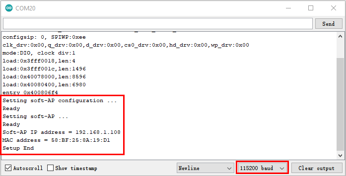

When observing the printed information of the serial monitor, turn on the WiFi scanning function of the mobile phone, you can see the ssid\_AP on ESP32, which is dubbed "ESP32\_Wifi" in this code. You can connect to it either by typing the password "12245678" or by modifying the code to change its AP name and password.  


## Project 25：WiFi Station+AP Mode

### 1.Introduction

In this project, we are going to learn the AP+Station mode of the ESP32.

### 2.Components

|  |  |
| :----------------------------------------------------------: | :----------------------------------------------------------: |
|                         USB Cable*1                          |                           ESP32*1                            |


### 3.Wiring Diagram

Plug the ESP32 mainboard to the USB port of your PC

 

### 4.Component Knowledge

**AP+Station mode:**

In addition to the AP mode and the Station mode, **AP+Station mode** can be used at the same time. Turn on the Station mode of the ESP32, connect it to the router network, and it can communicate with the Internet through the router. Then turn on the AP mode to create a hotspot network. 

Other WiFi devices can be connected to the router network or the hotspot network to communicate with the ESP32.

### 5.Test Code


Before running the code, you need to modify the ssid\_Router, password\_Router, ssid\_AP and password\_AP, as shown in the box below:


```c
//**********************************************************************************
/*
 * Filename    : WiFi AP+Station
 * Description : ESP32 connects to the user's router, turning on an access point
 * Auther      : http//www.keyestudio.com
*/
#include <WiFi.h>
 
const char *ssid_Router     =  "ChinaNet-2.4G-0DF0";  //Enter the router name
const char *password_Router =  "ChinaNet@233";  //Enter the router password
const char *ssid_AP         =  "ESP32_WiFi"; //Enter the router name
const char *password_AP     =  "12345678";  //Enter the router password

void setup(){
  Serial.begin(115200);
  Serial.println("Setting soft-AP configuration ... ");
  WiFi.disconnect();
  WiFi.mode(WIFI_AP);
  Serial.println("Setting soft-AP ... ");
  boolean result = WiFi.softAP(ssid_AP, password_AP);
  if(result){
    Serial.println("Ready");
    Serial.println(String("Soft-AP IP address = ") + WiFi.softAPIP().toString());
    Serial.println(String("MAC address = ") + WiFi.softAPmacAddress().c_str());
  }else{
    Serial.println("Failed!");
  }
  
  Serial.println("\nSetting Station configuration ... ");
  WiFi.begin(ssid_Router, password_Router);
  Serial.println(String("Connecting to ")+ ssid_Router);
  while (WiFi.status() != WL_CONNECTED){
    delay(500);
    Serial.print(".");
  }
  Serial.println("\nConnected, IP address: ");
  Serial.println(WiFi.localIP());
  Serial.println("Setup End");
}

void loop() {
}
//**********************************************************************************
```


6.Test Result

Ensure that the code in the program has been modified correctly, compile and upload the code to the ESP32. After uploading successfully，we will use a USB cable to power on. 

Open the serial monitor and set the baud rate to 115200, then monitor will display as follows: (If open the serial monitor and set the baud rate to 115200, the information is not displayed, please press the RESET button of the ESP32)


Open the WiFi scanning function of the mobile phone, you can see the ssid\_AP.


