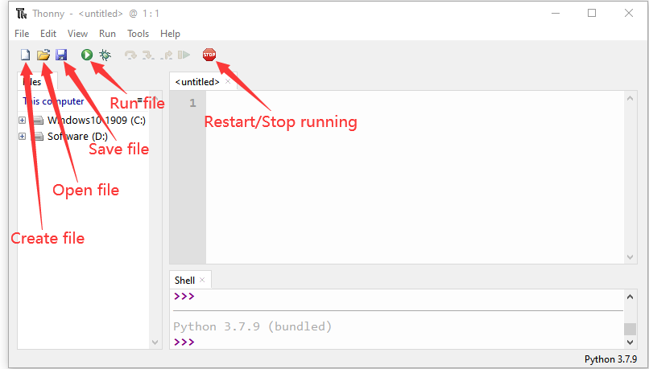
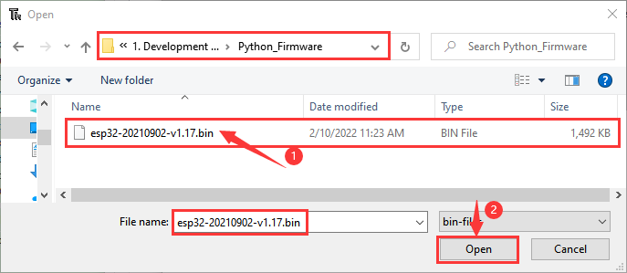
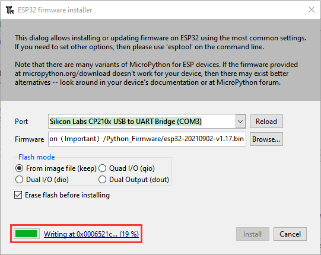
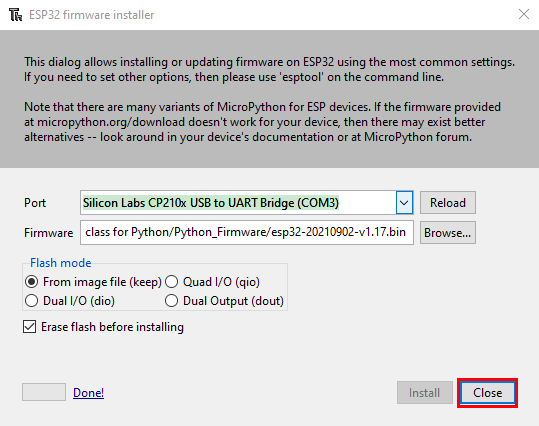
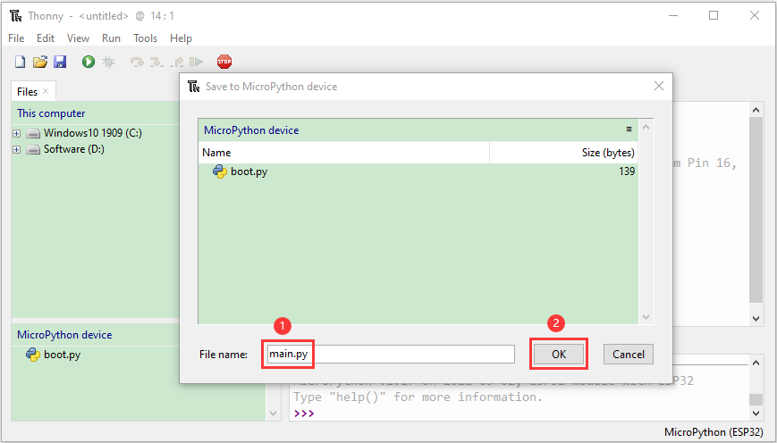

# Getting started with Python

## 1. Install Thonny：

Thonny is a free and open source software platform with small size, simple interface, simple operation and rich functions. It is a Python IDE suitable for beginners. In this tutorial, we use this IDE to develop a ESP32. Thonny supports multiple operating systems including Windows, Mac OS, Linux.

## 2. Download Thonny：

①. Enter the official website of Thonny: [https://thonny.org](https://thonny.org) and download the latest version of Thonny.

②. **Note:** This tutorial uses version 4.1.7. Please keep it consistent to avoid code incompatibility issues.

③. The downloaded Thonny icon is as follow:

④. Double-click“thonny-4.1.7.exe”and select install mode. You can choose 

⑤. You can also keep selecting **Next** to finish the installation.

⑥. If you want to change the route of installing Thonny，just click“**Browse...**”to select a new route and click **OK**.

⑦. Click **Create desktop icon,** you will view Thonny on your desktop.

⑧. Click“**Install**”

⑨. Wait for a while but don’t click **Cancel**

⑩. Click **“Finish”**

## 3. Basic Setting：

Double-click Thonny, choose language and initial settings and click **Let’s go！**

Click“**View**”→“**File**”and“**Shell**”

## 4. Install the CP2102 driver：

Before using the Thonny, we need to install the CP2102 driver in the computer.

**Windows system**

Link to download the driver of CP2102: [CP2102-Driver-File-Windows](CP2102-Driver-File-Windows.zip)

Check if the CP2102 driver has been installed

1\. Interface the ESP32 with your PC with a USB cable

2\. Click“This PC”and right-click Manage”

3\. Click“Device Manager”, if the CP2102 driver has been installed，Silicon Labs CP210x USB to UART Bridge(COMx) will be
shown.

4\. If the CP2102 has not been installed

5\. Click“CP2102USB to UART Bridge Controller”and Update driver”.

6\. Click“Browse my computer for drivers ”.

7\. Click Browse... to choose CP210x\_6.7.4 (“4. Python Tutorial\\1.Development Environment Configuration\\CP2102 Driver File-Windows”) and click Next

8\. The CP2102 driver will be installed

**MAC System**

1\. Download link for CP2102：[CP2102-Driver-File-MAC.zip](CP2102-Driver-File-MAC.zip)

2\. Download MacOS version

3\. Unzip the downloaded package

4\. Open the folder and double-click“SiLabsUSBDriverDisk.dmg”file

5\. Then you can see the following file

6\. Double-click**“Install CP210x VCP Driver”，tap**“**Don’t warn me when opening application on this disk image**”and click“**Open**”

7\. Click“**Continue**”

8\. Click“**Agree**”，then tap“**Continue**”

9\. Click“**Continue**”，then input your user password

10\. Select“**Select Open Security Preferences**”

11\. Click on security lock and enter your user password to
authorize.

12\. When you see that the lock is opened, click "Allow".

14\. Return to the installation interface and wait for the installation as prompted.

15\. The installation is successful

## 5. Burn Micropython firmware:

To run a Python program on the ESP32 board, we need to burn the firmware to the ESP32 board first.

**1. Download Micropython firmware**

microPython website：<http://micropython.org/>

The firmware we use：**esp32-20210902-v1.17.bin**，ESP32 firmware：[https://micropython.org/download/esp32/](https://micropython.org/download/esp32/)

We also offer corresponding firmware. Please click to download：[Download Python Firmware](Python-Firmware.zip)

**2. Burn the Micropython firmware**

Connect the ESP32 to your PC with a USB cable

Make sure the driver has been installed successfully and the COM port can be identified correctly. Open Device Manager and  expand “Ports”.

Open Thonny，click“run”and“Select interpreter...”

Select Micropython (ESP32) and Silicon Labs CP210x USB to UART Bridge(COM3) and click “Install or update firmware”.

Select“Silicon Labs CP210x USB to UART Bridge(COM3)”，click “ Browse...”and choose the firmware **esp32-20210902-v1.17.bin.** Check“Erase flash before installing”and“Flash mode”，then click“Install”.

If you haven't downloaded the firmware, please click on the link to download：[Download Python Firmware](Python-Firmware.zip)

（(Note：If you fail to install the firmware，press the Boot button on the ESP32 board and click“Install”）

Then click Close and OK

Turn off all windows and turn to the main page and click “STOP.

## 6. Test Code

**1. Test the Shell commander**

Input print('hello world') in the“Shell”and press **Enter**

**2. Run the test code(online)**

Connect the ESP32 to your PC. Users can program and debug programs with Thonny.

Open Thonny and click Open.

If you haven't downloaded the code file yet, please click on the link to download it: [Download Python Codes](Python-Codes.zip)

When a new window pops up, click“This computer”

Select the file“Project\_01\_HelloWorld.py”

Click ,“Hello World”will be printed in the“Shell”monitor.

Note: Press the reset button to reboot

**3. Run the test code(offline)**

After rebooting the ESP32, run the boot\.py file under the root directory first then run your code file.

So, we need to add a guide program to run the code of users.

Move the file“4. Python Tutorial\\2. Python Projects” to the disk(D)，the route is“D:/2. Python Projects”, then open the “Thonny”.

Click project 00. Boot.Boot and double-click boot\.py, then the code under MicroPython device can run offline.

If you want to run the code offline, you nee to upload boot\.py and program code to MicroPython device, then press the ESP32’s reset button. We will take the project 00 and project 01 as an example. Select boot\.py and right-click Upload to /.

Similarly, upload the project\_01\_Helloworld. py file to the "MicroPython Device". 

Press the Reset button, you will view code running in the Shell monitor

## 7. Thonny Common operations：

**1. Upload the code to the ESP32**

We take the boot\.py as an example. If we add a boot\.py in each code directory, reboot the ESP32, the boot\.py will run first.

Select “boot\.py”in the file Project 03：LED Flashing, right-click to select“Upload to /”. Then the code will be uploaded to the root directory of the ESP32 and click OK.

Download the code to your PC:

MicroPython device\<boot.py, then right-click Download to…

**2. Delete files of the ESP32**

For example, click“boot\.py”in the MicroPython device and right-click Delete.

Select boot\.py in the Project 03：LED Flashing folder, right-click Move to Recycle Bin to delete it.

**3. Create and save code**

Click“File”→“New”to create and edit code.

Enter the code in the new file. We take the Project\_03\_LED\_Flashing.py as an example.

Click  to save the code to your PC or the ESP32.

Select MicroPython device and enter main\.py in the new page and click OK.

Then the code will be uploaded to the ESP32.

Disconnect the USB cable and connect it, you can see the effect of the LED flashing continuously in the circuit on a cycle.  

