# Python Tutorial

## Download Python code files

Click on the link to download the Python code file：[Download Python Codes](Python-Codes.zip)

## Development Environment Configuration

Click on the link to enter the development environment setup tutorial:[Pythin Development Environment Configuration](4-1Python.md)

## Project 01: Hello World

1. Overview

For ESP32 beginners, we will start with some simple things. In this project, you only need a ESP32 mainboard, a USB cable and Raspberry Pi to complete the "Hello World\!" project, which is a test of communication between the ESP32 mainboard and the Raspberr  y Pi as well as a primary project.

2. Components

| 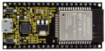 |  |
| ------------------------------------------------------------ | ------------------------------------------------------------ |
| ESP32*1                                                      | USB Cable*1                                                  |


3. Wiring Diagram：

In this project, we will use a USB cable to connect the ESP32 to Raspberry Pi.


**Running code online：**

To run the ESP32 online, you need to connect the ESP32 to the computer, which allows you to compile or debug programs using Thonny software.  

Advantages:

1\. You can use the Thonny software to compile or debug programs.

2. Through the "Shell" window, you can view error messages and output results generated during the running of the program as well as query related function information online to help improve the program.  

Disadvantages:

1. To run the ESP32 online, you must connect the ESP32 to a computer and run it with the Thonny software.  

2. If the ESP32 is disconnected from the computer , when they reconnect, the program won't run again.  

Basic Operation:

1. Open Thonny and click“Open...”.


2. Click“This computer”in the new pop-up window.

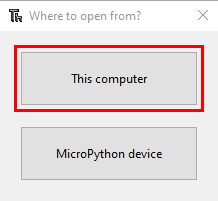

In the new dialog box，select“Project\_01\_HelloWorld.py”,click“Open”. (If you haven't downloaded the code file, please click on the link to download it:[Download Python Codes](Python-Codes.zip))


3. Click“Run current script”to execute the program“Hello World\!”, "Welcome Keyestudio" , which will be printed in the“Shell”window.


**Exit running online**

When running online, click “Stop /Restart Backend”or press “Ctrl+C”on the Thonny to exit the program.  


5. Test Code

    ```python
    print("Hello World!")
    print("Welcome Keyestudio")
    ```
    
    

## Project 02: Turn On LED

1. Introduction

In this project, we will show you how to light up the LED. We use the ESP32's digital pin to turn on the LED so that the LED is lit up.

2. Components

|  |  |  |
| ------------------------------------------------------------ | ------------------------------------------------------------ | ------------------------------------------------------------ |
| ESP32*1                                                      | Breadboard*1                                                 | USB Cable*1                                                  |
|  |  |  |
| Red LED*1                                                    | 220Ω Resistor*1                                              | Jumper Wire*2                                                |

3. Component Knowledge

**（1）LED:**


The LED is a semiconductor known as “light-emitting diode” , which is an electronic device made from semiconducting materials(silicon, selenium, germanium, etc.). It has an anode and a cathode, the short lead is cathode, which connects to GND, the long lead is anode, which connects to 3.3V or 5V.


**（2）Five-band resistor**

A resistor is an electronic component in a circuit that restricts or regulates the flow current to flow. On the left is the appearance of the resistor and on the right is the symbol for the resistance in the circuit . Its unit is(Ω). 1 mΩ= 1000 kΩ，1kΩ= 10007)


We can use resistors to protect sensitive components, such as LED. The strength of the resistance is marked on the body of the resistor with an electronic color code. Each color code represents a number, and you can refer to it in a resistance card.

\-Color 1 – 1st Digit.

\-Color 2 – 2nd Digit.

\-Color 3 – 3rd Digit.

\-Color 4 – Multiplier.

\-Color 5 – Tolerance.


In this kit, we provide three five-band resistors with different resistance values. We three five-band resistors as an example.

220Ω Resistor\*10


10KΩ Resistor\*10


1KΩ Resistor\*10

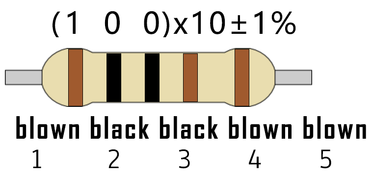

In the same voltage, there will be less current and more resistance. The connection between current(I), voltage(V), and resistance(R) can be expressed by the formula: I=U/R. In the figure below, if the voltage is 3V, the current through R1 is: I = U / R = 3 V / 10 KΩ= 0.0003A= 0.3mA.

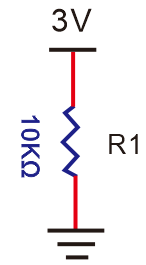

Don’t connect a low resistance directly to the two poles of the power supply, which will cause excessive current to damage the electronic components. Resistors do not have positive and negative poles.

**（3）Bread board**

Breadboards are used to build and test circuits quickly before completing any circuit design. There are many holes in the breadboard that can be inserted into circuit components such as integrated circuits and resistors. A typical breadboard is shown below：


The breadboard has strips of metal , which run underneath the board and connect the holes on the top of the board. The metal strips are laid out as shown below. Note that the top and bottom rows of holes are connected horizontally，while the remaining holes are connected vertically.


The first two rows (top) and the last two rows (bottom) of the breadboard are used for the positive pole (+) and negative pole (-) of the power supply respectively. The conductive layout of the breadboard is shown in the figure below:


When we connect DIP (Dual In-line Packages) components, such as integrated circuits, microcontrollers, chips and so on, we can see that a groove in the middle isolates the middle part, so the top and bottom of the groove is not connected. DIP components can be connected as shown in the following diagram:

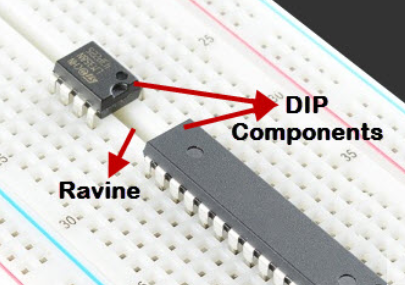


4)  **Power Supply**

The ESP32 needs 3.3V-5V power supply. In this project, we will connect the ESP32 to the computer via an USB cable.


4.Wiring Diagram

First, disconnect all power from the ESP32. Then build the circuit according to the wiring diagram. After the circuit is built and verified correctly, connect the ESP32 to your computer via a USB cable.

**Note:** Avoid any possible short circuits (especially connecting 3.3V and GND)\!

**WARNING:** A short circuit can cause high current in your circuit, create excessive component heat and cause permanent damage to your hardware\!

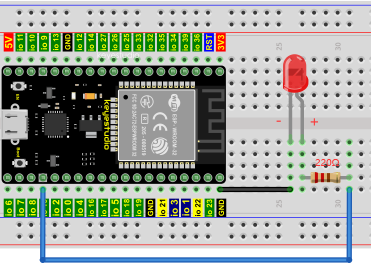

Note:

How to connect a LED


How to identify the 220Ω Five-band resistor


5. Test Code：

If you haven't downloaded the code file yet, please click on the link to download it:[Download Python Codes](Python-Codes.zip)


**Exit running online**

Open“Thonny” , click“This computer”→“D:”→“2. Python Projects”→“Project 02：Turn On LED”


Click“Project 02：Turn On LED”, double-click“Project\_02\_Turn\_On\_LED.py”to open it, as shown below;


```py
from machine import Pin
import time
led = Pin(15, Pin.OUT)   # create LED object from Pin 15, Set Pin 15 to output
led.value(1)    # Set led turn on
```


Connect the ESP32 to your PC. Click “Stop/Restart backend”then go to the Shell window to check.


Click “Run current script”，the code starts to be executed and the LED in the circuit lit up. Press “Ctrl+C” or click“Stop/Restart backend” to exit the program.


**Note**: This is the code running online. If you disconnect USB cable and power up the ESP32 or press its reset button, LED is not bright and the following messages will be displayed in the "**Shell**" window of Thonny:


Code running offline（Upload the code to ESP32）：

Make sure the ESP32 has been connected to the computer, click“Stop/Restart backend”.


As shown below, right-click the file“Project\_02\_Turn\_On\_LED.py”，select “**Upload to /**”to upload the code to ESP32.


Upload“boot.py”in the same way.


Press the reset button of ESP32 and you can see LED is ON .


**Note**：Codes here is run offline. If you want to stop running offline and enter“**Shell**”, just click“Stop/Restart backend”in Thonny.


## Project 03：LED Flashing

1.Introduction：

In this project, we will show you the LED flashing effect. We use the ESP32's digital pin to turn on the LED and make it flashing.

2.Components：

|  |  |  |
| ------------------------------------------------------------ | ------------------------------------------------------------ | ------------------------------------------------------------ |
| ESP32*1                                                      | Breadboard*1                                                 | USB Cable*1                                                  |
|  |  |  |
| Red LED*1                                                    | 220Ω Resistor*1                                              | Jumper Wire*2                                                |

3.Wiring diagram：

First, disconnect all power from the ESP32. Then build the circuit according to the wiring diagram. After the circuit is built and verified correct, connect the ESP32 to your computer using a USB cable.

**Note:** Avoid any possible short circuits (especially connecting 3.3V and GND)\!


Note:

How to connect a LED


How to identify the 220Ω Five-color ring resistor


4.Project code：

Codes used in this tutorial are saved in “2. Python Projects”. 

If you haven't downloaded the code file yet, please click on the link to download it:[Download Python Codes](Python-Codes.zip)


Code running online:

Open“Thonny”，click“This computer”→“D:”→“2. Python Projects”→“Project 03：LED Flashing”.


Expand folder“Project 03: LED Flashing”and double left-click “Project\_03\_LED\_Flashing.py” to open it. As shown in the
illustration below：


```python
from machine import Pin
import time

led = Pin(15, Pin.OUT)   # create LED object from Pin 15, Set Pin 15 to output

try:
    while True:
        led.value(1)    # Set led turn on
        time.sleep(0.5) # Sleep 0.5s
        led.value(0)    # Set led turn off
        time.sleep(0.5) # Sleep 0.5s
except:
    pass
```

Make sure the ESP32 has been connected to the computer. Click“Stop/Restart backend” and see what will display in the“**Shell**”window.


Click “Run current script”，the code starts to be executed and you can see the LED flash. Press“Ctrl+C”or click“Stop/Restart backend”to exit the program.


**Note**: This is the code running online. If you disconnect USB cable and power up the ESP32 or press its reset button, the LED in the circuit will stop flashing and the following messages will be displayed in the "Shell"


Code running offline（Upload the code to ESP32）：

Make sure the ESP32 has been connected to the computer, click“Stop/Restart backend”.


As shown below, right-click the file“Project\_03\_LED\_Flashing.py”，select “**Upload to /**”to upload the code to ESP32.


Upload“boot.py”in the same way.


Press the reset button of ESP32 and you can see the LED flash


**Note**：Codes here is run offline. If you want to stop running offline and enter“**Shell**”, just click “Stop/Restart backend”in Thonny.


## Project 04: Breathing Led

1.Introduction：

In previous studies, we know that LEDs have on/off state, so how to enter the intermediate state? How to output an intermediate state to make the LED half bright? That's what we're going to learn.

Breathing light, that is, LED is turned from off to on gradually, and gradually from on to off, just like "breathing". So, how to control the brightness of a LED? We will use ESP32’s PWM to achieve this target.

2.Components：

|  |  |  |
| ------------------------------------------------------------ | ------------------------------------------------------------ | ------------------------------------------------------------ |
| ESP32*1                                                      | Breadboard*1                                                 | USB Cable*1                                                  |
|  |  |  |
| Red LED*1                                                    | 220Ω Resistor*1                                              | Jumper Wire*2                                                |

3.Component knowledge：


**Analog & Digital:**

An Analog Signal is a continuous signal in both time and value. On the contrary, a Digital Signal or discrete time signal is a time series consisting of a sequence of quantities. Most signals in life are analog signals. A familiar example of an Analog Signal would be how the temperature throughout the day is continuously changing and could not suddenly change instantaneously from 0℃ to 10℃. However, Digital Signals can instantaneously change in value. This change is expressed in numbers as 1 and 0 (the basis of binary code). Their differences can more easily be seen when compared when graphed as below.


In practical application, we often use binary as the digital signal, that is a series of 0’s and 1’s. Since a binary signal only has two values (0 or 1), it has great stability and reliability. Lastly, both analog and digital signals can be converted into the other.

**PWM：**

PWM, Pulse-Width Modulation, is a very effective method for using digital signals to control analog circuits. Common processors cannot directly output analog signals. PWM technology makes it very convenient to achieve this conversion (translation of digital to analog signals).

PWM technology uses digital pins to send certain frequencies of square waves, that is, the output of high levels and low levels, which alternately last for a while. The total time for each set of high levels and low levels is generally fixed, which is called the period (Note: the reciprocal of the period is frequency). The time of high level outputs are generally called “pulse width”, and the duty cycle is the percentage of the ratio of pulse duration, or pulse width (PW) to the total period(T) of the waveform.

The longer the output of high levels last, the longer the duty cycle and the higher the corresponding voltage in the analog signal will be. The following figures show how the analog signal voltages vary between 0V-3V3 (high level is 3V3) corresponding to the pulse width 0%-100%:


The longer the PWM duty cycle is, the higher the output power will be. Now that we understand this relationship, we can use PWM to control the brightness of an LED or the speed of DC motor and so on. It is evident from the above that PWM is not real analog, and the effective value of the voltage is equivalent to the corresponding analog. So, we can control the output power of the LED and other output modules to achieve different effects.

**ESP32 and PWM:**

The ESP32 PWM controller has 8 independent channels, each of which can independently control frequency, duty cycle, and even accuracy. Unlike traditional PWM pins, the PWM output pins of ESP32 are configurable and they can be configured to PWM.

4.Wiring diagram：


**Note:**

How to connect a LED


How to identify the 220Ω Five-color ring resistor


5.Project code：

The design of this project makes the GP15 output PWM, and the pulse width gradually increases from 0% to 100%, and then gradually decreases from 100% to 0%.

Codes used in this tutorial are saved in“2. Python Projects”.

If you haven't downloaded the code file yet, please click on the link to download it:[Download Python Codes](Python-Codes.zip)


Open“Thonny”，click“This computer”→“D:”→“2. Python Projects”→”Project 04：Breathing Led”, and double left-click
“Project\_04\_Breathing\_LED.py”.


```python
import time
from machine import Pin,PWM

#The way that the ESP32 PWM pins output is different from traditionally controllers.
#It can change frequency and duty cycle by configuring PWM’s parameters at the initialization stage.
#Define GPIO15’s output frequency as 10000Hz and its duty cycle as 0, and assign them to PWM.
pwm =PWM(Pin(15,Pin.OUT),10000,0)

try:
    while True:
#The range of duty cycle is 0-1023, so we use the first for loop to control PWM to change the duty
#cycle value,making PWM output 0% -100%; Use the second for loop to make PWM output 100%-0%.  
        for i in range(0,1023):
            pwm.duty(i)
            time.sleep_ms(1)
            
        for i in range(0,1023):
            pwm.duty(1023-i)
            time.sleep_ms(1)  
except:
#Each time PWM is used, the hardware Timer will be turned ON to cooperate it. Therefore, after each use of PWM,
#deinit() needs to be called to turned OFF the timer. Otherwise, the PWM may fail to work next time.
    pwm.deinit()
```

6.Project result：

Make sure the ESP32 has been connected to the computer, click“Stop/Restart backend” .


Click “Run current script”, the code starts to be executed and you'll see that the LED is turned from ON to OFF and then back from OFF to ON gradually like breathing. Press“Ctrl+C”or click“Stop/Restart backend” to exit the program.


## Project 05：Traffic Lights

1.Introduction：

Traffic lights are closely related to people's daily life, which generally show red, yellow, and green. Everyone should obey the traffic rules, which can avoid many traffic accidents. In this project, we will use ESP32 and some LEDs (red, green and yellow) to simulate the traffic lights.

2.Components：

|  |  |  |  |
| ------------------------------------------------------------ | ------------------------------------------------------------ | ------------------------------------------------------------ | ------------------------------------------------------------ |
| ESP32*1                                                      | Red LED*1                                                    | USB Cable*1                                                  | Jumper Wires                                                 |
|  |  |  |  |
| Bread board*1                                                | Yellow LED*1                                                 | Green LED*1                                                  | 220Ω Resistor*3                                              |

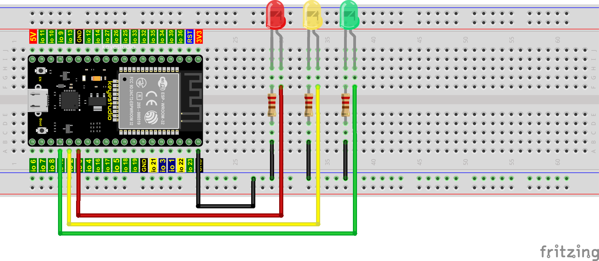

**Note:**

How to connect a LED


How to identify the 220Ω Five-color ring resistor


4.Project code：

Codes used in this tutorial are saved in“2. Python Projects”.

If you haven't downloaded the code file yet, please click on the link to download it:[Download Python Codes](Python-Codes.zip)


Open“Thonny”，click“This computer”→“D:”→“2. Python Projects”→“Project 05：Traffic Lights”. and double left-click “Project\_05\_Traffic\_Lights.py”.


```python
from machine import Pin
import time

led_red = Pin(0, Pin.OUT)  # create red led object from Pin 0, Set Pin 0 to output
led_yellow = Pin(2, Pin.OUT)  # create yellow led object from Pin 2, Set Pin 2 to output
led_green = Pin(15, Pin.OUT) # create green led object from Pin 15, Set Pin 15 to output

while True:
    led_red.value(1)  # Set red led turn on
    time.sleep(5)   # Sleep 5s
    led_red.value(0) # Set red led turn off 
    led_yellow.value(1)
    time.sleep(0.5)
    led_yellow.value(0)
    time.sleep(0.5)
    led_yellow.value(1)
    time.sleep(0.5)
    led_yellow.value(0)
    time.sleep(0.5)
    led_yellow.value(1)
    time.sleep(0.5)
    led_yellow.value(0)
    time.sleep(0.5)
    led_green.value(1)
    time.sleep(5) 
    led_green.value(0) 
```

5.Project result：

Make sure the ESP32 has been connected to the computer, click“Stop/Restart backend” .


Click “Run current script”, the code starts to be executed and you'll see are below:

① First, the green light will be on for five seconds and then off; 
② Next, the yellow light blinks three times and then goes off;
③ Then, the red light goes on for five seconds and then goes off;
④ Repeat steps 1 to 3 above.

Press “Ctrl+C” or click“Stop/Restart backend” to exit the program.


## Project 06: RGB LED

1.Introduction：


RGB is composed of three colors (red, green and blue), which can emit different colors of light by mixing these three basic colors.

In this project, we will introduce the RGB and show you how to use ESP32 to control the RGB to emit different color light. RGB is pretty basic, but it’s also a great way to learn the fundamentals of electronics and coding.

2.Components：

|  |  |  |
| ------------------------------------------------------------ | ------------------------------------------------------------ | ------------------------------------------------------------ |
| ESP32*1                                                      | RGB LED                                                      | Jumper Wires                                                 |
|  |  |  |
| Breadboard*1                                                 | 220Ω Resistor*3                                              | USB Cable*1                                                  |

3.Component knowledge：

Most monitors adopt the RGB color standard, and all colors on a computer screen are a mixture of red, green and blue in varying proportions.


This RGB LED has 4 pins, each color (red, green, blue) and a common cathode, to change its brightness, we can use the PWM of the ESP32 pins, which can give different duty cycle signals to the RGB to produce different colors of light.

If we use three 10-bit PWM to control the RGB, in theory, we can create 2 <sup>10</sup>\*2<sup>10</sup>\*2<sup>10</sup> = 1,073,741,824(1 billion) colors through different combinations.

4.Wiring diagram：


**Note：**

The longest pin (common cathode) of the RGB LED is connected to GND.


How to identify the 220Ω Five-color ring resistor


5.Project code：

Codes used in this tutorial are saved in“2. Python Projects”. 

If you haven't downloaded the code file yet, please click on the link to download it:[Download Python Codes](Python-Codes.zip)


Open“Thonny”，click“This computer”→“D:”→“2. Python Projects”→“Project 06：RGB LED”, and double left-click “Project\_06\_RGB\_LED.py”.


```python
# import Pin, PWM and Random function modules.
from machine import Pin, PWM
from random import randint
import time

#Configure ouput mode of GPIO15, GPIO2 and GPIO0 as PWM output and PWM frequency as 10000Hz.
pins = [0, 2, 15]

pwm0 = PWM(Pin(pins[0]),10000)  
pwm1 = PWM(Pin(pins[1]),10000)
pwm2 = PWM(Pin(pins[2]),10000)

#define a function to set the color of RGBLED.
def setColor(r, g, b):
    pwm0.duty(1023-r)
    pwm1.duty(1023-g)
    pwm2.duty(1023-b)
    
try:
    while True:
        red   = randint(0, 1023) 
        green = randint(0, 1023)
        blue  = randint(0, 1023)
        setColor(red, green, blue)
        time.sleep_ms(200)
except:
    pwm0.deinit()
    pwm1.deinit()
    pwm2.deinit()
```

6.Project result：

Make sure the ESP32 has been connected to the computer, click“Stop/Restart backend” .


Click “Run current script”, the code starts to be executed and you'll see that RGB begins to display random colors. Press“Ctrl+C”or click“Stop/Restart backend”to exit the program.


## Project 07: Flowing Water Light

1.Introduction：

In our daily life, we can see many billboards composed of different colors of LED. They constantly change the light (like water) to attract customers' attention. In this project, we will use ESP32 to control 10 leds to achieve the effect of flowing water.

2.Components：

|  |  |  |
| ------------------------------------------------------------ | ------------------------------------------------------------ | ------------------------------------------------------------ |
| ESP32*1                                                      | Breadboard*1                                                 | USB Cable*1                                                  |
|  |  |  |
| Red LED*1                                                    | 220Ω Resistor*1                                              | Jumper Wire*2                                                |

3.Wiring diagram :


**Note:**

How to connect a LED


How to identify the 220Ω Five-color ring resistor


4.Project code：

This project is designed to make a flowing water lamp. Which are these actions: First turn LED \#1 ON, then turn it OFF. Then turn LED \#2 ON, and then turn it OFF... and repeat the same to all 10 LEDs until the last LED is turns OFF. This process is repeated to achieve the“movements” of flowing water.

Codes used in this tutorial are saved in“2. Python Projects”. 

If you haven't downloaded the code file yet, please click on the link to download it:[Download Python Codes](Python-Codes.zip)


Open“Thonny”，click“This computer”→“D:”→“2. Python Projects”→“Project 07：Flowing Water Light”, and double left-click “Project\_07\_Flowing\_Water\_Light.py”.


```python
from machine import Pin
import time

#Use an array to define 10 GPIO ports connected to LED Bar Graph for easier operation.
pins = [22, 21, 19, 18, 17, 16, 4, 0, 2, 15]
#Use two for loops to turn on LEDs separately from left to right and then back from right to left
def showLed():
    for pin in pins:
        print(pin)
        led = Pin(pin, Pin.OUT)
        led.value(1)
        time.sleep_ms(100)
        led.value(0)
        time.sleep_ms(100)        
    for pin in reversed(pins):
        print(pin)
        led = Pin(pin, Pin.OUT)
        led.value(1)
        time.sleep_ms(100)
        led.value(0)
        time.sleep_ms(100)
          
while True:
    showLed()
```

5.Project result：

Make sure the ESP32 has been connected to the computer, click“Stop/Restart backend” .


Click “Run current script”, the code starts to be executed and you'll see that 10 LEDs will light up from left to right and then back from right to left. Press“Ctrl+C” or click“Stop/Restart backend” to exit the program.


## Project 08：1-Digit Digital Tube

1.Introduction：

A 1-Digit 7-Segment Display is an electronic display device that displays decimal numbers. It is widely used in digital clocks, electronic meters, basic calculators and other electronic devices that display digital information. Even though they may not look modern enough, they are an alternative to more complex dot matrix displays and are easy to use in limited light conditions and strong sunlight. In this project, we will use ESP32 to control 1-Digit 7-segment display to display numbers.

2.Components：

|  |  |  |
| ------------------------------------------------------------ | ------------------------------------------------------------ | ------------------------------------------------------------ |
| ESP32*1                                                      | Breadboard*1                                                 | USB Cable*1                                                  |
|  |  |  |
| 1-Digit 7-Segment Display*1                                  | 220Ω Resistor*8                                              | Jumper Wire*2                                                |

3.Component knowledge：


**1-Digit 7-Segment Display principle:** Digital tube display is a semiconductor light emitting device,its basic unit is a light-emitting diode (LED). Thedigital tube display can be divided into 7-segment display and 8-segment display according to the number of segments. The 8-segment display has one more LED unit than the 7-segment display (used for decimal point display). Each segment of the 7-segment display is a separate LED. According to the connection mode of the LED unit, the digital tube can be divided into a common anode digital tube and a common cathode digital tube.

In the common cathode 7-segment display, all the cathodes (or negative electrodes) of the segmented LEDs are connected together, so you should connect the common cathode to GND. To light up a segmented LED, you can set its associated pin to“HIGH”.

In the common anode 7-segment display, the LED anodes (positive electrodes) of all segments are connected together, so you should connect the common anode to“+5V”. To light up a segmented LED, you can set its associated pin to“LOW”.


Each part of the digital tube is composed of an LED. So when you use it, you also need to use a current limiting resistor. Otherwise, the LED will be damaged. In this experiment, we use an ordinary common cathode one-digit digital tube. As we mentioned above, you should connect the common cathode to GND. To light up a segmented LED, you can set its associated pin to“HIGH”.

4.Wiring diagram：

Note: The direction of the 7-segment display inserted into the breadboard is consistent with the wiring diagram, with one more point in the lower right corner.


5.Project code：

The digital display is divided into 7 segments, and the decimal point display is divided into 1 segment. When certain numbers are displayed, the corresponding segment will be lit. For example, when the number 1 is displayed, segments b and c will be turned on.

Codes used in this tutorial are saved in“2. Python Projects”. If you haven't downloaded the code file yet, please click on the link to download it:[Download Python Codes](Python-Codes.zip)


Open“Thonny”，click“This computer”→“D:”→“2. Python Projects”→“Project 08: 1-Digit Digital Tube”, and double left-click “Project\_08\_One\_Digit\_Digital\_Tube.py”.


```python
from machine import Pin
import time

a = Pin(16, Pin.OUT)
b = Pin(4, Pin.OUT)
c = Pin(5, Pin.OUT)
d = Pin(18, Pin.OUT)
e = Pin(19, Pin.OUT)
f = Pin(22, Pin.OUT)
g = Pin(23, Pin.OUT)
dp = Pin(17, Pin.OUT)

pins = [Pin(id,Pin.OUT) for id in [16, 4, 5, 18, 19, 22, 23, 17]]

def show(code):
    for i in range(0, 8):
        pins[i].value(~code & 1)
        code = code >> 1
        
#Select code from 0 to 9
mask_digits = [0xc0, 0xf9, 0xa4, 0xb0, 0x99, 0x92, 0x82, 0xf8,0x80, 0x90]
for code in reversed(mask_digits):
    show(code)
    time.sleep(1)
```

6.Project result：

Make sure the ESP32 has been connected to the computer, click“Stop/Restart backend” .


Click “Run current script”, the code starts to be executed and you'll see that the 1-Digit 7-Segment Display will display numbers from 9 to 0. Press“Ctrl+C”or click“Stop/Restart backend” to exit the program.


## Project 09：4-digit Digital Tube

1.Introduction

The 4-digit 7-segment display is a very practical display device and it is used for devices such as electronic clocks, score counters and the number of people in the park. Because of the low price, easy to use, more and more projects will use the 4 Digit 7-segment display. In this project, we use ESP32 to control the 4-digit 7-segment display to display digits.

2.Components

|  |  |  |
| ------------------------------------------------------------ | ------------------------------------------------------------ | ------------------------------------------------------------ |
| ESP32*1                                                      | Breadboard*1                                                 | USB Cable*1                                                  |
|  |  |  |
| 4-digit 7-segment display Module*1                           | 220Ω Resistor*8                                              | Jumper Wire*2                                                |

3.Component Knowledge


**4-digit 7-segment display：**It is a device with common cathode and anode, its display principle is similar to the 1-Digit digital tube display. Both of them have eight GPIO ports to control the digital tube display, that is 8 leds. However, here is 4-digit, so it needs four GPIO ports to control the bit selection end. Our 4 - digit digital tube is common cathode. 

The following figure shows the pin diagram of the 4-digit digital tube. G1, G2, G3 and G4 are the control pins. 


**Schematic Diagram**


4.Wiring Diagram


5.Test Code

Codes used in this tutorial are saved in“2. Python Projects”. If you haven't downloaded the code file yet, please click on the link to download it:[Download Python Codes](Python-Codes.zip)


Open“Thonny”，click“This computer”→“D:”→“2. Python Projects”→“Project 09：4-Digit Digital Tube”, then double left-click “Project\_09\_Four\_Digit\_Digital\_Tube.py”.


```python
from machine import Pin
import time

#Pin of each digit of nixie tube
a = Pin(18, Pin.OUT)
b = Pin(13, Pin.OUT)
c = Pin(2, Pin.OUT)
d = Pin(16, Pin.OUT)
e = Pin(17, Pin.OUT)
f = Pin(19, Pin.OUT)
g = Pin(0, Pin.OUT)
dp = Pin(4, Pin.OUT)

G1 = Pin(21, Pin.OUT)
G2 = Pin(22, Pin.OUT)
G3 = Pin(14, Pin.OUT)
G4 = Pin(15, Pin.OUT)
 
#digital tube a to dp corresponding development board pins
d_Pins=[Pin(i,Pin.OUT)  for i in [18,13,2,16,17,19,0,4]]
#Pin corresponding to digital tube segment G1, G2, G3, and G4
w_Pins=[Pin(i,Pin.OUT)  for i in [21,22,14,15]]
 
number={
    '0':
    [1,1,1,1,1,1,0,0],#0
    '1':
    [0,1,1,0,0,0,0,0],#1
    '2':
    [1,1,0,1,1,0,1,0],#2
    '3':
    [1,1,1,1,0,0,1,0],#3
    '4':
    [0,1,1,0,0,1,1,0],#4
    '5':
    [1,0,1,1,0,1,1,0],#5
    '6':
    [1,0,1,1,1,1,1,0],#6
    '7':
    [1,1,1,0,0,0,0,0],#7
    '8':
    [1,1,1,1,1,1,1,0],#8
    '9':
    [1,1,1,1,0,1,1,0],#9
}
 
def display(num,dp):
    global number
    count=0
    for pin in d_Pins:#displays the value of num 
        pin.value(number[num][count])
        count+=1
    if dp==1:
        d_Pins[7].value(0)
def clear():
    for i in w_Pins:
        i.value(0)
    for i in d_Pins:
        i.value(1)
def showData(num):
   #the hundreds, thousands, ones, and fractional values of a numeric value
    d_num=num
    location=d_num.find('.')
    if location>0:
        d_num=d_num.replace('.','')
        while len(d_num)<4:
            d_num='0'+d_num
        for i in range(0,4):
            time.sleep(2)
            clear()
            w_Pins[3-i].value(1)
            if i==location-1:
                display(d_num[i],1)
            else:
                display(d_num[i],0)
    if location<0:
        for i in range(0,4):
            time.sleep(2)
            clear()
            w_Pins[3-i].value(1)
            display(d_num[i],0)
while True:
 
    num='9016'
    showData(num)
```


6.Test Result

Make sure the ESP32 has been connected to the computer, then click“Stop/Restart backend” .


Click“Run current script”, the code starts to be executed and you'll see that 4-digit 7-segment display displays digits，and repeat these actions in an infinite loop. Press “Ctrl+C” or click“Stop/Restart backend” to exit the program.


## Project 10：8×8 Dot-matrix Display

1.Introduction

Dot matrix display is an electronic digital display device that can display information on machine, clocks, public transport departure indicators and many other devices. In this project, we will use ESP32 to control 8x8 LED dot matrix in a way that lights it up.

2.Components

|  |  |  |
| ------------------------------------------------------------ | ------------------------------------------------------------ | ------------------------------------------------------------ |
| ESP32*1                                                      | Breadboard*1                                                 | USB Cable*1                                                  |
|  |  |  |
| 8*8 dot matrix module *1                                     | 220Ω Resistor*8                                              | Jumper Wire*2                                                |

3.Component Knowledge

**8\*8 dot matrix module：** The 8\*8 dot matrix is composed of 64 LEDs, including row common anode and row common cathode. Our module is row common anode, each row has a line connecting the positive pole of the LED, and the column is connecting the negative pole of the LED lamp, as shown in the following figure :


4.Wiring Diagram


5.Test Code

The code used in this tutorial is saved in“2. Python Projects”. If you haven't downloaded the code file yet, please click on the link to download it:[Download Python Codes](Python-Codes.zip)


Open“Thonny”，click“This computer”→“D:”→“2. Python Projects”→“Project 10：8×8 Dot-matrix Display”, then double left-click“Project\_10\_8×8\_Dot\_Matrix\_Display.py”.


```python
from machine import Pin
import time

#Define the pin of the row and Set to output.
row1 = Pin(14, Pin.OUT)
row2 = Pin(26, Pin.OUT)
row3 = Pin(4, Pin.OUT)
row4 = Pin(27, Pin.OUT)
row5 = Pin(19, Pin.OUT)
row6 = Pin(16, Pin.OUT)
row7 = Pin(18, Pin.OUT)
row8 = Pin(17, Pin.OUT)
#Define the pins of the column and Set to output
col1 = Pin(32, Pin.OUT)
col2 = Pin(21, Pin.OUT)
col3 = Pin(22, Pin.OUT)
col4 = Pin(12, Pin.OUT)
col5 = Pin(0, Pin.OUT)
col6 = Pin(13, Pin.OUT)
col7 = Pin(33, Pin.OUT)
col8 = Pin(25, Pin.OUT)

#Sets the pin of the column to low level
col1.value(0)
col2.value(0)
col3.value(0)
col4.value(0)
col5.value(0)
col6.value(0)
col7.value(0)
col8.value(0)

#Since the column of the lattice has been set to low level, 
#the corresponding row of the lattice will light up when the pin of the row is at high level
def Row(d):
    if(d ==1):
        row1.value(1)  #Light the first line
    if(d ==2):
        row2.value(1)  #Light the second line
    if(d ==3):
        row3.value(1)
    if(d ==4):
        row4.value(1)
    if(d ==5):
        row5.value(1)
    if(d ==6):
        row6.value(1)
    if(d ==7):
        row7.value(1)
    if(d ==8):
        row8.value(1)
    
#Close the lattice
def off():
    row1.value(0)
    row2.value(0)
    row3.value(0)
    row4.value(0)
    row5.value(0)
    row6.value(0)
    row7.value(0)
    row8.value(0) 

try:
    print("test...")
    while True:
         for num in range(1,10):  #Light the lattice line by line
             Row(num)
             if(num == 9):  #Because the lattice has only 8 rows, and I'm limiting it here, is equal to 9
                off()      #Close the lattice
             time.sleep(0.2)

except:
    pass
```

6.Test Result

Make sure the ESP32 has been connected to the computer, then click“Stop/Restart backend” .


Click“Run current script”, the code starts to be executed and you'll see that the 8\*8 dot matrix gradually lights up. Press“Ctrl+C” or click“Stop/Restart backend”to exit the program.


## Project 11：74HC595N Control 8 LEDs 

1.Introduction：

In previous projects, we learned how to light up an LED.

With only 32 IO ports on ESP32, how do we light up a lot of leds? Sometimes it is possible to run out of pins on the ESP32, and you need to extend it with the shift register.You can use the 74HC595N chip to control 8 outputs at a time, taking up only a few pins on your microcontroller. In addition, you can also connect multiple registers together to further expand the output. In this project, we will use ESP32, 74HC595 chip and LED to make a flowing water light to understand the function of the 74HC595 chip.

2.Components：

|  |  |  |  |
| ------------------------------------------------------------ | ------------------------------------------------------------ | ------------------------------------------------------------ | ------------------------------------------------------------ |
| ESP32*1                                                      | Breadboard*1                                                 | 74HC595N chip*1                                              | Jumper Wires                                                 |
|  |  |  |                                                              |
| 220Ω Resistor*8                                              | Red LED*8                                                    | USB Cable*1                                                  |                                                              |

3.Component knowledge：

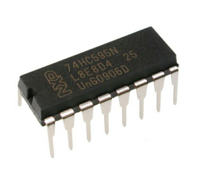

**74HC595N Chip:** The 74HC595 chip is used to convert serial data into parallel data. A 74HC595 chip can convert the serial data of one byte into 8 bits, and send its corresponding level to each of the 8 ports correspondingly. With this characteristic, the 74HC595 chip can be used to expand the IO ports of an ESP32. At least 3 ports are required to control the 8 ports of the 74HC595 chip.


The ports of the 74HC595 chip are described as follows ：

<table border="1">
<tbody>
<tr class="odd">
<td>Pin 13--OE</td>
<td><p>Enable output,</p>
<p>When this pin is in high level, Q0-Q7 is in high resistance state.</p>
<p>When this pin is in low level, Q0-Q7 is in output mode.</p></td>
</tr>
<tr class="even">
<td>Pin 14---SI</td>
<td>Serial data Input, only enter one bit at a time, so you can enter eight consecutive times to form one byte.</td>
</tr>
<tr class="odd">
<td>Pin 10---SCLR</td>
<td>Remove shift register: When this pin is in low level, the content in shift register will be cleared.. In this experiment, we connect VCC to maintain a high level.</td>
</tr>
<tr class="even">
<td>Pin 11---SCK</td>
<td>Serial shift clock: when its electrical level is rising, serial data input register will do a shift.</td>
</tr>
<tr class="odd">
<td>Pin 12---RCK</td>
<td>Parallel Update Output: when its electrical level is rising, it will update the parallel data output. In this case, the data is output from ports Q0 to Q7 in parallel</td>
</tr>
<tr class="even">
<td>Pin 9---SQH</td>
<td>Serial data output: it can be connected to more 74HC595 in series.</td>
</tr>
<tr class="odd">
<td>Q0--Q7(Pin 15，Pin 1-7)</td>
<td>Parallel data output, can directly control the 8 segments of the digital tube.</td>
</tr>
</tbody>
</table>

4.Wiring diagram：

Note: Note the orientation in which the 74HC595N chip is inserted.


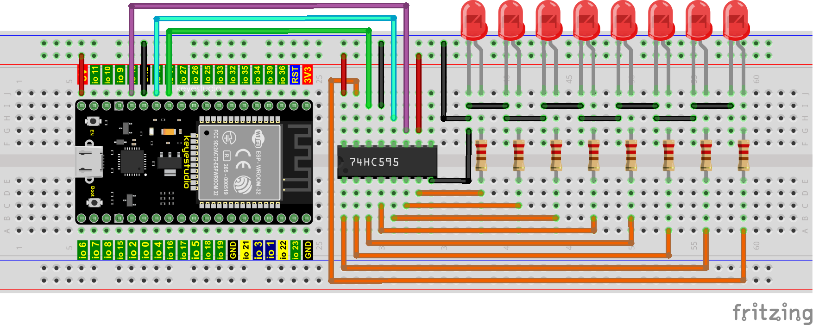

5.Project code：

Codes used in this tutorial are saved in“2. Python Projects”. If you haven't downloaded the code file yet, please click on the link to download it:[Download Python Codes](Python-Codes.zip)


Open“Thonny”，click“This computer”→“D:”→“2. Python Projects”→“Project 11：74HC595N Control 8 LEDs”.

Select“my74HC595.py”, right click your mouse to select“Upload to /”，wait for “my74HC595.py” to be uploaded to ESP32, and then double left-click “Project\_11\_74HC595N\_Controls\_8\_LEDs.py”.


```python
#Import time and my74HC595 modules.
from my74HC595 import Chip74HC595
import time

#Create a Chip74HC595 object and configure pins
chip = Chip74HC595(14, 12, 13)
# ESP32-14: 74HC595-DS(14)
# ESP32-12: 74HC595-STCP(12)
# ESP32-13: 74HC595-SHCP(11)

#The first for loop makes LED Bar display separately from left to right
#while the second for loop make it display separately from right to left.
while True:
    x = 0x01
    for count in range(8):
        chip.shiftOut(1, x)
        x = x<<1;
        time.sleep_ms(300)
    x = 0x01
    for count in range(8):
        chip.shiftOut(0, x)
        x = x<<1
        time.sleep_ms(300)
```

6.Project result：

Make sure the ESP32 has been connected to the computer, click“Stop/Restart backend” .


Click “Run current script”, the code starts to be executed and you'll see that the 8 LEDs start flashing in flowing water mode. Press“Ctrl+C”or click“Stop/Restart backend”to exit the program.


## Project 12：Active Buzzer

1.Introduction：

Active buzzer is a sound component that is widely used as a sound component for computers、printers、alarms、electronic toys and phones、timers etc. It has an internal vibration source, just by connecting to a 5V power supply, it can continuously buzz. In this project, we will use ESP32 to control the active buzzer to beep.

2.Components：

|  |  |  |                                                              |
| ------------------------------------------------------------ | ------------------------------------------------------------ | ------------------------------------------------------------ | ------------------------------------------------------------ |
| ESP32*1                                                      | Breadboard*1                                                 | Active buzzer*1                                              |                                                              |
|  |  |  |  |
| NPN Transistor(S8050)*1                                      | 1kΩ Resistor*1                                               | Jumper Wires                                                 | USB Cable*1                                                  |

3.Component knowledge：


**Active buzzer:** Active buzzer inside has a simple oscillator circuit, which can convert constant direct current into a certain frequency pulse signal. Once active buzzer receives a high level, it will produce sound. Passive buzzer is an internal without vibration source integrated electronic buzzer, it must be driven by 2k to 5k square wave, rather than a DC signal. The two buzzers are very similar in appearance, but one buzzer with a green circuit board is a passive buzzer, while the other buzzer with black tape is an active buzzer. Passive buzzers don't have positive polarity, but active buzzers have. As shown below:


**Transistor:**


Because the buzzer requires such large current that GPIO of ESP32 output capability cannot meet the requirement, a transistor of NPN type is needed here to amplify the current.

Transistor, the full name: semiconductor transistor, is a semiconductor device that controls current. Transistorcan be used to amplify weak signal, or works as a switch. It has three electrodes(PINs): base (b), collector (c) and emitter (e). When there is current passing between "be", "ce" will allow several-fold current (transistor magnification) pass, at this point, transistor works in the amplifying area. When current between "be" exceeds a certain value, "ce" will not allow current to increase any longer, at this point, transistor works in the saturation area. Transistor has two types as shown below: PNP and NPN.


In our kit, the PNP transistor is marked with 8550, and the NPN transistor is marked with 8050.

Based on the transistor's characteristics, it is often used as a switch in digital circuits. As micro-controller's capacity to output current is very weak, we will use transistor to amplify current and drive large-current components.

When using NPN transistor to drive buzzer, we often adopt the following method. If GPIO outputs high level, current will flow through R1, the transistor will get conducted, and the buzzer will sound. If GPIO outputs low level, no current flows through R1, the transistor will not be conducted, and buzzer will not sound.

When using PNP transistor to drive buzzer, we often adopt the following method. If GPIO outputs low level, current will flow through R1, the transistor will get conducted, and the buzzer will sound. If GPIO outputs high level, no current flows through R1, the transistor will not be conducted, and buzzer will not sound.

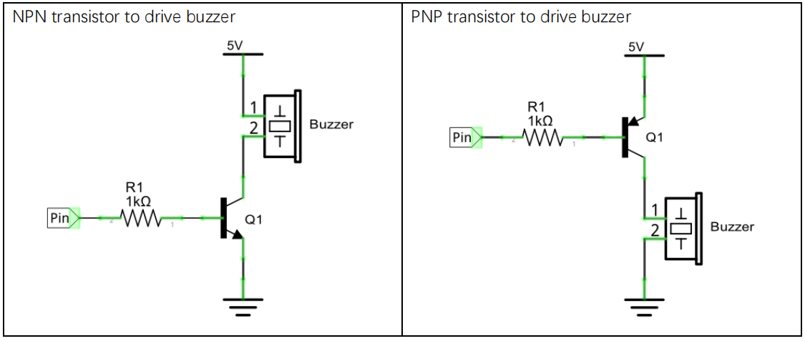

4.Wiring diagram：


Note: The buzzer power supply in this circuit is 5V. On a 3.3V power supply, the buzzer can work, but will reduce the loudness.

5.Project code：

Codes used in this tutorial are saved in“2. Python Projects”. If you haven't downloaded the code file yet, please click on the link to download it:[Download Python Codes](Python-Codes.zip)


Open“Thonny”，click“This computer”→“D:”→“2. Python Projects”→”Project 12: Active Buzzer”, and then double left-click “Project\_12\_Active\_Buzzer.py”.


```python
from machine import Pin
import time

buzzer = Pin(15, Pin.OUT)   # create buzzer object from Pin 15, Set Pin 15 to output

try:
    while True:
        buzzer.value(1)    # Set buzzer turn on
        time.sleep(0.5) # Sleep 0.5s
        buzzer.value(0)    # Set buzzer turn off
        time.sleep(0.5) # Sleep 0.5s
except:
    pass
```

6.Project result：

Make sure the ESP32 has been connected to the computer, click“Stop/Restart backend” .


Click “Run current script”, the code starts to be executed and you'll see that the active buzzer beeps. Press“Ctrl+C”or click “Stop/Restart backend”to exit the program.


## Project 13：Passive Buzzer

1.Introduction:

In a previous project, we studied an active buzzer, which can only make a sound and may make you feel very monotonous. In this project, we will learn a passive buzzer and use the ESP32 control it to work. Unlike the active buzzer, the passive buzzer can emit sounds of different frequencies.

2.Components：

|  |  |  |                                                              |
| ------------------------------------------------------------ | ------------------------------------------------------------ | ------------------------------------------------------------ | ------------------------------------------------------------ |
| ESP32*1                                                      | Breadboard*1                                                 | Passive Buzzer *1                                            |                                                              |
|  |  |  |  |
| NPN Transistor(S8050)*1                                      | 1kΩResistor*1                                                | Jumper Wires                                                 | USB Cable*1                                                  |

3.Component knowledge：


**Passive buzzer:** A passive buzzer is an integrated electronic buzzer with no internal vibration source and it has to be driven by 2K-5K square waves, not DC signals. The two buzzers are very similar in appearance, but one buzzer with a green circuit board is a passive buzzer and the other buzzer with black tape is an active buzzer. Passive buzzers cannot distinguish between positive polarity while active buzzers can.


**Transistor:** Please refer to Project 12.

4.Wiring diagram:


5.Project code：

Codes used in this tutorial are saved in“2. Python Projects”. If you haven't downloaded the code file yet, please click on the link to download it:[Download Python Codes](Python-Codes.zip)


Open“Thonny”，click“This computer”→“D:”→“2. Python Projects”→”Project 13: Passive Buzzer”, and then double left-click “Project\_13\_Passive\_Buzzer.py”.


```python
from machine import Pin
import time

#Initialize the passive buzzer
buzzer = Pin(15,Pin.OUT)

#Simulate two different frequencies
while True:
    #Output 500HZ frequency sound
    for i in range(80):
        buzzer.value(1)
        time.sleep(0.001)
        buzzer.value(0)
        time.sleep(0.001)
    #Output 250HZ frequency sound
    for i in range(100):
        buzzer.value(1)
        time.sleep(0.002)
        buzzer.value(0)
        time.sleep(0.002)
```

6.Project result：

Make sure the ESP32 has been connected to the computer, click“Stop/Restart backend”.


Click “Run current script”, the code starts to be executed and you'll see that the passive buzzer sounds alarm. Press“Ctrl+C”or click“Stop/Restart backend”to exit the program.


## Project 14: Mini Table Lamp

1.Introduction：

Do you know that the ESP32 can light up an LED when you press a button? In this project, we will use ESP32、a button switch and an LED to make a mini table lamp.

2.Components：

|  |  |  |  |                                                              |
| ------------------------------------------------------------ | ------------------------------------------------------------ | ------------------------------------------------------------ | ------------------------------------------------------------ | ------------------------------------------------------------ |
| ESP32*1                                                      | Breadboard*1                                                 | Button*1                                                     | Button Cap*1                                                 |                                                              |
|  |  |  |  |  |
| 10KΩ Resistor*1                                              | Red LED*1                                                    | 22Ω Resistor*1                                               | USB Cable*1                                                  | Jumper Wires                                                 |

3.Component knowledge：


**Button:** A button can control the circuit on and off, the button is plugged into a circuit, the circuit is disconnected when the button is not pressed. The circuit works when you press the button, but breaks again when you release it. Why does it only work when you press it? It starts from the internal structure of the button, which don’t allow current to travel from one end of the button to the other before it is pressed; When pressed, a metal strip inside the button connects the two sides to allow electricity to pass through.

The internal structure of the button is shown in the figure：. Before the button is pressed, 1 and 2 are on, 3 and 4 are also on, but 1, 3 or 1, 4 or 2, 3 or 2, 4 are off(not working). Only when the button is pressed, 1, 3 or 1, 4 or 2, 3 or 2, 4 are on.

The button switch is one of the most commonly used components in circuit design.

**Schematic diagram of the button:**


**What is button** **shake javascript?**

We think of the switch circuit as "press the button and turn it on immediately", "press it again and turn it off immediately". In fact, this is not the case.

The button usually uses a mechanical elastic switch, and the mechanical elastic switch will produce a series of shake javascript due to the elastic action at the moment when the mechanical contact is opened and closed (usually about 10ms). As a result, the button switch will not immediately and stably turn on the circuit when it is closed, and it will not be completely and instantaneously disconnected when it is turned off.


**How to eliminate the** **[shake](javascript:;)?**

There are two common methods, namely fix [shake](javascript:;) in the software and hardware. We only discuss the [shake](javascript:;) removal
in the software.

We already know that the [shake](javascript:;) time generated by elasticity is about 10ms, and the delay command can be used to delay the execution time of the command to achieve the effect of [shake](javascript:;) removal.

Therefore, we delay 0.02s in the code to achieve the key anti-shake function.


4.Wiring Diagram：


**Note:**

How to connect the LED


How to identify the 220Ω 5-band resistor and 10KΩ 5-band resistor


5.Project code：

Codes used in this tutorial are saved in“2. Python Projects”. If you haven't downloaded the code file yet, please click on the link to download it:[Download Python Codes](Python-Codes.zip)


Open“Thonny”，click“This computer”→“D:”→“2. Python Projects”→”Project 14: Mini Table Lamp”, and then double left-click “Project\_14\_Mini\_Table\_Lamp.py”.


```python
from machine import Pin
import time

led = Pin(4, Pin.OUT) # create LED object from Pin 4,Set Pin 4 to output                   
button = Pin(15, Pin.IN, Pin.PULL_UP) #Create button object from Pin15,Set GP15 to input

#Customize a function and name it reverseGPIO(),which reverses the output level of the LED
def reverseGPIO():
    if led.value():
        led.value(0)     #Set led turn off
    else:
        led.value(1)     #Set led turn on
        
try:
    while True:
        if not button.value():
            time.sleep_ms(20)
            if not button.value():
                reverseGPIO()
                while not button.value():
                    time.sleep_ms(20)
except:
    pass
```


6.Project result：

Make sure the ESP32 has been connected to the computer, click“Stop/Restart backend” .


Click “Run current script”, the code starts to be executed and you'll see that press the push button switch, the LED turns on. When it is released, the LED is still on. Press it again, and the LED turns off. When it is released, the LED stays off. Doesn't it look like a mini table lamp? Press“Ctrl+C”or click“Stop/Restart backend”to exit the program.


## Project 15：Tilt And LED

1.Introduction：

The ancients without electronic clock, so the hourglass are invented to measure time. The hourglass has a large capacity on both sides, and which is filled with fine sand on one side. What’s more, there is a small channel in the middle, which can make the hourglass stand upright , the side with fine sand is on the top. due to the effect of gravity,the fine sand will flow down through the channel to the other side of the hourglass. When the sand reaches the bottom, turn it upside down and record the number of times it has gone through the hourglass, therefore, the next day we can know the approximate time of the day by it. 

In this project, we will use ESP32 to control the tilt switch and LED lights to simulate an hourglass and make an
electronic hourglass.

2.Components：

|  |  |  |  |
| ------------------------------------------------------------ | ------------------------------------------------------------ | ------------------------------------------------------------ | ------------------------------------------------------------ |
| ESP32*1                                                      | Tilt Switch*1                                                | Red LED*4                                                    | 10KΩ Resistor*1                                              |
|  |  |  |  |
| Breadboard*1                                                 | 220Ω Resistor*4                                              | USB Cable*1                                                  | Jumper Wires                                                 |

3.Component knowledge：


Tilt switch is also called digital switch. Inside is a metal ball that can roll. The principle of rolling the metal ball to contact with the conductive plate at the bottom, which is used to control the on and off of the circuit. When it is a rolling ball tilt sensing switch with single directional trigger, the tilt sensor is tilted toward the trigger end (two gold-plated pin ends), the tilt switch is in a closed circuit and the voltage at the analog port is about 5V(binary number is 1023).

In this way, the LED will light up. When the tilting switch is in horizontal position or tilting to the other end, the tilting switch is in open state the voltage of the analog port is about 0V (binary number is 0), the LED will turn off. In the program, we judge the state of the switch based on whether the voltage value of the analog port is greater than 2.5V (binary number is 512).

The internal structure of the tilt switch is used here to illustrate how it works, as shown below:


4.Wiring Diagram：


**Note:**

How to connect the LED


How to identify the 220Ω 5-band resistor and 10KΩ 5-band resistor


5.Project code：

Codes used in this tutorial are saved in“2. Python Projects”. If you haven't downloaded the code file yet, please click on the link to download it:[Download Python Codes](Python-Codes.zip)


Open“Thonny”，click“This computer”→“D:”→“2. Python Projects”→“Project 15: Tilt And LED”, and then double left-click “Project\_15\_Tilt\_And\_LED.py”.


```python
from machine import Pin
import time

led1 = Pin(16, Pin.OUT) # create LED object from Pin 2,Set Pin 2 to output
led2 = Pin(17, Pin.OUT) # create LED object from Pin 0,Set Pin 0 to output
led3 = Pin(18, Pin.OUT) # create LED object from Pin 4,Set Pin 4 to output
led4 = Pin(19, Pin.OUT) # create LED object from Pin 16,Set Pin 16 to output
Tilt_Sensor = Pin(15,Pin.IN) #Create tilt object from Pin15,Set GP15 to input

while True:
    if(Tilt_Sensor.value() == 0) : #when the value of tilt sensor is 0
        led1.value(1) # led1 turn on
        time.sleep_ms(200)#delay
        led2.value(1) # led2 turn on
        time.sleep_ms(200)#delay
        led3.value(1) # led3 turn on
        time.sleep_ms(200)#delay
        led4.value(1) # led4 turn on
        time.sleep_ms(200)#delay 
    else :           #when the value of tilt sensor is 1
        led4.value(0) # led4 turn off
        time.sleep_ms(200)#delay
        led3.value(0) # led3 turn off
        time.sleep_ms(200)#delay
        led2.value(0) # led2 turn off
        time.sleep_ms(200)#delay
        led1.value(0) # led1 turn off
        time.sleep_ms(200)#delay
```


6.Project result：

Make sure the ESP32 has been connected to the computer, click“Stop/Restart backend” .


Click “Run current script”, the code starts to be executed and you'll see that when you tilt the breadboard to an angle, the LEDs will light up one by one. When you turn the breadboard to the original angle, the LEDs will turn off one by one. Like the hourglass, the sand will leak out over time. Press“Ctrl+C”or click “Stop/Restart backend”to exit the program.


## Project 16: I2C 128×32 LCD

1.Introduction：

In everyday life, we can do all kinds of experiments with the display module and also DIY a variety of small objects. For example, you can make a temperature meter with a temperature sensor and display, or make a distance meter with an ultrasonic module and display. In this project, we will use the LCD\_128X32\_DOT module as the display and connect it to the ESP32, which will be used to control the LCD\_128X32\_DOT display to display various English words, common symbols and numbers.

2.Components：

|  |  |                                                              |
| ------------------------------------------------------------ | ------------------------------------------------------------ | ------------------------------------------------------------ |
| ESP32*1                                                      | Breadboard*1                                                 |                                                              |
|  |  |  |
| LCD_128X32_DOT*1                                             | M-F Dupont Wires                                             | USB Cable*1                                                  |

3.Component knowledge：


**LCD\_128X32\_DOT:** It is an LCD module with 128\*32 pixels and its driver chip is ST7567A. The module uses the IIC communication mode, while the code contains a library of all alphabets and common symbols that can be called directly. When using, we can also set it in the code so that the English letters and symbols show different text sizes. To make it easy to set up the pattern display, we also provide a mold capture software that converts a specific pattern into control code and then copies it directly into the test code for use.

**Schematic diagram of LCD\_128X32\_DOT：**


**Features:**

Pixel: 128\*32 character

Operating voltage(chip)：4.5V to 5.5V

Operating current：100mA (5.0V)

Optimal operating voltage(module):5.0V

4.Wiring Diagram：


5.Project code：

Codes used in this tutorial are saved in“2. Python Projects”. If you haven't downloaded the code file yet, please click on the link to download it: [Download Python Codes](Python-Codes.zip)


Open“Thonny”，click“This computer”→“D:”→“2. Python Projects”→“Project 16: I2C 128×32 LCD”. Select“lcd128\_32.py”and “lcd128\_32\_fonts.py”，right-click your mouse to select“Upload to/”，wait for“lcd128\_32.py”and“lcd128\_32\_fonts.py”to be uploaded to ESP32，and then double left-click“Project\_16\_I2C\_128\_32\_LCD.py”.


```python
import machine
import time
import lcd128_32_fonts
from lcd128_32 import lcd128_32

#i2c config
clock_pin = 22
data_pin = 21
bus = 0
i2c_addr = 0x3f
use_i2c = True

def scan_for_devices():
    i2c = machine.I2C(bus,sda=machine.Pin(data_pin),scl=machine.Pin(clock_pin))
    devices = i2c.scan()
    if devices:
        for d in devices:
            print(hex(d))
    else:
        print('no i2c devices')

if use_i2c:
    scan_for_devices()
    lcd = lcd128_32(data_pin, clock_pin, bus, i2c_addr)

lcd.Clear()

lcd.Cursor(0, 4)
lcd.Display("KEYESTUDIO")
lcd.Cursor(1, 0)
lcd.Display("ABCDEFGHIJKLMNOPQR")
lcd.Cursor(2, 0)
lcd.Display("123456789+-*/<>=$@")
lcd.Cursor(3, 0)
lcd.Display("%^&(){}:;'|?,.~\\[]")
"""
while True:
    scan_for_devices()
    time.sleep(0.5)
"""
```


6.Project result：

Make sure the ESP32 has been connected to the computer, click“Stop/Restart backend” .


Click “Run current script”, the code starts to be executed and you'll see that the 128X32LCD module display will show“KEYESTUDIO”at the first line,“ABCDEFGHIJKLMNOPQR”will be displayed at the second line, ”123456789+-\*/\<\>=$@”will be shown at the third line and“%^&(){}:;'|?,.\~\\\\\[\]”will be displayed at the fourth line. Press“Ctrl+C”or click “Stop/Restart backend”to exit the program.


## Project 17：Small Fan

1.Introduction

In hot summer, we need electric fans to cool us down, so in this project, we will use a ESP32 to control a DC motor and small fan blades to make a small electric fan.

2.Components

|  |  |  |  |
| ------------------------------------------------------------ | ------------------------------------------------------------ | ------------------------------------------------------------ | ------------------------------------------------------------ |
| ESP32*1                                                      | Breadboard*1                                                 | 6 AA Battery Holder*1                                        | Breadboard Power Module*1                                    |
|  |  |  |  |
| AA Battery(Self-prepared)*6                                  | Fan*1                                                        | DC Motor*1                                                   | NPN Transistor (S8050)*1                                     |
|  |  |  |  |
| PNP Transistor (S8550)*1                                     | 1KΩ Resistor*1                                               | Jumper Wire                                                  | Diode*1                                                      |
| USB Cable*1 |                                                              |                                                              |                                                              |

**Keyestudio Breadboard Power Supply Module：**

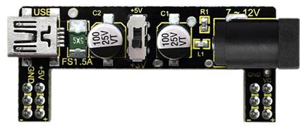

**Introduction:**

This breadboard power supply module is compatible with 5V and 3.3V, which can be applied to MB102 breadboard. The module contains two channels of independent control, powered by the USB all the way.

The output voltage is constant for the DC5V, and another way is powered by DC6.5-12V, output controlled by the slide switch, respectively for DC 5V and DC 3.3V.

If the other power supply is DC 6.5-12v, when the slide switch is switched to +5V, the output voltages of the left and right lines of the module are DC 5V. When the slide switch is switched to +3V, the output voltage of the USB power supply terminal of the module is DC 5V, and the output voltage of the DC 6.5-12V power supply terminal of the other power supply is DC3.3V.

3.Wiring Diagram 1：

We use the S8050（NPN transistor) to control the motor


Wire up first, then connect a fan at the DC motor

5.Test Code 1：

Codes used in this tutorial are saved in 2. Python Projects”.  If you haven't downloaded the code file yet, please click on the link to download it:[Download Python Codes](Python-Codes.zip)


Open“Thonny”，click“This computer”→“D:”→“2. Python Projects”→“Project 17: Small Fan”, and then double left-click“Project\_17.1\_ Small\_Fan.py”.


```python
from machine import Pin
import time

motor = Pin(15, Pin.OUT)   # create S8050 object from Pin 15, Set Pin 15 to output

try:
    while True:
        motor.value(1)    # Set motor turn on
        time.sleep(4) # Sleep 4s
        motor.value(0)    # Set motoe turn off
        time.sleep(2) # Sleep 2s
except:
    pass
```


Ensure the ESP32 is connecteed to the computer and tap “Stop/Restart backend”.

6.Project result：

Make sure the ESP32 has been connected to the computer, click“Stop/Restart backend” .


Power up and click“Run current script”, the code starts to be executed and you'll see that the small fan turn for 4s and stop for 2s.

Press“Ctrl+C”or click“Stop/Restart backend”to exit the program.


7.Wiring Diagram 2：

We use the S8050（PNP transistor) to control the motor

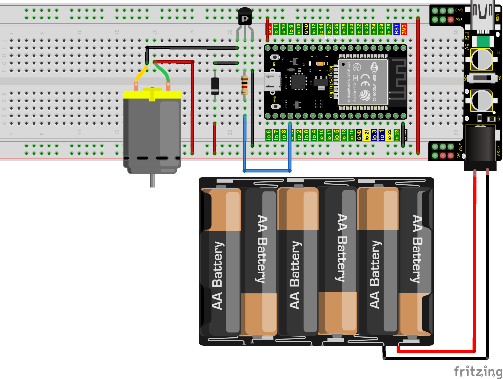

Wire up first, then connect a fan at the DC motor

8.Test Code 2：

Codes used in this tutorial are saved in“2. Python Projects”. If you haven't downloaded the code file yet, please click on the link to download it:[Download Python Codes](Python-Codes.zip)


Open“Thonny”，click“This computer”→“D:”→“2. Python Projects”→“Project 17：Small Fan”, and then double left-click“Project\_17.2\_ Small\_Fan.py”.


```python
from machine import Pin
import time

motor = Pin(15, Pin.OUT)   # create S8550 object from Pin 15, Set Pin 15 to output

try:
    while True:
        motor.value(0)    # Set motor turn on
        time.sleep(4) # Sleep 4s
        motor.value(1)    # Set motoe turn off
        time.sleep(2) # Sleep 2s
except:
    pass
```


9.Test Result 2：

Make sure the ESP32 has been connected to the computer, click“Stop/Restart backend” .


Power up and click“Run current script”, the code starts to be executed and you'll see that the small fan turn for 4s and stop for 2s. Press“Ctrl+C”or click“Stop/Restart backend”to exit the program.


## Project 18：Dimming Light

1.Introduction：

A potentiometer is a three-terminal resistor with sliding or rotating contacts that forms an adjustable voltage divider. It works by changing the position of the sliding contacts across a uniform resistance. In the potentiometer, the entire input voltage is applied across the whole length of the resistor, and the output voltage is the voltage drop between the fixed and sliding contact.

In this project, we will learn how to use ESP32 to read the values of the potentiometer, and make a dimming lamp with LED.

2.Components：

|  |  |  |  |
| ------------------------------------------------------------ | ------------------------------------------------------------ | ------------------------------------------------------------ | ------------------------------------------------------------ |
| ESP32*1                                                      | Breadboard*1                                                 | Potentiometer*1                                              | Red LED*1                                                    |
|  |  |  |                                                              |
| 220ΩResistor*1                                               | Jumper Wires                                                 | USB Cable*1                                                  |                                                              |

3.Component knowledge：


**Adjustable potentiometer:** It is a kind of resistor and an analog electronic component, which has two states of 0 and 1(high level and low level). The analog quantity is different, its data state presents a linear state such as 1 \~ 1024.

**ADC :** An ADC is an electronic integrated circuit used to convert analog signals such as voltages to digital or binary form consisting of 1s and 0s. The range of our ADC on ESP32 is 12 bits, that means the resolution is 2^12=4096, and it represents a range (at 3.3V) will be divided equally to 4096 parts. The rage of analog values corresponds to ADC values. So the more bits the ADC has, the denser the partition of analog will be and the greater the precision of the resulting conversion.


Subsection 1: the analog in rang of 0V---3.3/4095 V corresponds to digital 0;

Subsection 2: the analog in rang of 3.3/4095 V---2\*3.3 /4095V corresponds to digital 1;

…

The following analog will be divided accordingly.

The conversion formula is as follows:


**DAC：**The reversing of this process requires a DAC, Digital-to-Analog Converter. The digital I/O port can output high level and low level (0 or 1), but cannot output an intermediate voltage value. This is where a DAC is useful. ESP32 has two DAC output pins with 8-bit accuracy, GPIO25 and GPIO26, which can divide VCC(here is 3.3V) into 2^8=256 parts. For example, when the digital quantity is 1, the output voltage value is 3.3/256 \*1 V, and when the digital quantity is 128, the output voltage value is 3.3/256\*128=1.65V, the higher the accuracy of DAC, the higher the accuracy of output voltage value will be.

The conversion formula is as follows:


**ADC on ESP32：**

ESP32 has 16 pins can be used to measure analog signals. GPIO pin sequence number and analog pin definition are shown in the following table：

<table border="1">
<tbody>
<tr class="odd">
<td><strong>ADC number in ESP32</strong></td>
<td><strong>ESP32 GPIO number</strong></td>
</tr>
<tr class="even">
<td><strong>ADC0</strong></td>
<td><strong>GPIO 36</strong></td>
</tr>
<tr class="odd">
<td><strong>ADC3</strong></td>
<td><strong>GPIO 39</strong></td>
</tr>
<tr class="even">
<td><strong>ADC4</strong></td>
<td><strong>GPIO 32</strong></td>
</tr>
<tr class="odd">
<td><strong>ADC5</strong></td>
<td><strong>GPIO33</strong></td>
</tr>
<tr class="even">
<td><strong>ADC6</strong></td>
<td><strong>GPIO34</strong></td>
</tr>
<tr class="odd">
<td><strong>ADC7</strong></td>
<td><strong>GPIO 35</strong></td>
</tr>
<tr class="even">
<td><strong>ADC10</strong></td>
<td><strong>GPIO 4</strong></td>
</tr>
<tr class="odd">
<td><strong>ADC11</strong></td>
<td><strong>GPIO0</strong></td>
</tr>
<tr class="even">
<td><strong>ADC12</strong></td>
<td><strong>GPIO2</strong></td>
</tr>
<tr class="odd">
<td><strong>ADC13</strong></td>
<td><strong>GPIO15</strong></td>
</tr>
<tr class="even">
<td><strong>ADC14</strong></td>
<td><strong>GPIO13</strong></td>
</tr>
<tr class="odd">
<td><strong>ADC15</strong></td>
<td><strong>GPIO 12</strong></td>
</tr>
<tr class="even">
<td><strong>ADC16</strong></td>
<td><strong>GPIO 14</strong></td>
</tr>
<tr class="odd">
<td><strong>ADC17</strong></td>
<td><strong>GPIO27</strong></td>
</tr>
<tr class="even">
<td><strong>ADC18</strong></td>
<td><strong>GPIO25</strong></td>
</tr>
<tr class="odd">
<td><strong>ADC19</strong></td>
<td><strong>GPIO26</strong></td>
</tr>
</tbody>
</table>

**DAC on ESP32：**

ESP32 has two 8-bit digital analog converters to be connected to GPIO25 and GPIO26 pins, respectively, and it is immutable. As shown in the following table：

<table border="1">
<tbody>
<tr class="odd">
<td><strong>Simulate pin number</strong></td>
<td><strong>GPIO number</strong></td>
</tr>
<tr class="even">
<td><strong>DAC1</strong></td>
<td><strong>GPIO25</strong></td>
</tr>
<tr class="odd">
<td><strong>DAC2</strong></td>
<td><strong>GPIO26</strong></td>
</tr>
</tbody>
</table>
4.Read the ADC value, DAC value and voltage value of the potentiometer：

We connect the potentiometer to the analog IO port of ESP32 to read the ADC value, DAC value and voltage value of the potentiometer, please refer to the wiring diagram below：


Codes used in this tutorial are saved in“2. Python Projects”. If you haven't downloaded the code file yet, please click on the link to download it:[Download Python Codes](Python-Codes.zip)


Open“Thonny”，click“This computer”→“D:”→“2. Python Projects”→“Project 18：Dimming Light”，and then double left-click “Project\_18.1\_Read\_Potentiometer\_Analog\_Value.py”.


```python
# Import Pin, ADC and DAC modules.
from machine import ADC,Pin,DAC
import time

# Turn on and configure the ADC with the range of 0-3.3V 
adc=ADC(Pin(36))
adc.atten(ADC.ATTN_11DB)
adc.width(ADC.WIDTH_12BIT)

# Read ADC value once every 0.1seconds, convert ADC value to DAC value and output it,
# and print these data to “Shell”. 
try:
    while True:
        adcVal=adc.read()
        dacVal=adcVal//16
        voltage = adcVal / 4095.0 * 3.3
        print("ADC Val:",adcVal,"DACVal:",dacVal,"Voltage:",voltage,"V")
        time.sleep(0.1)
except:
    pass
```

Make sure the ESP32 has been connected to the computer, click“Stop/Restart backend” .


Click “Run current script”, the code starts to be executed and you'll see that the "Shell" window of Thonny IDE will print the ADC value, DAC value and voltage value of the potentiometer, turn the potentiometer handle, the ADC value and voltage value will change. Press“Ctrl+C”or click“Stop/Restart backend”to exit the program.


5.Wiring diagram of the dimming lamp：

In the previous step, we read the ADC value, DAC value and voltage value of the potentiometer. Now we need to convert the ADC value of the potentiometer into the brightness of the LED to make a lamp that can adjust the brightness.The wiring diagram is as follows:

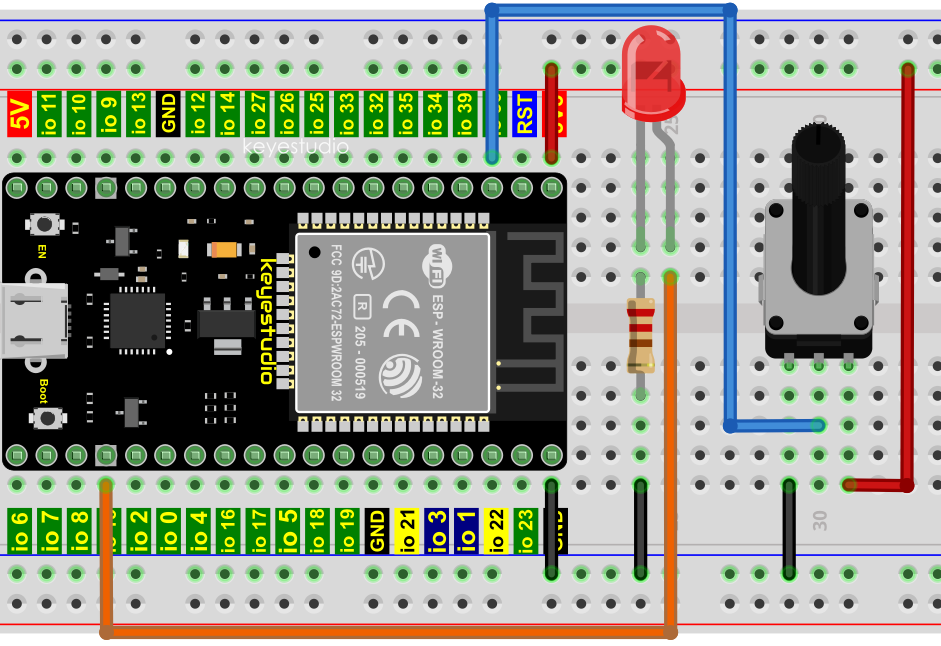

6.Project code：

Codes used in this tutorial are saved in“2. Python Projects”. If you haven't downloaded the code file yet, please click on the link to download it:[Download Python Codes](Python-Codes.zip)


Open“Thonny”，click“This computer”→“D:”→“2. Python Projects”→“Project 18: Dimming Light”，and then double
left-click“Project\_18.2\_Dimming\_Light.py”.


```python
from machine import Pin,PWM,ADC
import time

pwm =PWM(Pin(15,Pin.OUT),1000)
adc=ADC(Pin(36))
adc.atten(ADC.ATTN_11DB)
adc.width(ADC.WIDTH_10BIT)

try:
    while True:
        adcValue=adc.read()
        pwm.duty(adcValue)
        print(adc.read())
        time.sleep_ms(100)
except:
    pwm.deinit()
```

7.Project result：

Make sure the ESP32 has been connected to the computer, click“Stop/Restart backend” .


Click “Run current script”, the code starts to be executed and you'll see that turn the potentiometer handle and the brightness of the LED will change accordingly. Press“Ctrl+C”or click“Stop/Restart backend”to exit the program.


## Project 19：Flame Alarm

1.Introduction：

Fire is a terrible disaster and fire alarm systems are very useful in houses、commercial buildings and factories. In this project, we will use ESP32 to control a flame sensor, a buzzer and a LED to simulate fire alarm devices. This is a meaningful maker activity.

2.Components：

|  |  |  |  |
| ------------------------------------------------------------ | ------------------------------------------------------------ | ------------------------------------------------------------ | ------------------------------------------------------------ |
| ESP32*1                                                      | Breadboard*1                                                 | Red LED*1                                                    | Active Buzzer*1                                              |
|  |  |  |  |
| Flame Sensor*1                                               | 220Ω Resistor*1                                              | 10KΩResistor*1                                               | Jumper Wires                                                 |
|  |  |  |                                                              |
| NPN Transistor(S8050)*1                                      | 1kΩ Resistor*1                                               | USB Cable*1                                                  |                                                              |

3.Component knowledge：


The flame emits a certain amount IR light that is invisible to the human eye, but our flame sensor can detect it and alert a microcontroller(such as ESP32) that a fire has been detected. It has a specially designed infrared receiver tube to detect the flame and then convert the flame brightness into a fluctuating level signal. The short pin of the receiving triode is negative pole and the other long pin is positive pole. We should connect the short pin (negative) to 5V and the long pin(positive) to the analog pin, a resistor and GND. As shown in the figure below：


**Note:** Since vulnerable to radio frequency radiation and temperature changes, the flame sensor should be kept away from heat sources like radiators, heaters and air conditioners, as well as direct irradiation of sunlight, headlights and incandescent light.

4.Read the ADC value, DAC value and voltage value of the flame sensor：

We first use a simple code to read the ADC value, DAC value and voltage value of the flame sensor and print them out. Please refer to the wiring diagram below：


Codes used in this tutorial are saved in“2. Python Projects”. If you haven't downloaded the code file yet, please click on the link to download it:[Download Python Codes](Python-Codes.zip)


Open“Thonny”，click“This computer”→“D:”→“2. Python Projects”→”Project 19: Flame Alarm”, and then double left-click “Project\_19.1\_Read\_Analog\_Value\_Of\_Flame\_Sensor.py”.


```python
# Import Pin, ADC and DAC modules.
from machine import ADC,Pin,DAC
import time

# Turn on and configure the ADC with the range of 0-3.3V 
adc=ADC(Pin(36))
adc.atten(ADC.ATTN_11DB)
adc.width(ADC.WIDTH_12BIT)

# Read ADC value once every 0.1seconds, convert ADC value to DAC value and output it,
# and print these data to “Shell”. 
try:
    while True:
        adcVal=adc.read()
        dacVal=adcVal//16
        voltage = adcVal / 4095.0 * 3.3
        print("ADC Val:",adcVal,"DACVal:",dacVal,"Voltage:",voltage,"V")
        time.sleep(0.1)
except:
    pass
```

Make sure the ESP32 has been connected to the computer, click“Stop/Restart backend” .


Click“Run current script”, the code starts to be executed and you'll see that the "Shell" window of Thonny IDE will print the ADC value、DAC value and voltage value of the flame sensor. When the flame is close to the flame sensor, the ADC value, DAC value and voltage value increase; Conversely, the ADC value, DAC value and voltage value decrease. Press“Ctrl+C”or click“Stop/Restart backend”to exit the program.


5.Wiring diagram of the flame alarm：

Next, we will use a flame sensor, a buzzer, and a LED to make an interesting project, that is flame alarm. When flame is detected, the LED flashes and the buzzer alarms.

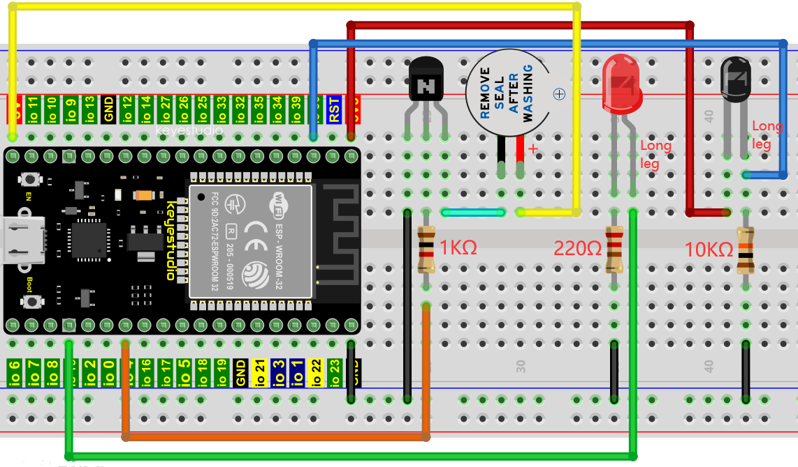

6.Project code:（Note： the threshold of 500 in the code can be reset itself as required)

Codes used in this tutorial are saved in“2. Python Projects”. If you haven't downloaded the code file yet, please click on the link to download it:[Download Python Codes](Python-Codes.zip)


Open“Thonny”，click“This computer”→“D:”→“2. Python Projects”→“Project 19: Flame Alarm”, and then double left-click“Project 19：Flame Alarm”.


```py
from machine import ADC, Pin
import time

# Turn on and configure the ADC with the range of 0-3.3V 
adc=ADC(Pin(36))
adc.atten(ADC.ATTN_11DB)
adc.width(ADC.WIDTH_12BIT)
# create LED object from Pin 15,Set Pin 15 to output
led = Pin(15, Pin.OUT) 
# create buzzer object from Pin 4, Set Pin 4 to output
buzzer = Pin(4, Pin.OUT)   
 
# If the flame sensor detects a flame, the buzzer will beep
# and the LED will blink when the analog value is greater than 500
# Otherwise, the buzzer does not sound and the LED goes off 
while True:
    adcVal=adc.read()
    if adcVal >500:
        buzzer.value(1)    # Set buzzer turn on
        led.value(1)    # Set led turn on
        time.sleep(0.5) # Sleep 0.5s
        buzzer.value(0) 
        led.value(0)    # Set led turn off
        time.sleep(0.5) # Sleep 0.5s
    else:
        buzzer.value(0)    # Set buzzer turn off
        led.value(0)    # Set led turn off
```


7.Project result：

Make sure the ESP32 has been connected to the computer, click“Stop/Restart backend” .


Click “Run current script”, the code starts to be executed and you'll see that when the flame sensor detects the flame, the LED flashes and the buzzer alarms. Otherwise, the LED does not light, the buzzer does not sound. Press“Ctrl+C”or click“Stop/Restart backend”to exit the program.


## Project 20：Night Lamp

1.Introduction：

Sensors or components are ubiquitous in our daily life. For example, some public street lamps will automatically turn on at night and turn off during the day. Why? In fact, this make use of a photosensitive element that senses the intensity of external ambient light. When the outdoor brightness decreases at night, the street lights will turn on automatically. In the daytime, the street lights will automatically turn off. the principle of which is very simple, In this Project, we use ESP32 to control a LED to achieve the effect of the street light.

2.Components：

|  |  |  |  |
| ------------------------------------------------------------ | ------------------------------------------------------------ | ------------------------------------------------------------ | ------------------------------------------------------------ |
| ESP32*1                                                      | Breadboard*1                                                 | Red LED*1                                                    | 10KΩResistor*1                                               |
|  |  |  |  |
| Photoresistor*1                                              | 220ΩResistor*1                                               | Jumper Wires                                                 | USB Cable*1                                                  |

3.Component knowledge：


**Photoresistor :** It is a kind of photosensitive resistance, its principle is that the photoresistor surface receives brightness (light) to reduce the resistance, the resistance value will change with the detected intensity of the ambient light . With this characteristic, we can use the photosensitive resistance to detect the light intensity. Photosensitive resistance and its electronic symbol are as follows：


The following circuit is used to detect changes in resistance values of photoresistors：


In the circuit above, when the resistance of the photoresistor changes due to the change of light intensity, the voltage between the photoresistor and resistance R2 will also change.  Thus, the intensity of light can be obtained by measuring this voltage.

4.Read the ADC value, DAC value and voltage value of the photoresistor：

We first use a simple code to read the ADC value, DAC value and voltage value of the photoresistor and print them out. Please refer to the following wiring diagram：


Codes used in this tutorial are saved in“2. Python Projects”. If you haven't downloaded the code file yet, please click on the link to download it:[Download Python Codes](Python-Codes.zip)


Open“Thonny”，click“This computer”→“D:”→“2. Python Projects”→”Project 20: Night Lamp”，and then double left-click “Project\_20.1\_Read\_Photosensitive\_Analog\_Value.py””.


```python
# Import Pin, ADC and DAC modules.
from machine import ADC,Pin,DAC
import time

# Turn on and configure the ADC with the range of 0-3.3V 
adc=ADC(Pin(36))
adc.atten(ADC.ATTN_11DB)
adc.width(ADC.WIDTH_12BIT)

# Read ADC value once every 0.1seconds, convert ADC value to DAC value and output it,
# and print these data to “Shell”. 
try:
    while True:
        adcVal=adc.read()
        dacVal=adcVal//16
        voltage = adcVal / 4095.0 * 3.3
        print("ADC Val:",adcVal,"DACVal:",dacVal,"Voltage:",voltage,"V")
        time.sleep(0.1)
except:
    pass
```

Make sure the ESP32 has been connected to the computer, click“Stop/Restart backend” .


Click“Run current script”, the code starts to be executed and you'll see that the "Shell" window of Thonny IDE will print the ADC value、DAC value and voltage value of the photoresistor. When the light intensity around the photoresistor is gradually reduced, the ADC value、DAC value and voltage value will gradually increase. On the contrary, the ADC value, DAC value and voltage value decreases gradually. Press“Ctrl+C”or click“Stop/Restart backend”to exit the program.


5.Wiring diagram of the light-controlled lamp：

We made a small dimming lamp in the front, now we will make a light controlled lamp. The principle is the same, that is, the ESP32 takes the ADC value of the sensor, and then adjusts the brightness of the LED.

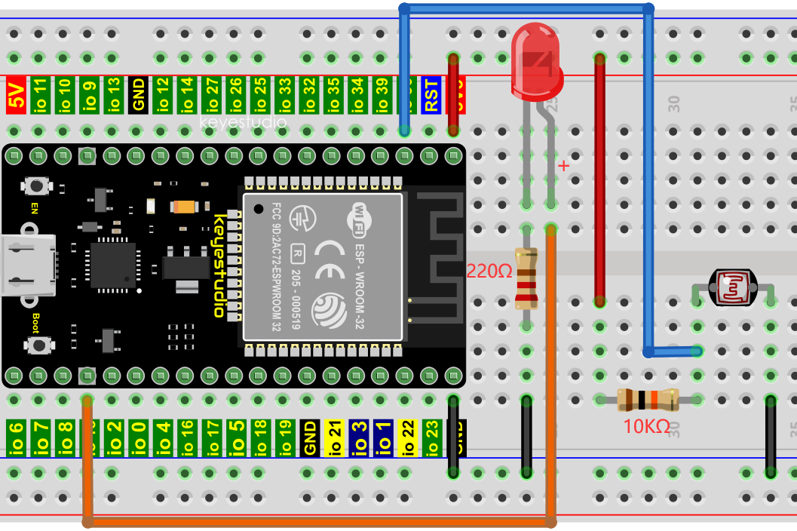

6.Project code：

Codes used in this tutorial are saved in“2. Python Projects”. If you haven't downloaded the code file yet, please click on the link to download it:[Download Python Codes](Python-Codes.zip)


Open“Thonny”，click“This computer”→“D:”→“2. Python Projects”→”Project 20: Night Lamp”，and then double left-click “Project\_20.2\_Night\_Lamp.py”.


```python
from machine import Pin,PWM,ADC
import time

pwm =PWM(Pin(15,Pin.OUT),1000)
adc=ADC(Pin(36))
adc.atten(ADC.ATTN_11DB)
adc.width(ADC.WIDTH_10BIT)

try:
    while True:
        adcValue=adc.read()
        pwm.duty(adcValue)
        print(adc.read())
        time.sleep_ms(100)
except:
    pwm.deinit()
```

7.Project result：

Make sure the ESP32 has been connected to the computer, click“Stop/Restart backend” .


Click “Run current script”, the code starts to be executed and you'll see that when the intensity of light around the photoresistor is reduced, the LED will be bright, on the contrary, the LED will be dim. Press“Ctrl+C”or click“Stop/Restart backend”to exit the program.


## Project 21：Temperature Instrument

1.Introduction：

Thermistor is a kind of resistor whose resistance depends on temperature changes, which is widely used in gardening, home alarm system and other devices. Therefore, we can use the feature to make a temperature instrument.

2.Components：

|  |  |  |  |
| ------------------------------------------------------------ | ------------------------------------------------------------ | ------------------------------------------------------------ | ------------------------------------------------------------ |
| ESP32*1                                                      | Breadboard*1                                                 | Thermistor*1                                                 | 10KΩResistor*1                                               |
|  |  |  |  |
| M-F Dupont Wires                                             | LCD 128X32 DOT*1                                             | Jumper Wires                                                 | USB Cable*1                                                  |

3.Component knowledge：

**Thermistor:** A Thermistor is a temperature sensitive resistor. When it senses a change in temperature, the resistance of the Thermistor will change. We can take advantage of this characteristic by using a Thermistor to detect temperature intensity. A Thermistor and its electronic symbol are shown below:


The relationship between resistance value and temperature of a thermistor is：


**Where:**

**Rt** is the thermistor resistance under T2 temperature;

**R** is the nominal resistance of thermistor under T1 temperature;

**EXP\[n\]** is nth power of e;

**B** is for thermal index;

**T1, T2** is Kelvin temperature (absolute temperature). Kelvin temperature=273.15 + Celsius temperature.

For the parameters of the Thermistor, we use: B=3950, R=10k, T1=25.

The circuit connection method of the Thermistor is similar to photoresistor, as the following：

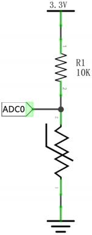

We can use the value measured by the ADC converter to obtain the resistance value of Thermistor, and then we can use the formula to obtain the temperature value.

Therefore, the temperature formula can be derived as:：


4.Read the value of the Thermistor：

First we will learn the thermistor to read the current ADC value, voltage value and temperature value and print them out. Please connect the wires according to the wiring diagram below：


Codes used in this tutorial are saved in“2. Python Projects”. If you haven't downloaded the code file yet, please click on the link to download it:[Download Python Codes](Python-Codes.zip)


Open“Thonny”，click“This computer”→“D:”→“2. Python Projects”→“Project 21: Temperature Instrument, and then double left-click “Project\_21.1\_Read\_the\_thermistor\_analog\_value.py”.


```python
from machine import Pin, ADC
import time
import math

#Set ADC
adc=ADC(Pin(36))
adc.atten(ADC.ATTN_11DB)
adc.width(ADC.WIDTH_12BIT)

try:
    while True:
        adcValue = adc.read()
        voltage = adcValue / 4095 * 3.3
        Rt = 10 * voltage / (3.3-voltage)
        tempK = (1 / (1 / (273.15+25) + (math.log(Rt/10)) / 3950))
        tempC = (tempK - 273.15)
        print("ADC value:",adcValue,"  Voltage:",voltage,"V","  Temperature: ",tempC,"C");
        time.sleep(1)
except:
    pass
```

Make sure the ESP32 has been connected to the computer, click“Stop/Restart backend”.


Click “Run current script”, the code starts to be executed and you'll see that the "Shell" window of Thonny IDE will continuously display the thermistor's current ADC value、voltage value and temperature value. Try pinching the thermistor with your index finger and thumb (don't touch wires) for a while, and you will see the temperature increase. Press“Ctrl+C”or click“Stop/Restart backend”to exit the program.


5.Wiring diagram of the temperature instrument：

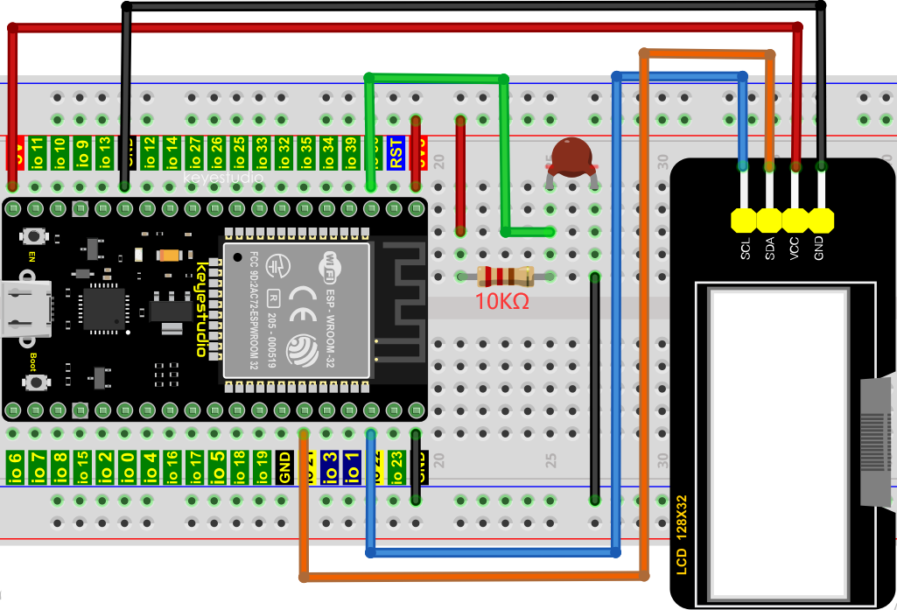

6.Project code：

Codes used in this tutorial are saved in“2. Python Projects”. If you haven't downloaded the code file yet, please click on the link to download it:[Download Python Codes](Python-Codes.zip)


Open“Thonny”，click“This computer”→“D:”→“2. Python Projects”→“Project 21: Temperature Instrument”. Select“lcd128\_32.py”and “lcd128\_32\_fonts.py”，right-click your mouse to select“Upload to/”，wait for“lcd128\_32.py”an “lcd128\_32\_fonts.py”to be uploaded to ESP32，and double left-click“Project\_21.2\_Temperature\_Instrument.py”.


```python
from machine import Pin, ADC, I2C
import machine
import time
import math
import lcd128_32_fonts
from lcd128_32 import lcd128_32

#Set ADC
adc=ADC(Pin(36))
adc.atten(ADC.ATTN_11DB)
adc.width(ADC.WIDTH_12BIT)

#i2c config
clock_pin = 22
data_pin = 21
bus = 0
i2c_addr = 0x3f
use_i2c = True

def scan_for_devices():
    i2c = machine.I2C(bus,sda=machine.Pin(data_pin),scl=machine.Pin(clock_pin))
    devices = i2c.scan()
    if devices:
        for d in devices:
            print(hex(d))
    else:
        print('no i2c devices')
        
try:
    while True:
        adcValue = adc.read()
        voltage = adcValue / 4095 * 3.3
        Rt = 10 * voltage / (3.3-voltage)
        tempK = (1 / (1 / (273.15+25) + (math.log(Rt/10)) / 3950))
        tempC = int(tempK - 273.15)        
        if use_i2c:
            scan_for_devices()
            lcd = lcd128_32(data_pin, clock_pin, bus, i2c_addr)  
        lcd.Clear()
        lcd.Cursor(0, 0)
        lcd.Display("Voltage:")
        lcd.Cursor(0, 8)
        lcd.Display(str(voltage))
        lcd.Cursor(0, 20)
        lcd.Display("V")
        lcd.Cursor(2, 0)
        lcd.Display("Temperature:")
        lcd.Cursor(2, 12)
        lcd.Display(str(tempC))
        lcd.Cursor(2, 15)
        lcd.Display("C")
        time.sleep(0.5)
except:
    pass
```

7.Project result：

Make sure the ESP32 has been connected to the computer, click“Stop/Restart backend” .


Click “Run current script”, the code starts to be executed and you'll see that the LCD 128X32 DOT displays the voltage value of the thermistor and the temperature value in the current environment. Press“Ctrl+C”or click “Stop/Restart backend”to exit the program.


## Project 22：WiFi Station Mode

1.Introduction：

ESP32 has three different WiFi operating modes : Station mode，AP mode and AP+Station mode. All WiFi programming projects must be configured with WiFi operating mode before using WiFi, otherwise WiFi cannot be used. In this project, we will learn about ESP32's WiFi Station mode.

2.Components：

|  |  |
| ------------------------------------------------------------ | ------------------------------------------------------------ |
| USB  Cable*1                                                 | ESP22*1                                                      |

3.Project wiring：

Connect the ESP32 to the USB port on your computer using a USB cable.


4.Component knowledge：

**Station mode:** When ESP32 selects Station mode, it acts as a WiFi client. It can connect to the router network and communicate with other devices on the router via WiFi connection. As shown below, the PC is connected to the router, and if ESP32 wants to communicate with the PC, it needs to be connected to the router.


5.Project code：

Codes used in this tutorial are saved in“2. Python Projects”. If you haven't downloaded the code file yet, please click on the link to download it:[Download Python Codes](Python-Codes.zip)


Open“Thonny”，click“This computer”→“D:”→“2. Python Projects”→“Project 22：WiFi Station Mode”，and double left-click “Project\_22\_WiFi\_Station\_Mode.py”.


```python
import time
import network # Import network module.

ssidRouter     = 'ChinaNet-2.4G-0DF0' # Enter the router name
passwordRouter = 'ChinaNet@233' # Enter the router password

def STA_Setup(ssidRouter,passwordRouter):
    print("Setup start")
    sta_if = network.WLAN(network.STA_IF) # Set ESP32 in Station mode.
    if not sta_if.isconnected():
        print('connecting to',ssidRouter)
  # Activate ESP32’s Station mode, initiate a connection request to the router
  # and enter the password to connect.      
        sta_if.active(True)
        sta_if.connect(ssidRouter,passwordRouter)
  #Wait for ESP32 to connect to router until they connect to each other successfully.      
        while not sta_if.isconnected():
            pass
  # Print the IP address assigned to ESP32-WROVER in “Shell”. 
    print('Connected, IP address:', sta_if.ifconfig())
    print("Setup End")
    
try:
    STA_Setup(ssidRouter,passwordRouter)
except:
    sta_if.disconnect()
```

Because the names and passwords of routers in various places are different, before the code runs, users need to enter the correct router’s name and password in the box as shown in the illustration above.

After making sure the router name and password are entered correctly, click “Run current script”, the code starts to be executed and wait for ESP32 to connect to your router and print the IP address assigned by the router to ESP32 in the "Shell" window of Thonny IDE.


## Project 23：WiFi AP Mode

1.Introduction：

ESP32 has three different WiFi operating modes : Station mode，AP mode and AP+Station mode. All WiFi programming projects must be configured with WiFi operating mode before using WiFi, otherwise WiFi cannot be used. In this project, we will learn about ESP32's WiFi AP mode.

2.Components：

|  |  |
| ------------------------------------------------------------ | ------------------------------------------------------------ |
| USB  Cable*1                                                 | ESP22*1                                                      |

3.Project wiring：

Connect the ESP32 to the USB port on your computer using a USB cable.


4.Component knowledge：

**AP mode :** When ESP32 selects AP mode, it creates a hotspot network that is separated from the Internet and waits for other WiFi devices to connect. As shown in the figure below, ESP32 is used as a hotspot. If a mobile phone or PC wants to communicate with ESP32, it must be connected to the hotspot of ESP32. Only after a connection is established with ESP32 can they communicate.

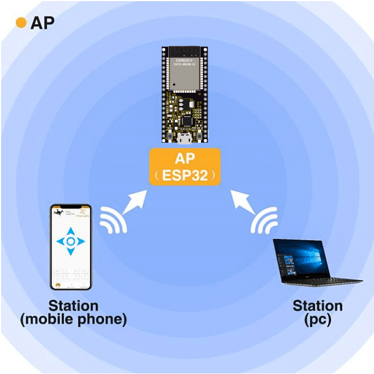

5.Project code：

Codes used in this tutorial are saved in“2. Python Projects”. If you haven't downloaded the code file yet, please click on the link to download it:[Download Python Codes](Python-Codes.zip)


Open“Thonny”，click“This computer”→“D:”→“2. Python Projects”→“Project 23：WiFi AP Mode”, and double left-click
“Project\_23\_WiFi\_AP\_Mode.py”.


```python
import network #Import network module.

#Enter correct router name and password.
ssidAP         = 'ESP32_WiFi' #Enter the router name
passwordAP     = '12345678'  #Enter the router password

local_IP       = '192.168.0.147'
gateway        = '192.168.0.1'
subnet         = '255.255.255.0'
dns            = '8.8.8.8'

#Set ESP32 in AP mode.
ap_if = network.WLAN(network.AP_IF)

def AP_Setup(ssidAP,passwordAP):
    ap_if.ifconfig([local_IP,gateway,subnet,dns])
    print("Setting soft-AP  ... ")
    ap_if.config(essid=ssidAP,authmode=network.AUTH_WPA_WPA2_PSK, password=passwordAP)
    ap_if.active(True)
    print('Success, IP address:', ap_if.ifconfig())
    print("Setup End\n")
    
try:
    AP_Setup(ssidAP,passwordAP)
except:
    print("Failed, please disconnect the power and restart the operation.")
    ap_if.disconnect()
```

6.Project result：

Before the code runs, you can make any changes to the AP name and password for ESP32 in the box as shown in the illustration above. Of course, you can leave it alone by default.

Click “Run current script”, the code starts to be executed and open the AP function of ESP32 and print the access point information in the "Shell" window of Thonny IDE.


Turn on the WiFi scanning function of your phone, and you can see the ssid\_AP on ESP32, which is called "ESP32\_Wifi" in this code. You can enter the password "12345678" to connect it or change its AP name and password by modifying ode.


## Project 24：WiFi Station+AP Mode

1.Introduction：

ESP32 has three different WiFi operating modes : Station mode，AP mode and AP+Station mode. All WiFi programming projects must be configured with WiFi operating mode before using WiFi, otherwise WiFi cannot be used. In this project, we will learn ESP32's WiFi Station+AP mode.

2.Components：

|  |  |
| ------------------------------------------------------------ | ------------------------------------------------------------ |
| USB  Cable*1                                                 | ESP22*1                                                      |

3.Project wiring：

Connect the ESP32 to the USB port on your computer using a USB cable.


4.Component knowledge：

**AP+Station mode:** In addition to AP mode and Station mode, ESP32 can also use AP mode and Station mode at the same time. This mode contains the functions of the previous two modes. Turn on ESP32's Station mode, connect it to the router network, and it can communicate with the Internet via the router. At the same time, turn on its AP mode to create a hotspot network. Other WiFi devices can choose to connect to the router network or the hotspot network to communicate with ESP32.

5.Project code：

Codes used in this tutorial are saved in“2. Python Projects”. If you haven't downloaded the code file yet, please click on the link to download it:[Download Python Codes](Python-Codes.zip)


Open“Thonny”，click“This computer”→“D:”→“2. Python Projects”→“Project 24：WiFi Station+AP Mode”，and double left-click “Project\_24\_WiFi\_Station+AP\_Mode.py”.


```python
import network #Import network module.

ssidRouter     = 'ChinaNet-2.4G-0DF0' #Enter the router name
passwordRouter = 'ChinaNet@233' #Enter the router password

ssidAP         = 'ESP32_WiFi'#Enter the AP name
passwordAP     = '12345678' #Enter the AP password

local_IP       = '192.168.0.147'
gateway        = '192.168.0.1'
subnet         = '255.255.255.0'
dns            = '8.8.8.8'

sta_if = network.WLAN(network.STA_IF)
ap_if = network.WLAN(network.AP_IF)
    
def STA_Setup(ssidRouter,passwordRouter):
    print("Setting soft-STA  ... ")
    if not sta_if.isconnected():
        print('connecting to',ssidRouter)
        sta_if.active(True)
        sta_if.connect(ssidRouter,passwordRouter)
        while not sta_if.isconnected():
            pass
    print('Connected, IP address:', sta_if.ifconfig())
    print("Setup End")
    
def AP_Setup(ssidAP,passwordAP):
    ap_if.ifconfig([local_IP,gateway,subnet,dns])
    print("Setting soft-AP  ... ")
    ap_if.config(essid=ssidAP,authmode=network.AUTH_WPA_WPA2_PSK, password=passwordAP)
    ap_if.active(True)
    print('Success, IP address:', ap_if.ifconfig())
    print("Setup End\n")

try:
    AP_Setup(ssidAP,passwordAP)    
    STA_Setup(ssidRouter,passwordRouter)
except:
    sta_if.disconnect()
    ap_if.idsconnect()
```

6.Project result：

It is analogous to Project 35 and project 36. Before running the code, you need to modify ssidRouter, passwordRouter, ssidAP and passwordAP shown in the box of the illustration above.

After making sure that the code is modified correctly, click“Run current script” the code starts to be executed and the“Shell”window of Thonny IDE will display as follows:


Turn on the WiFi scanning function of your phone, and you can see the ssidAP on ESP32.

s