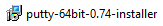
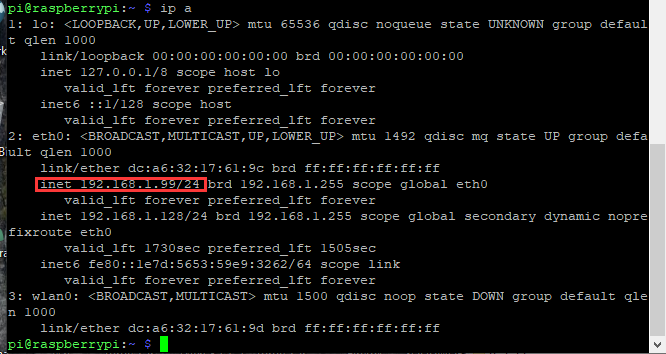
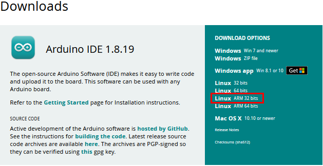
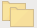
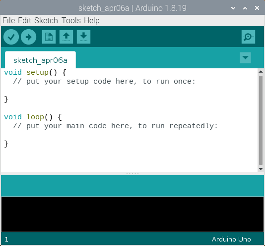
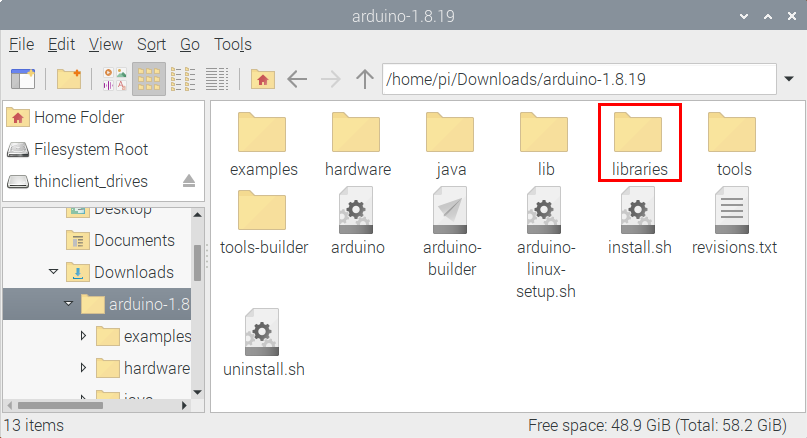

# Raspberry Pi

Raspberry Pi is a card computer whose official system is Raspberry Pi OS, which can be installed on other systems,, such as: ubuntu, Windows IoT. Raspberry Pi can be used as a personal server, a router camera monitoring and recognition, as well as voice interaction by connecting a camera and a voice interactive assistant.

Furthermore, Raspberry Pi leads out 40Pin pins that can be connected to various sensors and control LEDs, motors, etc, making it can be used to create a robot.

## Install the Raspberry Pi OS System：

### 1\. Tools needed for the Raspberry Pi system：

#### 1.1. Hardware Tool：

（1）Raspberry Pi 4B/3B/2B 

（2）Above 16G TFT Memory Card

（3）Card Reader 

（4）Computer and other parts

#### 1.2. Software tools that need to be installed：

**Windows System：**

**（1）Install putty**

Download link：[https://www.chiark.greenend.org.uk/\~sgtatham/putty/](https://www.chiark.greenend.org.uk/~sgtatham/putty/)

After downloading the package file , double-click it and tap“Next”.

Click “Next”.

Select “Install Putty files”, and click “Install”

After a few seconds, the installation is complete, click "Finish".

**Remote Login software -WinSCP**

Download link: [https://winscp.net/eng/download.php](https://winscp.net/eng/download.php)

After downloading the WinSCP software file, double-click it then click.

Click“Accept”，then select the appropriate option and click“Next”, then click“Install”.

After a few seconds, the installation is complete, click "Finish".

**Format TFT card tool-- SD Card Formatter**

Download link：

[http://www.canadiancontent.net/tech/download/SD\_Card\_Formatter.html](http://www.canadiancontent.net/tech/download/SD_Card_Formatter.html)

Unzip the SDCardFormatterv5\_WinEN package and double-click the SD Card Formatter file to run it.

Click “Next”，select “” and click “Next”.

Click “Next” again, and then click “Install”.

After a few seconds, the installation is complete, click "Finish".

**（4）Burn mirror system software tool--- Win32DiskImager**

Download link：[https://sourceforge.net/projects/win32diskimager/](https://sourceforge.net/projects/win32diskimager/)

After downloading the software file，double-click it and then click “Run”.

After selecting，and click “Next”.

Click “Browse...”，select the location where Win32DiskImager is installed and click “Next”.

1.  Click “Browse...”，select the location where Win32DiskImager is installed and click“Next”.

2.  > Selectand click“Next”，and then click“Install”.

d. After a few seconds, the installation is complete, click "Finish".

（5）Scan for IP address software tool---WNetWatcher

Download Link：http://www.nirsoft.net/utils/wnetwatcher.zip

#### 1.3. Raspberry PI mirror system

Download link for the latest version：

[https://www.raspberrypi.org/downloads/raspberry-pi-os/](https://www.raspberrypi.org/downloads/raspberry-pi-os/)

Download link for the old version：

- > Raspbian：

- > https://downloads.raspberrypi.org/raspbian/images/

- > Raspbian full：

- > https://downloads.raspberrypi.org/raspbian\_full/images/

- > Raspbian lite：

- > https://downloads.raspberrypi.org/raspbian\_lite/images/

We use the 2020.05.28 version in the tutorial and recommend you to use this version(Please download this version as shown in the picture below.)

<https://downloads.raspberrypi.org/raspios_full_armhf/images/raspios_full_armhf-2021-05-28/>

### 2\. Install Raspberry Pi OS system on Raspberry Pi 4B:

**2.1.Connect the TFT memory card to a card reader, then plug the card reader into a computer’s USB port.**

**2.2.Use the SD Card Formatter to format a TFT memory card, as illustrated below：**

**2.3.Burn System:**

Use **Win32DiskImager** to burn the official **Raspberry Pi OS** mirror to the TFT memory card.

After the mirror system is burned, don’t pull out the card reader, use a notepad to create a file named **SSH** and delete**.txt**, then copy it to the boot directory of the TFT card, so that you can open the SSH login function, as shown in the following figure:

Pull out the card reader.

**2.4.Log in system:**

The following operations require raspberry to share the same LOCAL area network with the PC.

Insert the burned TFT memory card into the Raspberry Pi, connect internet cables and plug in power. If there is a screen and a HDMI cable of Raspberry Pi, connect the screen, and you can see the Raspberry Pi OS startup screen. If there is not a HDMI cable of Raspberry Pi, you can enter the desktop of Raspberry Pi via SSH remote login software---WinSCP and xrdp.

**Remote login**

**Use WinSCP to log in using the default Raspberry Pi system name、default user name、default password.**

**Note that only a raspberry pi can be connected to a network.**

**View the ip address and mac address** 

Click to open terminal and input the password: raspberry, and tap“Enter”on keyboard.

After successfully login, open the terminal, input **ip a** and tap“Enter”keyboard to view the ip address and mac address.

From the above figure, mac address of this Raspberry Pi is a6:32:17:61:9c, and ip address is 192.168.1.128(use ip address to finish
xrdp remote login).

Since mac address never changes, you could confirm ip via mac address when not sure which ip it is.

**Fix the IP address of Raspberry Pi**

IP address is changeable, therefore, we need to make IP address fixed for convenient use.

Follow the below steps:

Switch to root user

If without root user’s password

① Set root password

Input password in the terminal: sudo passwd root to set password.

② Switch to root user

su root

③ Fix the configuration file of IP address

Firstly change IP address of the following configuration file.

（\#New IP address:：address 192.168.1.99）

Copy the above new address to terminal and tap“**Enter**”keyboard.

**Configuration File:**

echo -e '

auto eth0

iface eth0 inet static

\#Change IP address

address 192.168.1.99

netmask 255.255.255.0

gateway 192.168.1.1

network 192.168.1.0

broadcast 192.168.1.255

dns-domain 119.29.29.29

dns-nameservers 119.29.29.29

metric 0

mtu 1492

'\>/etc/network/interfaces.d/eth0

④ Reboot the system to activate the configuration file.

Input the restart command in the terminal: sudo reboot

You could log in via fixed IP afterwards.

⑤ Check IP to ensure IP address fixed well.

Log in desktop on Raspberry Pi wirelessly

If we don't have an HDMI cable to connect to the display, can we wirelessly log in to the Raspberry Pi desktop from the Windows
desktop? Yes, there are many methods, VNC and Xrdp are commonly used to log in desktop of Raspberry Pi wirelessly.

Let’s take an example of Xrdp.

①Install Xrdp Service in the terminal

Installation commands:

Switch to root User: su root

Installation commands: apt-get install xrdp

Enter y and tap“**Enter**”keyboard..

As shown below:

Open the remote desktop connection on Windows

Press **WIN+R** on keyboard and enter mstsc.exe.

As shown below:

Enter the IP address of the Raspberry Pi, as shown below. Click“Connect” and then click “Connect”again. 192.168.1.99 is the ip address we use, you could change it into your IP address.

A prompt will appear and you can click“Yes”.

Then enter the user name: pi ,and the default password: raspberry, as shown below:

Click“OK”or tap“Enter”keyboard, you will view the desktop of Raspberry Pi OS, as shown below:

Now, we finish the basic configuration of the Raspberry Pi OS system.

## Preparation of C language control basic hardware:

C language is a programming language with a considerably fast running speed. There are numerous software and system core code written in it, such as Linux system. Notably, hardware MCU and embedded class are not exception. Thereby, it makes sense to learn the C language to control hardware.

#### (1)Description of basic raspberry pi accessories：

**Raspberry Pi 4B：**

Below are the raspberry pi pictures and model pictures supported by this learning kit. There are 40 pins.

| Raspberry Pi 4B                                              | Raspberry Pi 4B Model                                        |
| ------------------------------------------------------------ | ------------------------------------------------------------ |
|  |  |

**Hardware Interfaces**

#### Raspberry Pi +ESP32 main board + breadboard +USB cable, as shown below：

**(3)Copy Example Code Folder to Raspberry Pi：**

Place example code folder to the pi folder of Raspberry Pi. Just copy and paste the **2. Projects.zip** file (the default is **ZIP** file)that we provided into user pi and unzip it, as shown below:                                                                                                                                                                                                                                                                                                                                                                                                                                                                                                                                                                                                                                                                                                                                                                                                                                                                                                                                                                                                                                                                                                                                                                                                                                                                                                                                                                                                                                                                                                                                                                                                                                                                                                                                                                                                                                                                                                                                                                                                                                                                                                                                                                                                                                                                                                                                                                                                                                                                                                                                                                                                                                                                                                                                                                                                                                                                                                                                                                                                                                                                                                                                                                                                                                                                                                                                                                                                                                                                                                                                                                                                                                                                                                                                                                                                                                                                                            

**Linux System（Raspberry Pi）：**

### (2) Download and install Arduino IDE：

（1）First, click on Raspberry Pi's browser.

2.  Enter the Official Arduino website in your browser: [www.arduino.cc/en/software](http://www.arduino.cc/en/software) , as shown below:

There are various versions of IDE for Arduino. Just download a version compatible with your system (install the lasted Arduino IDE) and click“Linux ARM 32 bits”.

Just click **JUST DOWNLOAD** to download

After a few seconds, the lastest Arduino IDE（Arduino 1.8.19 version）zip file can be directly downloaded.

(4) Click , then find the **Downloads** file from the pi folder and click it. In the **Downloads** folder, you can see the package“arduino-1.8.19-linuxarm.tar.xz”that you just downloaded. Then unzip the package“arduino-1.8.19-linuxarm.tar.xz”, after a while, the package is unzipped.

（5）Clickfile and tap it，click“Execute”in the dialog that appears to install the Arduino IDE. Once installed, an Arduino software shortcut is generated in the desktop.

（6）Click and click to open the Arduino IDE.

### (3) Install the ESP32 on Arduino IDE：

Note: You need to download Arduino IDE 1.8.5 or advanced version to install the ESP32.

1)  > Click and click  to open the Arduino IDE.

2)  Click **“File**”→**“Preferences”**, copy the website address <https://dl.espressif.com/dl/package_esp32_index.json> in the “**Additional Boards Manager URLs:**” and click “**OK**” to save the address.

3.  Click “**Tools**”→“**Board:**”, then click “**Boards Manager...**” to enter “**Boards Manager**” page . Enter “**esp32**” as follows and
select the latest version to Install. The installation package is not large, click “**Install**” to start the installation.

4.  After a while, the ESP32 installation package is installed. Then click “**Close**”.

### 3\. Arduino IDE Settings and Toolbars:

Click and click  to open the Arduino IDE.

When downloading the code to the board, you must select the correct name of Arduino board that matches the board connected to the Raspberry Pi, click“**Tools**”→“**Board:**”, as shown below ;

(Note: We use the ESP32 board in this tutorial; therefore, we select ESP32 Arduino**)**

Then select the correct COM port (After connecting the ESP32 mainboard to the Raspberry Pi via a USB cable, you can see the corresponding COM port).

Before uploading the code to the ESP32 mainboard, we have to demonstrate the function of each symbol.

A- Used to verify whether there is any compiling mistakes or not.

B- Used to upload the sketch to your Arduino board.

C- Used to create shortcut window of a new sketch.

D- Used to directly open an example sketch.

E- Used to save the sketch.

F- Used to send the serial data received from board to the serial monitor.

## Import the Arduino C library

### What are Libraries ?

Libraries are a collection of code that make it easy for you to connect sensors, displays and modules, etc.

For example, the built-in LiquidCrystal library helps talk to LCD displays. There are hundreds of additional libraries available on the Internet for download.

The built-in libraries and some of these additional libraries are listed in the reference. (https://www.arduino.cc/en/Reference/Libraries)

### How to Install a Library ?

**Step 1:** Click ，tap“Downloads”file，and click“arduino-1.8.19”file，then find and click “libraries” file from the “arduino-1.8.19” file.

**Step 2 :** Copy and paste the Arduino C library ZIP file (the default is ZIP file) from the provided Arduino Libraries folder into the
libraries file opened in the first step（the route is：/home/pi/Downloads/arduino-1.8.19/libraries.

Click on the link to download the library file：[Arduino C Librarie](Arduino-Librarie.zip)

**Step 3:** Unzip the Arduino C package in the libraries folder（for example：right-click“LCD\_128X32.zip”file ，select and tap “Extract Here”to unzip the “LCD\_128X32.zip”file. Similarly, unzip the remaining library files in the same way.). So you can see all the decompressed Arduino C library files.

